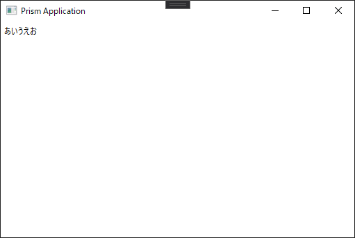
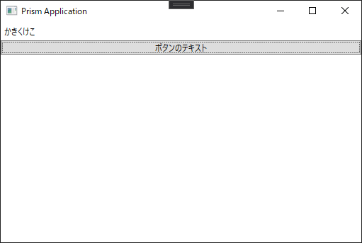
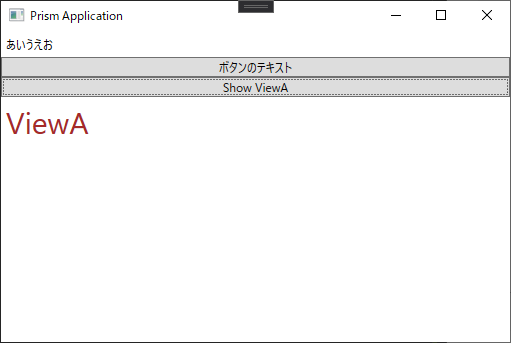
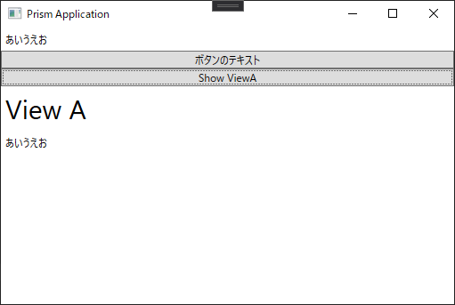

# Prism(C# の MVVM フレームワーク) を使ってみるテスト

VisualStudio 2019 に、Prism Template Pack を入れた状態で使っています。
とりあえず、.NET 5 でやってみます。(何か問題があったら .NET Core 3 か .NET Framework に切り替えます)

## ウィンドウの表示位置を画面中央にする

とりあえず、自動生成された MainWindow を画面中央に表示されるようにします。

```xml
<Window x:Class="PrismTest.Views.MainWindow"
        xmlns="http://schemas.microsoft.com/winfx/2006/xaml/presentation"
        xmlns:x="http://schemas.microsoft.com/winfx/2006/xaml"
        xmlns:prism="http://prismlibrary.com/"
        prism:ViewModelLocator.AutoWireViewModel="True"
        Title="{Binding Title}" Height="350" Width="525"
        WindowStartupLocation="CenterScreen">
    <Grid>
        <ContentControl prism:RegionManager.RegionName="ContentRegion" />
    </Grid>
</Window>
```

上記の **WindowStartupLocation="CenterScreen"** の部分で画面中央表示を指定しています。

## データのバインド

自動生成されたソースファイルでタイトル文字列がデータバインドされています。
MainWindow.xaml の *Title="{Binding Title}"* の部分で、ウィンドウの *Title* に Title というデータをバインドしています。

バインドされているデータは、MainWindowViewModel.cs の下記の部分で指定されています。

```cs
        private string _title = "Prism Application";
        public string Title { get => _title; set => SetProperty(ref _title, value); }
```

MainWindow.xaml の *Title* に、MainWindowViewModel.cs の *Title(_title)* がバインドされています。

## ラベルデータのバインド

次に、ラベルのデータをバインドしてみます。
MainWindow.xqml を以下のように変更します。

```xml
  <Grid>
    <StackPanel>
      <Label Content="{Binding LabelData}"/>
      <ContentControl prism:RegionManager.RegionName="ContentRegion" />
    </StackPanel>
  </Grid>
```

MainWindowViewModel.cs に下記のコードを追加します。
これで、xaml の LabelData に "あいうえお" が表示されます。

```cs
    private string _labelData = "あいうえお";
    public string LabelData { get => _labelData; set => SetProperty(ref _labelData, value); }
```



MainWindow.xaml の *Content="{Binding LabelData}"* の部分で、ラベルの内容が MainWindowViewModel.cs の *LabelData(_labelData)* にバインドされています。

**ラベルは Content をバインドする**ということですね。

## ボタンデータのバインド

次はボタンデータをバインドしてみます。
MainWindow.xaml に書きを追加します。

```xml
  <Grid>
    <StackPanel>
      <Label Content="{Binding LabelData}"/>
      <Button Content="ボタンのテキスト" Command="{Binding TestButton}"/>
      <ContentControl prism:RegionManager.RegionName="ContentRegion" />
    </StackPanel>
  </Grid>
```

*\<Button Content="ボタンのテキスト" Command="{Binding TestButton}"/\>* の部分が追加された部分です。

MainWindowViewModel.cs に書きを追加します。

```cs
    public MainWindowViewModel() {
      TestButton = new DelegateCommand(TestButtonExecute);
    }

    public DelegateCommand TestButton { get; }

    private void TestButtonExecute() {
      LabelData = "かきくけこ";
    }
```

TestButton という MainWindow.xaml で定義したオブジェクトを、DelegateCommant で、引数にイベとハンドラを指定して作成し、TestButtonExecute でクリック時の処理を書きます。



**ボタンは Command をバインドする**ということですね。

## 画面遷移

次は、RequestNavigate を使用して画面遷移する方法です。

* まず、Views を右クリックして、追加→新しい項目で開いたダイアログから、Prism UserControl(WPF) を選択して ViewA という新しいビューを追加します。

* ViewA.xaml を下記のように修正します。

```xml
<UserControl x:Class="PrismTest.Views.ViewA"
             xmlns="http://schemas.microsoft.com/winfx/2006/xaml/presentation"
             xmlns:x="http://schemas.microsoft.com/winfx/2006/xaml"
             xmlns:prism="http://prismlibrary.com/"             
             prism:ViewModelLocator.AutoWireViewModel="True">
  <Grid>
    <Label Content="ViewA" FontSize="30" Foreground="Brown"/>
  </Grid>
</UserControl>
```

*<Label Content="ViewA" FontSize="30" Foreground="Brown"\/>* を追加しています。

* 次に、MainWindow.xaml にテスト用のボタンを追加します。

```xml
  <Grid>
    <StackPanel>
      <Label Content="{Binding LabelData}"/>
      <Button Content="ボタンのテキスト" Command="{Binding TestButton}"/>
      <Button Content="Show ViewA" Command="{Binding ShowViewAButton}"/>

      <ContentControl prism:RegionManager.RegionName="ContentRegion" />
    </StackPanel>
  </Grid>
```

*<Button Content="Show ViewA" Command="{Binding ShowViewAButton}"\/>* を追加しています。

* MainWindowViewModel.cs に画面遷移処理を追加します

```cs
using Prism.Commands;
using Prism.Mvvm;
using Prism.Regions;    // 追加
using PrismTest.Views;  // 追加

namespace PrismTest.ViewModels {
  public class MainWindowViewModel : BindableBase {
    private readonly IRegionManager _regionManager; // 追加

    private string _title = "Prism Application";
    public string Title {
      get => _title;
      set => SetProperty(ref _title, value);
    }

    private string _labelData = "あいうえお";
    public string LabelData { get => _labelData; set => SetProperty(ref _labelData, value); }

    public MainWindowViewModel(IRegionManager regionManager) {
      _regionManager = regionManager; // 追加
      TestButton = new DelegateCommand(TestButtonExecute);
      ShowViewAButton = new DelegateCommand(ShowViewAButtonExecute);  // 追加
    }

    public DelegateCommand TestButton { get; }
    public DelegateCommand ShowViewAButton { get; } // 追加

    private void TestButtonExecute() {
      LabelData = "かきくけこ";
    }

    // 追加
    private void ShowViewAButtonExecute() {
      _regionManager.RequestNavigate("ContentRegion", nameof(ViewA)); 
    }
  }
}
```

* App.xaml.cs に新しいビューを登録する

```cs
using Prism.Ioc;
using PrismTest.Views;
using System.Windows;

namespace PrismTest {
  /// <summary>
  /// Interaction logic for App.xaml
  /// </summary>
  public partial class App {
    protected override Window CreateShell() {
      return Container.Resolve<MainWindow>();
    }

    protected override void RegisterTypes(IContainerRegistry containerRegistry) {
      containerRegistry.RegisterForNavigation<ViewA>(); // 追加
    }
  }
}
```

実行して Show ViewA ボタンを押下すると、ボタンの下の領域に ViewA が表示されます。



ということで、画面遷移をする場合は

1. 遷移先ビューを作成
2. 親ビューのビューモデルコンストラクタで IRegionManager を受け取り保存する
3. 画面遷移処理で、IRegionManager の RequestNavigation メソッドを使用して View を表示する処理を追加する
4. App.xaml.cs 内の RegisterTypes メソッド内で IContainerRegistry.RegisterForNavigation メソッドでビューを登録する

ということですね。

## RequestNavigate でパラメータを渡す

遷移するビューにパラメータを渡してみます。

view の xaml を下記のように変えます。

```xml
<StackPanel>
  <Label Content="View A" FontSize="30"/>
  <Label Content="{Binding TestLabel}"/>
</StackPanel>
```

下のラベルに受け取ったパラメータの文字列が表示されます。

ViewModel を下記のように変更します。

```cs
private void ShowViewAButtonExecute() {
  var p = new NavigationParameters();
  p.Add(nameof(ViewAViewModel.TestLabel), LabelData);
  _regionManager.RequestNavigate("ContentRegion", nameof(ViewA), p);
}
```

NavigationParameters を作成し、パラメータを辞書に追加してから、RequestNavigate の最後の引数として渡します。

最後に、ViewAViewModel を下記のように変更します。

```cs
public class ViewAViewModel : BindableBase, INavigationAware {
  public ViewAViewModel() { }

  private string _testLabel = string.Empty;
  public string TestLabel { get => _testLabel; set => SetProperty(ref _testLabel, value); }

  public void OnNavigatedTo(NavigationContext navigationContext) {
    TestLabel = navigationContext.Parameters.GetValue<string>(nameof(TestLabel));
  }

  public bool IsNavigationTarget(NavigationContext navigationContext) {
    return false;
  }

  public void OnNavigatedFrom(NavigationContext navigationContext) { }
}
```

INavigationAware インターフェースを実装しています。インターフェース関数の役割は下記のとおりです。

* **OnNavigatedTo**
  ナビゲーションが移ってきた時に実行される。パラメータを受け取りたい場合はこの関数で受け取ります。
* **IsNavigationTarget**
  インスタンスの状態を保存するかを決定します。状態を保存する場合は true を返します。
* **OnNavigatedFrom**
  ナビゲーションが他に遷移する時に実行されます。終了処理が必要な場合は個々で処理します。

ここでは、パラメータを受け取りたいので、OnNavigatedTo 関数で TestLabel という名前をキーにした文字列をディクショナリから取得して、TestLabel に表示しています。

実行して、ボタンを押下すると、受け取った文字列が表示されていることがわかります。



ということで、遷移先のビューにパラメータを渡す場合は、渡す側で NavigationParameters を作成して RequestNavigate に渡す。受け取る側のビューで、INavigationAware インターフェースの OnNavigateTo 関数で、受け取った NavigationContext 内の該当キーでパラメータを受け取る。という動作になります。

## IsNavigationTarget の確認

### 以下作成中

***

**[戻る](../../index.md)**
