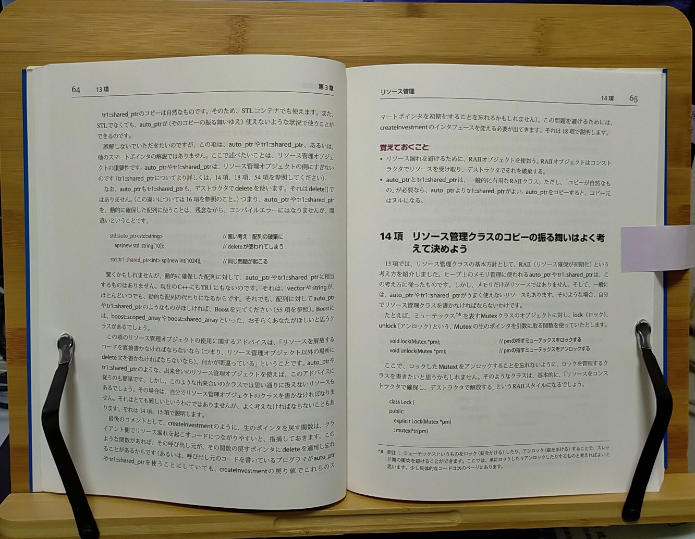

# どうでもよさげな日記

***
次の案件は C++ になるかもしれない…まだわからんけども！
Qt のライセンスやっぱ買おうかな？ 年間 5 万ぐらいだったかな？…うーん悩む…。

2021/08/27
***
少し前に、15.6 インチのタッチ対応 4K モバイルモニタを買った。
縦置きにして、ソースを眺める用に買ったんだけど、さすがに 4K はいらなかったかな…？と思う。^^;
グレアなんで映り込みも結構気になるけど、ノングレアでタッチ対応は殆どないようなので仕方ない…。
タッチ対応は、リモートのミーティングの際に ホワイトボード的なものに使えればと思ってタッチ対応のを選んだんだけど、その点はまあまあ価値があったかな？

最近、仕事では Qt/C++ → WPF(Prism)/C# になった。と言っても UI 周りはあまり触ってないんだけども。

今までは Android アプリを Qt で作ってたんだけど、最近 Kotlin の本を買ったので Kotlin にしようかな？と思ってる。
Qt で Android 開発は、ハマりポイントが多すぎて、正直生産性が低い(Qt 自体は生産性高いんだけども)。
それと、Qt はライセンス変更の影響で、ライセンス買わないとなかなか使いにくものになってしまっていて、趣味で使うにはちょっと敷居が高くなってしまった感がある…。残念。

2021/08/25
***
ちょっと前に書見台を買った。ページを押さえる部分が結構きつめなんで、それなりに分厚い本でも問題ない感じ。
その分ページ送りには両手が必要…^^;

2021/06/07
***
仕事でめちゃくちゃ久しぶりに Windows の COM 関係を C++ で触ってる。
相変わらずめんどくさいなぁ COM 。昔はよくあった Inside Windows 系の本って今あんまりないんだなぁ。
いろんなものが Web ベースになって需要が減ってるんだろう。
Windows も最近は C# がメインになってきて、より一層 C++ で COM を直接触る機会がなくなってる気がする。
ロボティクスとか画像処理とかなんか面白そうな仕事ないかなぁ。

2021/03/21
***
とりあえず、 Android アプリを公開して、 1 回リビジョンアップをしてみた。
これで手順は大体わかったけど、結構めんどくさい。
アプリの概要などに同じ語句が繰り返されていると、何故か審査が NG になるのね…。
もうほぼ目的は達成したんだけど、既に次のバージョンを個人では使っているのと、リリースされたばかりの Qt 6 でビルドしてみたいのでもう一回ぐらいマイナーバージョンアップしようかなと。

2020/12/23
***
コロナのせいか、仕事の案件数がかなり減っているようで、なかなか厳しいですなぁ…。
まだこの業界はマシなほう(Web 系とかはむしろバブル？)だけど。

この暇な時間を使って、何かしようと思って、最近は Android アプリに手を出してみた。
Google Play Developer にも登録した。
そして、ちょっと前から完全に個人用に作って使っていたアプリ( Hello, World! に毛が生えたような QML アプリケーション)を試しに登録してみようと、四苦八苦して AdMob を実装した。( QtAdMob 作者の方に感謝^^;)
で、あとは微調整したり、 スクショ用意したり、説明文書いたりして登録するだけのところまで来た。が、今そこで一旦 Unity 遊びにハマっている…。早く登録しないと。
目標は、 Google Play Developer の登録費用 $20 を回収することである。^^;
数年計画か？(ヽ´ω`)

ということで、 Unity も触り始め、数十年ぶりにゲーム開発をしてみようか？とも思ってる。
しかし、ゲーム開発楽になりましたね…なにしろフルアセンブラで開発してた世代ですから…。(ものすごく遠い目)
C++ 使えるし、 Unity より UE4 だ！と思ってちょっと触ってみたんだけど、 Blueprint がどうも肌に合わない。というかコードを書きたいねん！ていう欲求が満たされない^^;(それに、ちょっと重すぎるかな？)
Unity の方が、 C# とはいえコード書く部分が残ってる(というか必須)なんで、そっち触ってます。
これは完全に趣味ですな。

2020/11/26
***

**[戻る](../index.md)**
