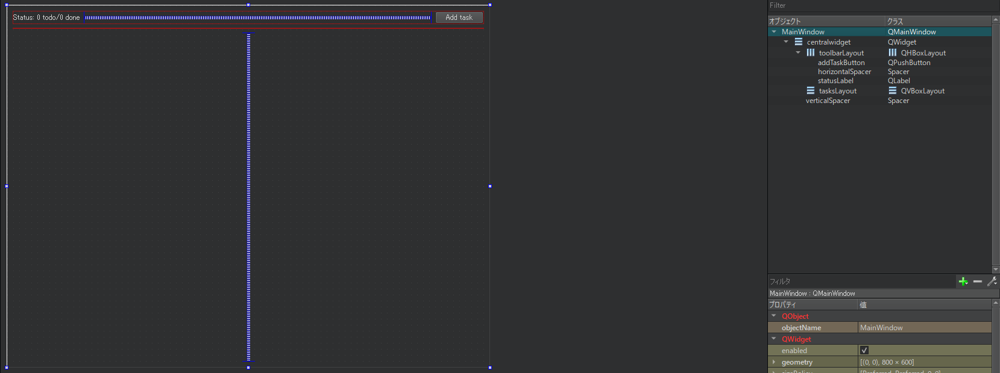

# タスクの追加

ここで、MainWindowのレイアウトを変更して、todoタスクを表示できるようにします。現在、タスクを表示するウィジェットはありません。MainWindow.uiファイルを開いて編集すると以下のようになります。



編集内容は下記のとおりです。
* toolbarLayoutとtasksLayoutを含むcentralWidgetの垂直レイアウト。
* 垂直方向のスペーサが上記のレイアウトを上に押し上げ、できるだけ小さなスペースになるようにする。
* 自動生成されたmenuBar、mainToolBar、statusBarは不要なため削除します。

オブジェクトインスペクタウィンドウでMainWindowを選択し、**QWidget**|**windowTitle**プロパティを編集してMainWindowのタイトルをTodoに変更することを忘れないでください。

## Qt tip

デザイナーモードでShift + F4キーを押すと、フォームエディタとソース表示が切り替わります。

これでMainWindow UIがタスクを受け入れる準備ができたので、コード部分に切り替えてみましょう。アプリケーションは新しいタスクを記憶しておく必要があります。MainWindow.hに以下を追加します。

```C++
#include <QMainWindow>
#include <QVector>

#include <task.h>

QT_BEGIN_NAMESPACE
namespace Ui { class MainWindow; }
QT_END_NAMESPACE

class MainWindow : public QMainWindow
{
    Q_OBJECT

public:
    MainWindow(QWidget *parent = nullptr);
    ~MainWindow();

public slots:
    void addTask();

private:
    Ui::MainWindow *ui;
    QVector<Task*> mTasks;
};
```

QVectorは動的配列を提供するQtコンテナクラスで、std::vectorに相当します。原則として、stlコンテナのほうがカスタマイズ性は高いですが、Qtコンテナに比べていくつかの機能が不足している可能性があります。C++11のスマートポインタを使用する場合は、stdコンテナを使用するべきですが、これについては後ほど説明します。

QVectorのQtドキュメントでは、次のような記述につまずくことがあるかもしれません。
「ほとんどの目的では、QListクラスを使うのが正しい選択です。」これについてはQtコミュニティで議論があります。

* 配列の先頭や途中にポインタよりも大きなオブジェクトを挿入する必要があることはよくありますか？ならばQListを使用しましょう。
* 連続したメモリ割り当てが必要ですか？CPUやメモリのオーバーヘッドを少なくしたいですか？ならばQVectorクラスを使用しましょう。

すでに追加されているスロットaddTask()は、新しいTaskオブジェクトをmTasksに追加するたびに呼び出される関数になりました。

addTaskButtonがクリックされるたびにQVectorのタスクを追加してみましょう。まず、MainWindow.cppファイル内のclocked()シグナルを接続します。

```C++
MainWindow::MainWindow(QWidget *parent)
    : QMainWindow(parent)
    , ui(new Ui::MainWindow)
    , mTasks()
{
    ui->setupUi(this);
    connect(ui->addTaskButton, &QPushButton::clicked, this, &MainWindow::addTask);
}
```

## C++ tip

ベストプラクティスとして、常にイニシャライザリストでメンバ変数を初期化し、変数宣言の順序を尊重するようにしてください。コードの実行速度が向上し、不要な変数のコピーを避けることができます。

addTask()関数は以下のようになります。

```C++
void MainWindow::addTask()
{
    qDebug() << "Adding new task";
    Task* task = new Task("Untitled task");
    mTasks.append(task);
    ui->tasksLayout->addWidget(task);
}
```

新しいタスクを作成し、それをmTaskベクタに追加しました。TaskはQWidgetなので、taskLayoutに直接追加しました。ここで注意すべきことは、この新しいタスクのメモリを管理していないということです。タスクの削除命令はどこにあるのでしょうか？これはこの章の最初のほうで説明したQtフレームワークの重要な機能で、QObjectクラスのparent化はオブジェクトの破棄を自動的に処理します。

QObjectクラスの親は自動的にオブジェクトの破棄を処理します。この場合、ui->tasksLayout->addWidget(task)コールには興味深い副作用があります。タスクのコンストラクタで定義されているQObject*の親はtasksLayoutになり、tasksLayoutが自分のメモリを解放したときにタスクのデストラクタが呼び出されます。

これは、正確には下記のタイミングで行われます。

```C++
MainWindow::~MainWindow()
{
    delete ui;
}
```

MainWindowが解放されると(main.cppファイルに割り当てられたスタック変数であることを覚えておいてください)、delete uiが呼び出され、その結果、QObject階層全体が破棄されます。この機能は興味深い結果をもたらします。第一にアプリケーションでQObjectのparentモデルを使用している場合、管理するメモリ量が大幅に減ります。第二に、この機能はC++11の新しいセマンティクス、特にスマートポインタと衝突する可能性があります。これについては後の章で詳しく説明します。

***
**[戻る](../index.html)**
