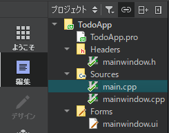
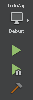
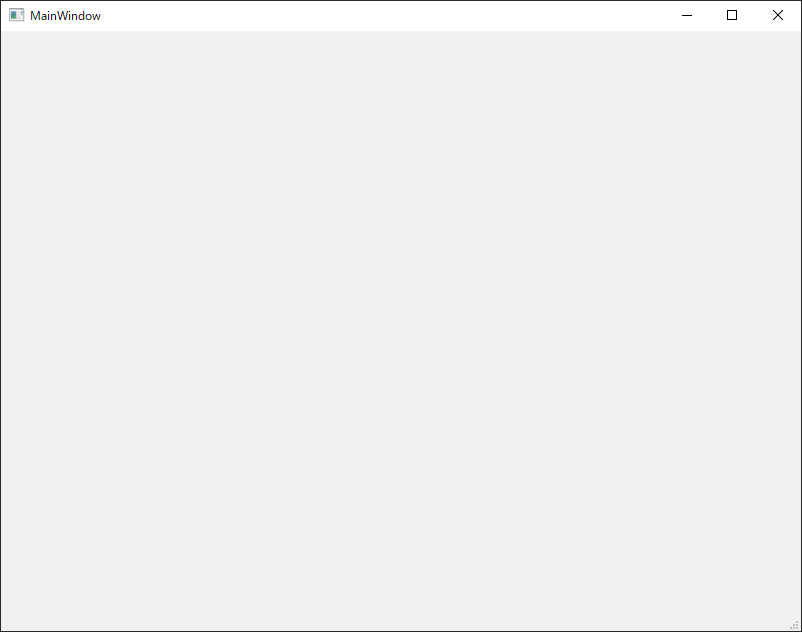

# プロジェクトの作成

まずQt Creatorを起動します。

Qt Creatorでは、「ファイル」→「ファイル/プロジェクトの新規作成」→「プロジェクト」内の「アプリケーション」→「Qt Widgets Application」を選択します。

ウィザードが以下の６ステップを案内してくれます。
1. **パス(プロジェクトパス)**:プロジェクト名と場所を選択します。
2. **ビルドシステム**:Qtで使用するビルドシステムを指定します。
3. **詳細(Class Information)**:基本クラスの情報と生成されるクラス名の指定。
4. **Translation(Translation File)**:翻訳言語とファイルの指定。(国際化しない場合は不要)
5. **キット(キットの選択)**:プロジェクトが対象とするプラットフォーム(デスクトップ、Androidなど)を選択します。
6. **概要(プロジェクト管理)**:新規プロジェクトをサブプロジェクトとして設定し、自動的にバージョン管理システムに追加する設定を行えます。

プロジェクト名以外はデフォルトで構いませんが、プロジェクト名には「todo」や「TodoApp」などのそれらしい名前をつけてください。

ウィザードが完了するとQt Creatorはいくつかのファイルが生成され、Project階層ビューでそれらを確認できます。



.proファイルはQtのプロジェクト設定ファイルです。Qtがqmakeを実行する際に使用されます。(その結果Makefileが生成されます)

基本的な.proファイルには、一般的に以下のような内容が含まれます。
* 使用されているQtモジュール(core、guiなど)
* ターゲット名(todo、todo.exeなど)
* プロジェクトテンプレート(app、libなど)
* ソースとヘッダとフォーム

QtとC++14の組み合わせにはいくつかの素晴らしい機能があります。GCCとCLANGコンパイラの場合は、C++14を有効にするには、次に示すようにQtプロジェクトファイル(.proファイル)でCONFIG += c++14を追加する必要があります。

```
QT       += core gui

greaterThan(QT_MAJOR_VERSION, 4): QT += widgets

CONFIG += c++14

DEFINES += QT_DEPRECATED_WARNINGS

#DEFINES += QT_DISABLE_DEPRECATED_BEFORE=0x060000    # disables all the APIs deprecated before Qt 6.0.0

SOURCES += \
    main.cpp \
    mainwindow.cpp

HEADERS += \
    mainwindow.h

FORMS += \
    mainwindow.ui

qnx: target.path = /tmp/$${TARGET}/bin
else: unix:!android: target.path = /opt/$${TARGET}/bin
!isEmpty(target.path): INSTALLS += target
```

MainWindow.hとMainWindow.cppファイルはMainWindowクラスのヘッダとソースで、ウィザードで生成されたデフォルトのGUIが含まれています。

MainWindow.uiファイルは、XML形式のUIデザインファイルです。Qt Designerを使用するとWYSIWIGエディタで簡単に編集することができます。

<br>

ここでmain.cppを示します。

```C++
#include "mainwindow.h"

#include <QApplication>

int main(int argc, char *argv[])
{
    QApplication a(argc, argv);
    MainWindow w;
    w.show();
    return a.exec();
}
```

当然main.cppにはプログラムエントリーポイントがあり、次の2つのアクションを実行します。
* メインウィンドウをインスタンス化して表示する
* QApplicationをインスタンス化し、ブロッキングメインイベントループを実行する

<br>

これは、Qt Creatorの左下のツールバーです。<br>


これはtodoアプリケーションをデバッグモードで実行する際に使用します。
1. プロジェクトがデバッグビルドモードになっていることを確認します。
2. ハンマーボタンを使ってプロジェクトをビルドします。
3. 緑色の再生ボタンを使ってデバッグを開始します。

すると空っぽのウィンドウが表示されます。このMainWindowがどのように構築されているかを説明したあとで、これを修正します。

<br>
空っぽのMainWindowのスクリーンショット

## Qt tip
* Ctrl + B(Windows/Linux)またはCommand + B(Mac)を押してプロジェクトをビルドできます。
* F5(Windows/Linux)またはCommand + R(Mac)を押してアプリケーションをデバッグモードで実行します。

***
**[戻る](../index.html)**
