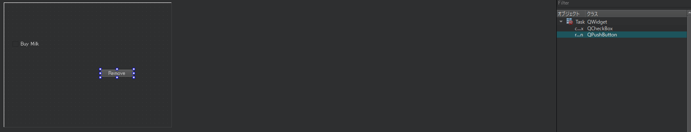
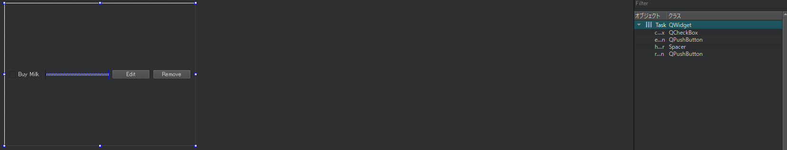

# カスタムQWidget

ここで、データ(タスク名と完了ステータス)を保持するTaskクラスを生成しなければなりません。このクラスは、フォームファイルをMainWindowとは別に作成します。Qt Creatorには基底クラスとそれに関連するフォームを自動生成するツールが用意されています。

**ファイル** → **ファイル**/**プロジェクトの新規作成** → **Qt** → **Qt Designerフォームクラス**をクリックします。いくつかのフォームテンプレートがありますが、Qt Creatorがtodoアプリケーションのプロジェクトを開始したときに作成してくれたMainWindowに見覚えがあるでしょう。Widgetを選択し、クラス名をTaskとし、次へをクリックします。
Qt Creatorは下記のことを行います。

1. Task.hファイルとTask.cppファイルの作成。
2. 関連するTask.uiを作成し、Task.hに接続するための結合作業を行う。
3. これら3つの新しいファイルを.proに追加し、コンパイル可能にする。

これでTaskクラスを実装する準部が整いました、まずはTask.uiを編集しましょう。
チェックボックス(objectNameにcheckboxと入力)とプッシュボタン(objectNameはremoveButton)をドラッグ&ドロップします。



この状態ではアイテムはうまく整列していません。ウィジェットをどのようにレイアウトするか、また、ウィンドウのジオメトリが変化した際(例えばユーザがウィンドウサイズを変更したときなど)にどのように反応するかを指定する必要があります、このために、Qtにはいくつかのデフォルトのレイアウトクラスが用意されています。

* **Vertical Layout**: このレイアウトでは、ウィジェットは垂直にスタックされます。
* **Horizontal Layout**: このレイアウトでは、ウィジェットは水平方向にスタックされます。
* **Grid Layout**: このレイアウトでは、ウィジェットは小さなセルに細分化できるグリッドに配置されます。
* **Form Layout**: このレイアウトでは、ウィジェットはウェブフォーム、ラベル、インプットのように配置されます。

すべてのレイアウトでは、すべてのウィジェットが等しい領域を占めるように配置されます。各ウィジェットの制約に応じてウィジェットの形状は変更されたり余白が追加されたりします。チェックボックスは引き延ばされませんが、プッシュボタンは引き延ばされます。

Taskオブジェクトでは、水平方向にスタックします。フォームエディタタブでウィンドウを右クリックして、**レイアウト** → **水平に並べる**を選択します。これで新しいウィジェットが追加されるたびに、ウィジェットが水平に配置されます。

チェックボックスオブジェクトの後ろにプッシュボタン(objectName=editButton)を追加します。

フォームエディタウィンドウでは、UIがどのようにレンダリングされるかをリアルにプレビューすることができます。ここでウィンドウを引き伸ばすと、各ウィジェットがこのイベントにどのように反応するかを観察できます。水平方向にリサイズすると、プッシュボタンが引き伸ばされていることに気づくでしょう。違和感がありますね。このボタンを引き伸ばさないことをレイアウトに「ヒント」することが必要です。スペーサーウィジェットを追加します。ウィジェットボックスにあるHorizintal Spacerをチェックボックスオブジェクトの後ろにドロップします。



スペーサは、隣接するウィジェットを(水平または垂直に)押して、可能な限りスペースを小さくする特別なウィジェットです。editButtonとremoveButtonオブジェクトは、テキストのスペースだけを占有するようになり、ウィンドウのサイズを変更したときにウィンドウの端に押し付けられます。

フォームに任意のタイプのレイアウトを追加して(垂直、水平、グリッド、フォーム)、ウィジェット、スペーサ、レイアウトを組み合わせて複雑な外観のアプリケーションを作成することができます。これらのツールは、異なるウィンドウの形状に適切に反応できる見栄えの良いデスクトップアプリケーションをデザインすることを目的としています。

これでDesignerの部分は終了したので、Taskのソースコードに切り替えます。Qt Design Formクラスを作成したので、TaskはUIと密接にリンクしています。これをこれをもとにしてモデルをまとめて保存していきます。Taskオブジェクト作成するにはタスク名が必要です。

```C++
#ifndef TASK_H
#define TASK_H

#include <QWidget>
#include <QString>

namespace Ui {
class Task;
}

class Task : public QWidget
{
    Q_OBJECT

public:
    explicit Task(const QString& name, QWidget *parent = nullptr);
    ~Task();
    
    void setName(const QString& name);
    QString name() const;
    bool isCompleted() const;
    
private:
    Ui::Task *ui;
};

#endif // TASK_H
```
コンストラクタではタスク名を指定していますが、オブジェクトの状態を保存するprivateフィールドはありません。これはすべてフォーム部分で行われます。また、フォームと相互作用するゲッタとセッタをいくつか追加しました。モデルはUIから完全に分離されているほうが良いのですが、この例ではそれらをマージするだけで十分にシンプルになります。さらに、タスクの実装の詳細は外部から隠されているので、後でリファクタリングすることができます。以下はTask.cppファイルの内容です。

```C++
#include "task.h"
#include "ui_task.h"

Task::Task(const QString &name, QWidget *parent) :
    QWidget(parent),
    ui(new Ui::Task)
{
    ui->setupUi(this);
    setName(name);
}

Task::~Task()
{
    delete ui;
}

void Task::setName(const QString &name)
{
    ui->checkbox->setText(name);
}

QString Task::name() const
{
    return ui->checkbox->text();
}

bool Task::isCompleted() const
{
    return ui->checkbox->isChecked();
}
```

この実装は簡単で、ui->checkboxに情報を格納し、name()およびisComplete()ゲッタはui->checkboxからデータを取得します。

***
**[戻る](../index.html)**
