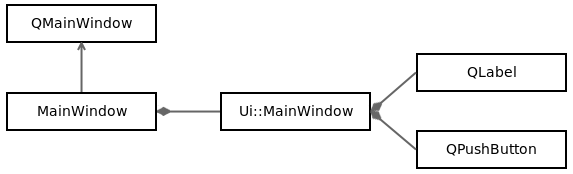

# MainWindowの構造

この自動生成されたクラスは、Qtのフレームワーク使用例として完璧かつシンプルです。前述したように、MainWindow.uiファイルはUIデザインを記述したもので、MainWindow.h/MainWindow.cppはUIで操作できるC++オブジェクトです。

ここで重要なのは、ヘッダファイルのMainWindow.hに注目することです。MainWindowオブジェクトはQtのQMainWindowクラスを継承しています。

```C++
#ifndef MAINWINDOW_H
#define MAINWINDOW_H

#include <QMainWindow>

QT_BEGIN_NAMESPACE
namespace Ui { class MainWindow; }
QT_END_NAMESPACE

class MainWindow : public QMainWindow
{
    Q_OBJECT

public:
    MainWindow(QWidget *parent = nullptr);
    ~MainWindow();

private:
    Ui::MainWindow *ui;
};
#endif // MAINWINDOW_H
```

このクラスはQMainWindowクラスを継承しているので、ヘッダファイルの上部に対応するインクルードを追加しています。続く部分はUi::MainWindowの前方宣言なので、ポインタを宣言しているだけです。

Q_OBJECTはQt開発者出ない人には少し奇妙に見えるかもしれませんが、このマクロはクラスが独自のシグナル/スロットを定義し、よりグローバルにQtのメタオブジェクトシステムを定義することを可能にします。これらの機能については、この章の後半で説明します。

このクラスは、publicなコンストラクタとデストラクタを定義しています。後者はかなり一般的ですが、コンストラクタにはparentパラメータを受け取ります。このパラメータはQWidgetポインタでデフォルトではnullptrです。

QWidgetはUIコンポーネントで、ラベル、テキストボックス、ボタンなどです。ウィンドウやレイアウト他のUIウィジェットの間に親子関係を定義しておくと、アプリケーションのメモリ管理が楽になります。この場合、親を削除するだけで十分なのですがデストラクタは子も削除し、その子も削除します。

MainWindowクラスは、QtフレームワークのQMainWidgetを継承しています。privateフィールドにはuiメンバ変数持ちます。この変数の型はUi::MainWindowのポインタで、Qtが生成したui_MainWindow.hファイルで定義されています。これはUIデザインファイルMainWindow.uiのC++変換されたものです。uiメンバ変数を使用すると、次の図のようにC++からUIコンポーネント(QLabelやQPushButtonなど)を操作できるようになります。



<br>

## C++ tip
クラスがクラス型に対してポインタや参照しか使わない場合は、前方宣言を使うことでヘッダを含めないようにすることができ、これによりコンパイル時間が大幅に短縮されます。

<br>

ヘッダの部分が終わったので、MainWindow.cppのソースファイルについて説明します。

次のコードでは、最初のincludeはクラスのヘッダです。2番めのincludeは生成されたクラスUi::MainWindowが必要とするincludeです。このincludeはヘッダでは前方宣言しかしていないので必須です。

```C++
#include "mainwindow.h"
#include "ui_mainwindow.h"

MainWindow::MainWindow(QWidget *parent)
    : QMainWindow(parent)
    , ui(new Ui::MainWindow)
{
    ui->setupUi(this);
}

MainWindow::~MainWindow()
{
    delete ui;
}
```

***
**[戻る](../index.html)**
