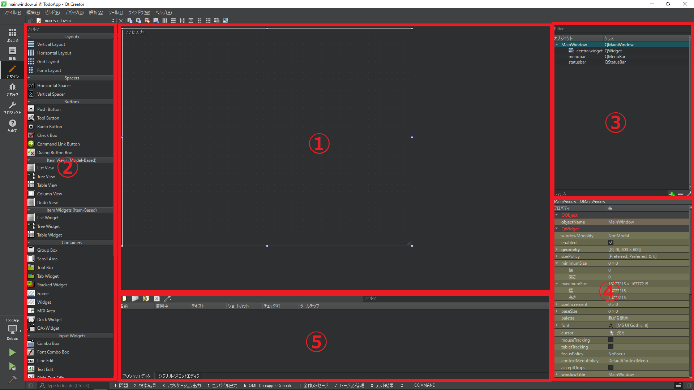
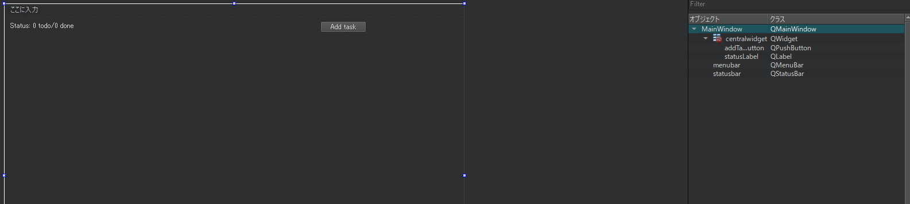

# Qt Designer

Qt Designerは、Qtアプリケーションを開発するための主要なツールです。このWYSIWYGエディタを使えば、GUIを簡単にデザインすることができます。MainWindow.uiファイルの編集モードとデザインモードを切り替えると、実際のXMLとデザイナーが表示されます。

デザイナはいくつかのパーツに分かれています。
* **フォームエディタ**:フォームの外観が表示されます。
* **ウィジェットボックス**:フォームで使用できるすべてのウィジェットが含まれています。
* **オブジェクトインスペクタ**:フォームを階層ツリーとして表示します。
* **プロパティエディタ**:選択されたウィジェットのプロパティを列挙します。
* **アクションエディタ/シグナル&スロットエディタ**:オブジェクト間の接続を処理します。

この空のウィンドウを飾るときが来ました。フォームのDisplay Widgetsセクションからlabelウィジェットをドラッグ&ドロップしてみましょう。プロパティエディタで名前とテキストのプロパティを変更することができます。

今回はtodoアプリケーションを作成しているので、下記の値をおすすめします。
* objectName: statusLabel
* text: Status 0 todo/0 done

このlabelは、後にtodoタスクの数と完了したタスクの数を表示します。
OK、保存してビルドし、アプリケーションを起動します。ウィンドウに新しいラベルが表示されるはずです。

これで以下のプロパティを持つプッシュボタンを追加できます。
* objectName: addTaskButton
* text: Add task

こんな感じになったはずです。

 

## Qt tip
ウィジェットをダブルクリックすることでウィジェットのtextプロパティを直接編集することが可能です。

***
**[戻る](../index.html)**
