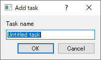

# QDialogの使用

私たちは、無題ではないタスクを提供したいと思っています。ユーザはタスクを作成するときにその名前を定義する必要があります。最も簡単な方法は、ユーザがタスク名を入力できるダイアログを表示することです。幸いなことに、QtはaddTask()にぴったりなダイアログを提供してくれます。

```C++
#include <QInputDialog>
...
void MainWindow::addTask()
{
    bool ok;

    QString name = QInputDialog::getText(this,
                                         tr("Add task"),
                                         tr("Task name"),
                                         QLineEdit::Normal,
                                         tr("Untitled task"),
                                         &ok);
    if (ok && !name.isEmpty()) {
        qDebug() << "Adding new task";
        Task* task = new Task(name);
        mTasks.append(task);
        ui->tasksLayout->addWidget(task);
    }
}
```

QInputDialog::getText関数は、ダイアログを表示するstaticなブロック関数です。ユーザがダイアログで確認/キャンセルすると、コードは続行されます。アプリケーションを実行して新しいタスクを追加しようとすると、このように表示されます。



QInputDialog::getTextのシグネチャは以下のようになります。

```C++
QString QInputDialog::getText(
    QWidget *parent,
     const QString &title,
      const QString &label,
       QLineEdit::EchoMode mode = QLineEdit::Normal,
        const QString &text = QString(),
         bool *ok = nullptr, ...)
```

内容を見てみましょう。

* **parent**: これはQInputDialogがアタッチされている親ウィジェット(MainWindow)です。これもQObjectクラスの親モデルのインスタンスです。
* **title**: ウィンドウに表示されるタイトルです。これは、ウィンドウのタイトルに表示されるタイトルです。この例ではtr("Add task")を使用していますが、これはQtがコードの中でi18nをどのように扱うかを示しています。与えられた文字列に対して複数の翻訳を提供する方法については後述します。
* **label**: これは入力テキストフィールドのすぐ上に表示されるラベルです。
* **mode**: 入力フィールドがどのように表示されるかを指定します(パスワードモードではテキストが非表示になります)。
* **ok**: これは変数へのポインタで、ユーザがOKを選択した場合はtrueに、Cancelを選択した場合はfalseに設定されます。

この例では無視しても問題ないオプションのパラメータが他にもいくつかあります。

***
**[戻る](../index.html)**

