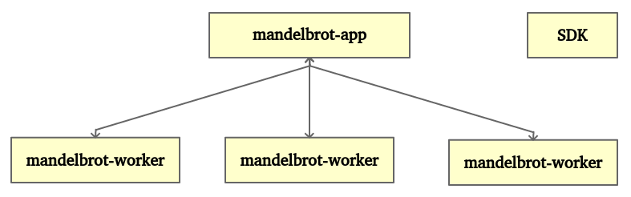
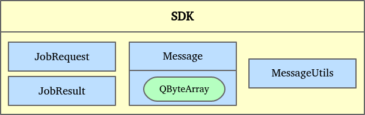
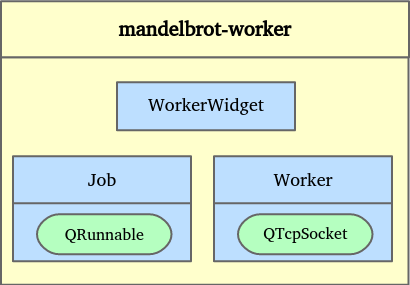
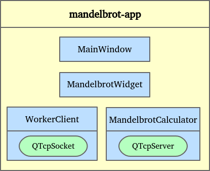

# IPCプロジェクトの構築

第9章「マルチスレッドで正気を保つ」のマンデルブロ画像生成装置は、コンピュータの全コアを使ってコンピューティングを高速化します。今回は、あなたのコンピュータのすべてのコアを使いたい!まず最初にやるべきことは、適切なIPC技法を選択することです。今回のプロジェクト例では、メインアプリケーションを実行しているサーバに対して、ワーカーとして機能する複数のクライアント間で通信を確立したいと考えています。TCP/IPソケットは、1対多の通信を可能にします。また、このIPC方式は1台のコンピュータに限定されず、ネットワークを介して複数のコンピュータ上で動作することができる。本プロジェクトの例では、マルチスレッドTCPサーバを実装し、ソケットを使用しています。

次の図では、アーキテクチャについて説明します。

それぞれの役者のグローバルな役割についてお話しましょう。

* mandelbrot-app: マンデルブロの絵を表示したり、ユーザのマウスイベントを処理したりするメインのアプリケーションです。ただし、この章では、このアプリケーションはアルゴリズム自体を計算するのではなく、接続されたワーカーへのリクエストを生成します。そして、ワーカーから提供された結果を集約します。
* mandelbrot-worker: ミニオンの登場です!ワーカーはスタンドアロンのプログラムです。TCP ソケットを介して mandelbrot アプリに接続しています。ワーカーはリクエストを受け取り、ジョブを計算し、結果を送り返します。
* SDK: これは、両方のアプリケーションで使用される共通のものを再グループ化します。SDKが変更された場合は、依存するすべてのアプリケーションを更新する必要があります。

ご覧のように、このアーキテクチャは、このプロジェクトで必要とされる 1 対多の通信に適しています。mandelbrot-appアプリケーションは、同じマンデルブロ図を生成するために、1人または多数のワーカーを使用することができます。

さて、全体像を把握したところで、各モジュールを詳しく見てみましょう。下図のように、SDKに含まれるすべてのクラスを見ることができます。

SDKは、複数のモジュール（アプリケーション、ライブラリなど）が一緒に通信したり、同じアクションを実行する必要がある場合に必要不可欠です。メインのソースコードを損なうことなく、SDK をサードパーティの開発者に提供することができます。このプロジェクトでは、mandelbrot-appとmandelbrot-workerはMessageを交換することで一緒に通信します。メッセージ構造は、両方のエンティティが知っている必要があります。Messageクラスは、typeとQByteArray型の生のdataを含んでいます。メッセージtypeに応じて、生データは空であったり、オブジェクトを含むことができます。このプロジェクトでは、メッセージ data は JobRequest または JobResult になります。mandelbrot-appはmandelbrot-workerにJobRequestを送信します。その後、ワーカーはメインアプリケーションに JobResult を返します。最後に、MessageUtilsには、メインアプリケーションとワーカーがMessageを送受信するために使用する関数が含まれています。

これでマンデルブロワーカーについてもっと詳しく説明できるようになりました。次の図で説明します。

mandelbrot-workerプログラムは、マシンのすべてのCPUコアを使用することができます。ソケット機構により、複数の物理マシン上で同時に実行することができます。WorkerWidgetクラスは、Workerオブジェクトの状態を表示します。Workerオブジェクトは、QTcpSocketを使ってmandelbrot-appとの通信を処理します。Jobはタスクを計算するQRunnableクラスです。このソフトウェアのワークフローは以下の通りです。

1. mandelbrot-appアプリケーションにレジスタ__Message__を送信します。
2. mandelbrot-appからいくつかのJobRequestを受け取り、すべてのタスクを完了するためにいくつかのJobインスタンスを作成します。
3. 各 Job は専用のスレッドで実行されており、JobResult を生成します。
4. JobResultをmandelbrot-appに送信します。
5. 終了時に、登録を解除した Message を mandelbrot-app に送信します。

これで、mandelbrot-appのアーキテクチャについて話をする時間になりました。次の図を見てください。

これがメインのアプリケーションです。CPUの弱いコンピュータでも起動でき、本当の重労働はマンデルブロットワーカーソフトウェアを実行しているワーカーが行います。GUIのMainWindowオブジェクトとMandelbrotWidgetオブジェクトは、第9章「マルチスレッドで正気を保つ」で紹介したものと同じです。MandelbrotCalculatorクラスは、QRunnable自体を実行しないので、このプロジェクトでは少し異なります。これは、登録されたすべてのワーカーを処理し、それらのタスクにタスクをディスパッチするTCPサーバです。各mandelbrot-workerは、専用のQTcpSocketを持つWorkerClientオブジェクトインスタンスによって管理されます。以下はmandelbrot-appのワークフローです。

1. 特定のポートでTCPサーバを実行します。
2. Register Messageを受信し、登録されたワーカーごとにWorkerClientオブジェクトを作成します。
3. MandelbrotWidgetがピクチャ生成を要求すると、MandelbrotCalculatorはマンデルブロのピクチャ全体を計算するために必要なJobRequestオブジェクトを作成します。
4. JobRequestオブジェクトはワーカーに送信されます。
5. マンデルブロワーカーからJobResultを受信して集計する。
6. 画像を表示するMandelbrotWidgetオブジェクトにJobResultを送信する。
7. ワーカーから登録解除されたMessageを受信した場合、WorkerClientオブジェクトが解放され、このワーカーはピクチャ生成に使用されなくなります。

これで、このプロジェクトのアーキテクチャの完全な概要を知ることができるはずです。このプロジェクトの実装を始めましょう。ch10-mandelbrot-ipcという**Subdirs**プロジェクトを作成します。ご想像の通り、mandelbrot-appとmandelbrotworkerの2つのサブプロジェクトを作成します。

以降のセクションでの実装は、アーキテクチャの提示順序に従います。

1. SDKを使用しています。
2. mandelbrot-worker。
3. mandelbrot-app。

実装は複雑さのステップアップです。全体的なアーキテクチャを明確に保つために、一休みしてこのセクションに戻ってくることを躊躇しないでください。

***

**[戻る](../index.html)
