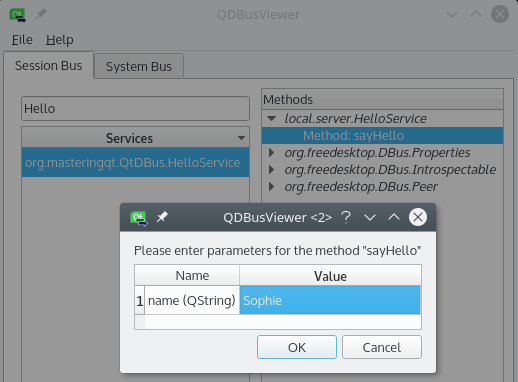

# 10.IPCが必要ですか？ミニオンを働かせましょう

前の章では、同じプロセスのスレッド間で情報を送信する方法を学びました。この章では、異なるプロセスのスレッド間でデータを共有する方法を学びます。さらに、異なる物理的なコンピュータ上で実行されているアプリケーション間で情報を共有します。第9章「マルチスレッドで正気を保つ」のマンデルブロ・ジェネレータ・アプリケーションを強化します。マンデルブロー・アプリケーションは、ワーカー・プログラムによって処理された結果のみを表示するようになりました。これらの手先プログラムの使命は一つだけです。それは、タスクをできるだけ速く計算して、結果をメインアプリケーションに返すことです。

この章で取り上げたトピックをご紹介します。

* 2つのアプリケーションがどのように通信できるか
* マルチスレッドTCPサーバの作成
* TCP ソケットでの読み書き
* QSharedMemory、QProcess、Qt D-Busのような他のIPC技術
* QDataStreamを使用したネットワークシリアライズ
* コンピュータクラスタリング
* プロセス間コミュニケーション技術

**IPC(プロセス間通信)**とは、2つ以上のプロセス間の通信です。これらのプロセスは、同じアプリケーションのインスタンスであっても、異なるアプリケーションのインスタンスであっても構いません。Qt フレームワークには、アプリケーション間の通信を実装するのに役立つ複数のモジュールが用意されています。これらのモジュールのほとんどはクロスプラットフォームです。ここでは、Qtが提供するIPCツールについて説明します。

最初のツールはTCP/IPソケットです。これは、ネットワーク上での双方向のデータ交換を提供します。したがって、異なるコンピュータ上のプロセスと対話するために使用することができます。さらに、loopbackインターフェイスを使用すると、同じコンピュータ上で実行されているプロセスと通信することができます。必要なクラスはすべて QtNetwork モジュールの中にあります。このテクニックは、クライアント・サーバー・アーキテクチャに依存しています。ここにサーバー部分の例を示します。

```C++
QTcpServer* tcpServer = new QTcpServer(this);
tcpServer->listen(QHostAddress::Any, 5000);

connect(tcpServer, &QTcpServer::newConnection, [tcpServer] {
    QTcpSocket *tcpSocket = tcpServer->nextPendingConnection();
    QByteArray response = QString("Hello").toLatin1();
    tcpSocket->write(response);
    tcpSocket->disconnectFromHost();
    qDebug() << "Send response and close the socket";
});
```

最初のステップは、QTcpServerクラスのインスタンスを作成することです。これは新しい着信TCP接続を扱います。次に、listen()関数を呼び出します。ネットワークインターフェースを指定し、サーバが着信接続をリッスンしなければならないポートを指定することができます。この例では、ポート 5000 のすべてのネットワークアドレス (例えば、127.0.0.0.1、192.168.1.4 など) をリッスンします。クライアントがこのサーバとの接続を確立すると、QTcpServer::newConnection()シグナルがトリガーされます。このラムダスロットを分解してみましょう。

1. クライアントとの新しい接続に関連するQTcpSocketクラスを取得します。
2. ASCIIメッセージ「Hello」でQByteArrayレスポンスを用意します。オリジナリティのなさは忘れてください。
3. ソケットを介してクライアントにメッセージを送信します。
4. 最後にソケットを閉じます。そうすると、こちら側のクライアントは、切断されてしまいます。

***

## Tips

QTcpServerクラスをテストするには、WindowsではPuttyのようなtelnetツール、LinuxやMac OSではtelnetコマンドを使用します。

***

以下のスニペットはクライアント部分です。

```C++
QTcpSocket *tcpSocket = new QTcpSocket(this);
tcpSocket->connectToHost("127.0.0.1", 5000);

connect(tcpSocket, &QTcpSocket::connected, [tcpSocket] {
    qDebug() << "connected";
});
connect(tcpSocket, &QTcpSocket::readyRead, [tcpSocket] {
    qDebug() << QString::fromLatin1(tcpSocket->readAll());
});
connect(tcpSocket, &QTcpSocket::disconnected, [tcpSocket] {
    qDebug() << "disconnected";
});
```

クライアントはまた、QTcpSocketクラスを使用して通信します。接続はクライアントによって開始されることが判明したので、サーバのアドレスとポートを指定して connectToHost() 関数を呼び出す必要があります。このクラスは、接続状態を示す connected() や disconnected() などの便利なシグナルをたくさん提供しています。readyRead() シグナルは、新しいデータが読み込めるようになったときに発行されます。readAll()関数は、利用可能なすべてのデータを含むQByteArrayを返します。この例では、サーバがクライアントに ASCII メッセージを送信していることがわかっています。したがって、このバイト配列を QString に変換して表示することができます。

この例では、サーバはTCPソケットに書き込み、クライアントはTCPソケットに読み込みます。しかし、この通信は双方向なので、クライアントもデータを書き込んで、サーバもデータを読むことができます。クライアントからデータを送信して、サーバに表示してみてください。サーバー部分のdisconnectFromHost()呼び出しを外して通信を継続させる必要があることに注意してください。

Qt フレームワークは、複雑なオブジェクトを簡単に送信し、パッケージの断片化を処理するためのヘルパークラス QDataStream を提供しています。この概念については、この章のプロジェクト例で後述します。

2つ目のIPC技術である**共有メモリ**について説明しましょう。デフォルトでは、異なるプロセスは同じメモリ空間を使用しません。QSharedMemoryクラスは、複数のプロセス間で共有メモリを作成して使用するためのクロスプラットフォームのメソッドを提供します。それにもかかわらず、プロセスは同じコンピュータ上で実行されなければなりません。共有メモリはキーによって識別されます。すべてのプロセスは、同じ共有メモリセグメントを共有するために同じキーを使用しなければなりません。最初のプロセスが共有メモリセグメントを作成し、その中にデータを入れます。

```C++
QString sharedMessage("Hello");
QByteArray sharedData = sharedMessage.toLatin1();

QSharedMemory* sharedMemory = new QSharedMemory(
    "sharedMemoryKey", this);
sharedMemory->create(sharedMessage.size());

sharedMemory->lock();

memcpy(sharedMemory->data(),
    sharedData.data(),
    sharedData.size());
sharedMemory->unlock();
```

全てのステップを一緒に分析してみましょう。

1. もう一度、QByteArrayクラスで変換したQString「Hello」を共有したいと思います。 
2. QSharedMemoryクラスをsharedMemoryKeyというキーで初期化します。2番目の処理では、この同じキーを使用する必要があります。
3. 最初のプロセスは、特定のサイズの共有メモリセグメントをバイト単位で作成します。
4. これで、ロック/アンロックシステムに自信が持てるようになりました。QSharedMemoryクラスは、共有アクセスを保護するためにセマフォを使用します。共有メモリを操作する前にロックする必要があります。
5. QByteArrayクラスからQSharedMemoryクラスにデータをコピーするために、古典的なmemcpy()関数を使用します。
6. 最後に共有メモリのロックを解除します。

QShareMemoryクラスを破棄すると、プロセスを共有メモリセグメントから切り離すdetach()関数が呼び出されます。このプロセスが最後にアタッチされたものである場合、detach()は共有メモリセグメントも破壊します。アタッチされたQShareMemoryが生きている間は、共有メモリセグメントは他のプロセスで利用可能です。次のスニペットでは、2番目のセグメントが共有メモリにアクセスする方法を説明します。

```C++
QSharedMemory* sharedMemory = new QSharedMemory(
    "sharedMemoryKey", this);
sharedMemory->attach();

sharedMemory->lock();

QByteArray sharedData(sharedMemory->size(), '\0');

memcpy(sharedData.data(),
    sharedMemory->data(),
    sharedMemory->size());
sharedMemory->unlock();

QString sharedMessage = QString::fromLatin1(sharedData);
qDebug() << sharedMessage;

sharedMemory->detach();
```

ここに重要なステップがあります。

1. 最初のプロセスと同様に、この2番目のプロセスでは、キーであるsharedMemoryKeyでQShareMemoryクラスを初期化します。
2. 次に、attach()関数を使用して、共有メモリセグメントにプロセスをアタッチします。
3. QShareMemoryクラスにアクセスする前に、QShareMemoryクラスをロックする必要があります。
4. QByteArrayに共有メモリのサイズをNULL文字である\0で初期化します。
5. memcpy()関数は、QShareMemoryからQByteArrayにデータをコピーします。
6. QByteArrayをQStringに変換して、メッセージを表示します。
7. 最後に detach()関数を呼び出して、共有メモリセグメントからプロセスを切り離します。

create()関数とattach()関数はデフォルトでQShareMemory::ReadWriteアクセスを指定していることに注意してください。また、QShareMemory::ReadOnlyアクセスを使用することもできます。

***

## Tips2

クラス、QBufferとQDataStreamを使用して、複雑なオブジェクトをバイト配列で、またはバイト配列からシリアライズすることができます。

***

もう一つのIPCの方法は、QProcessクラスを使用することです。メインプロセスは、子プロセスとして外部アプリケーションを起動します。通信は標準の入出力デバイスを使用して行われます。標準の入出力チャンネルに依存したhelloコンソールアプリケーションを作成してみましょう。

```C++
QTextStream out(stdout);
QTextStream in(stdin);

out << QString("Please enter your name:\n");
out.flush();

QString name = in.readLine();

out << "Hello " << name << "\n";
return 0;
```

QTextStreamクラスを使用して、標準ストリーム、stdout、stdinを簡単に操作することができます。アプリケーションは、Please enter your name:.というメッセージを表示します。その後、readLine()関数を呼び出して、ユーザが名前を入力するまで待ちます。最後に、プログラムは、メッセージHelloとユーザーnameを表示します。このコンソールアプリケーションを自分で起動した場合、自分の名前をキーボードに入力して、自分の名前のついた最終的なHelloメッセージを表示する必要があります。

以下のスニペットは、helloアプリケーションを実行して通信します。さらに、子のhelloアプリケーションをプログラム的に制御することができます。

```C++
QProcess* childProcess = new QProcess(this);

connect(childProcess,
    &QProcess::readyReadStandardOutput, [childProcess] {
        qDebug().noquote() << "[*]" << childProcess->readAll();
});

connect(childProcess, &QProcess::started, [childProcess] {
    childProcess->write("Sophie\n");
});

childProcess->start("/path/to/hello");
```

ここでは、このメインアプリケーションで実行されるすべてのステップを紹介します。

1. 外部アプリケーションを起動できるQProcessオブジェクトを初期化します。
2. 子プロセスはコンソールにメッセージを表示するので、標準出力に書き込みます。そして、READYReadStandardOutput()シグナルを送信します。この場合、子プロセスからのメッセージであることを識別するために、プレフィックス[*]を付けてデバッグテキストとして出力します。
3. 子プロセスが開始されるとすぐに、started()シグナルが送信されます。この例では、子プロセスの標準入力に Sophie という名前を書きます (Lenna が嫉妬するでしょう！)。
4. すべての準備ができたら、helloコンソールアプリケーションへのパスでQProcessクラスを起動することができます。

メインアプリケーションを起動すると、コンソールにこのような結果が表示されるはずです。

```shell
[*] Please enter your name:
[*] Hello Sophie
```

ミッション完了!メインアプリケーションはhelloアプリケーションのラッパーです。子プロセスからのすべてのメッセージを受け取り、特定の名前などの情報を子プロセスに送ることができます。

***

## Tips3

QProcess::start() 関数は、2 番目の変数である子プロセスのコマンドライン引数も受け付けます。

***

最後に一緒に扱うIPCの仕組みは、**D-Busプロトコル**です。現在、Qt の D-Bus モジュールは公式には Linux でのみサポートされています。Windowsで使用する場合は、Qtのソースからコンパイルする必要があります。IPCや**RPC(リモートプロシージャコール)**のための統一されたプロトコルと見ることができます。など、多くの形式の通信が可能です。

* マンツーマン
* 一対多
* 多対多

Qt D-Busの良いところは、バスをまたいでシグナル/スロットの仕組みまで使えることです。あるアプリケーションから発せられたシグナルを、別のアプリケーションのスロットに接続することができます。KDE や GNOME のような Linux デスクトップ環境は D-Bus を使用しています。つまり、D-Bus を使ってデスクトップをコントロールすることもできるということです。

D-Busの主な概念をご紹介します。

* Bus: 多対多の通信で使用されます。D-Busは**システムバス**と**セッションバス**の2つのバスを定義します。
* Service name: これはバス上のサービスの識別子です。
* Message: 1つのアプリケーションから送信されるメッセージです。バスが使用されている場合、メッセージには宛先が含まれています。

Qt D-Bus Viewerツールは、Qtのインストールフォルダ（例えば、/Qt/5.7/gcc_64/bin/qdbusviewer）にあります。システムとセッションバスのすべてのサービスからのすべてのオブジェクトとメッセージが表示されます。公開されたメソッドを呼び出して結果を取得してみてください。

Linux の D-Bus サービスをいじってみたところで、自分のサービスを作成してみましょう。まず、簡単な HelloService オブジェクトを作成します。

```C++
//HelloService.h
class HelloService : public QObject
{
    Q_OBJECT

public slots:
    QString sayHello(const QString &name);
};

//HelloService.cpp
QString HelloService::sayHello(const QString& name)
{
    qDebug().noquote() << name << " is here!";
    return QString("Hello %1!").arg(name);;
}
```

ここでは大したことはありません。唯一の関数は、nameを必要とし、誰がここにいるかを表示し、Helloメッセージを返すパブリック・スロットです。次のスニペットでは、メインアプリケーションが新しいD-BusサービスとHelloServiceオブジェクトを登録しています。

```C++
HelloService helloService;
QString serviceName("org.masteringqt.QtDBus.HelloService");

QDBusConnection::sessionBus().registerService(serviceName);
QDBusConnection::sessionBus().registerObject("/",
    &helloService, QDBusConnection::ExportAllSlots);
```

メインアプリケーションでは、HelloServiceオブジェクトを初期化します。次に、org.masteringqt.QtDBus.HelloServiceという名前の新しいサービスをセッションバスに登録します。最後に、HelloServiceオブジェクトを登録し、すべてのスロットを公開します。この例では、シンプルなオブジェクトパス/が使用されていることに注意してください。これでサービスアプリケーションの部分は終了です。HelloServiceオブジェクトを呼び出すクライアントアプリケーションです。

```C++
QString serviceName("org.masteringqt.QtDBus.HelloService");
QDBusInterface serviceInterface(serviceName, "/");
QDBusReply<QString> response = serviceInterface.call(
    "sayHello", "Lenna");
qDebug().noquote() << response;
```

クライアントの部分を段階的に分析してみましょう。

1. サービスアプリケーションと同じサービス名とパスでQDBusInterfaceオブジェクトを初期化します。
2. HelloService 上のリモートメソッド sayHello() を、パラメータ Lenna (待って、ソフィーはどこ？) を指定して呼び出します。
3. レスポンスはQDBusReplyオブジェクトに格納されます。私たちの場合は、QString 型です。
4. 最後に、HelloService オブジェクトで生成されたメッセージを表示します。

サービスアプリケーションを起動してからクライアントアプリケーションを起動すると、このようなコンソール出力が得られるはずです。

```C++
//service application output
Lenna is here!

//client application output
Hello Lenna!
```

QDBusViewerツールを使用してD-Busサービスを検索します。**セッションバス**タブを選択します。リストからサービスを選択します。次に、sayHelloメソッドを選択します。これを右クリックすると、メソッドを呼び出すことができます。入力ポップアップが表示され、この例では名前のメソッドパラメータを入力するように求められます。次のスクリーンショットは、それがどのように見えるかを示しています（Sophieがいるようです）。



***

**[戻る](../index.html)**
