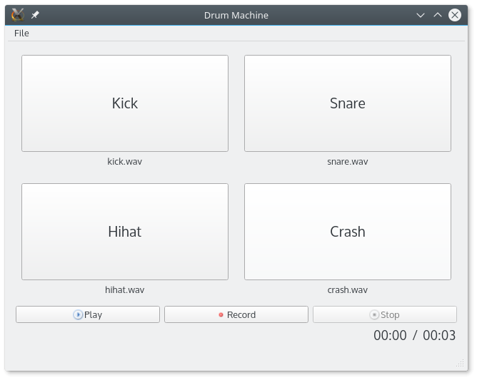

# マウスのドラッグ＆ドロップイベントを受け入れる

このプロジェクトの例では、SoundEffectWidget に .wav ファイルをドラッグ＆ドロップすると、再生されるサウンドを変更することができます。SoundEffectWidgetのコンストラクタは、ドラッグ＆ドロップを許可するための特定のタスクを実行します。

```C++
setAcceptDrops(true);
```

ドラッグ＆ドロップのコールバックをオーバーライドできるようになりました。まずは dragEnterEvent() 関数から始めてみましょう。

```C++
//SoundEffectWidget.h
class SoundEffectWidget : public QWidget
{
...
protected:
    void dragEnterEvent(QDragEnterEvent* event) override;
    ...
};

//SoundEffectWidget.cpp
void SoundEffectWidget::dragEnterEvent(QDragEnterEvent* event)
{
    if (event->mimeData()->hasFormat("text/uri-list")) {
        event->acceptProposedAction();
    }
}
```

dragEnterEvent() 関数は、ユーザがウィジェット上のオブジェクトをドラッグするたびに呼び出されます。私たちの場合は、MIMEタイプのファイルへのドラッグ＆ドロップのみを許可したいと考えています。"text/uri-list" (file://, http:// などの URI のリスト) の MIME タイプのファイルへのドラッグ＆ドロップのみを許可したいと考えています。この場合、QDragEnterEvent::acceptProposedAction()関数を呼び出して、このオブジェクトをドラッグ＆ドロップに受け入れることを通知することができますが、この場合は、QDragEnterEvent::acceptProposedAction()関数を呼び出すことができます。

これで、2 番目の関数 dropEvent() を追加することができます。

```C++
//SoundEffectWidget.h
class SoundEffectWidget : public QWidget
{
    ...
protected:
    void dropEvent(QDropEvent* event) override;
    ...
};

//SoundEffectWidget.cpp
void SoundEffectWidget::dropEvent(QDropEvent* event)
{
    const QMimeData* mimeData = event->mimeData();
    if (!mimeData->hasUrls()) {
        return;
    }
    const QUrl url = mimeData->urls().first();
    QMimeType mime = QMimeDatabase().mimeTypeForUrl(url);
    if (mime.inherits("audio/wav")) {
        loadSound(url);
    }
}
```

まずはサニティーチェックです。イベントにURLがない場合は何もしません。QMimeData::hasUrls()関数は、MIMEタイプ"text/uri-text"でのみtrueを返します。ユーザは一度に複数のファイルをドラッグ＆ドロップできることに注意してください。私たちの場合は、最初のURLだけを扱います。ファイルが .wav ファイルであることは、その MIME タイプで確認できます。MIME タイプが "audio/wav" であれば、loadSound() 関数を呼び出し、この SoundEffectWidget に割り当てられたサウンドを更新します。

次のスクリーンショットは、ch11-drum-machineの完全なアプリケーションを示しています。



***

## まとめ

シリアライズは、アプリケーションを閉じたときにデータを永続化するための良い方法です。この章では、QVariant を使用して C++ オブジェクトをシリアライズ可能にする方法を学びました。Bridge パターンを使用して、柔軟なシリアライズ構造を作成しました。オブジェクトを JSON や XML などの異なるテキスト形式で保存したり、バイナリ形式で保存したりしました。また、Qtマルチメディアモジュールを使って、いくつかの効果音を再生することも学びました。これらのサウンドは、マウスのクリックやキーボードのキーでトリガーすることができます。ファイルのドラッグ＆ドロップで新しいサウンドをロードできるように、ユーザーフレンドリーなインタラクションを実装しました。次の章では、QTest フレームワークと、アプリケーションとテストをきれいに分離できるようにプロジェクトを整理する方法を見ていきます。

***

**[戻る](../index.html)**
