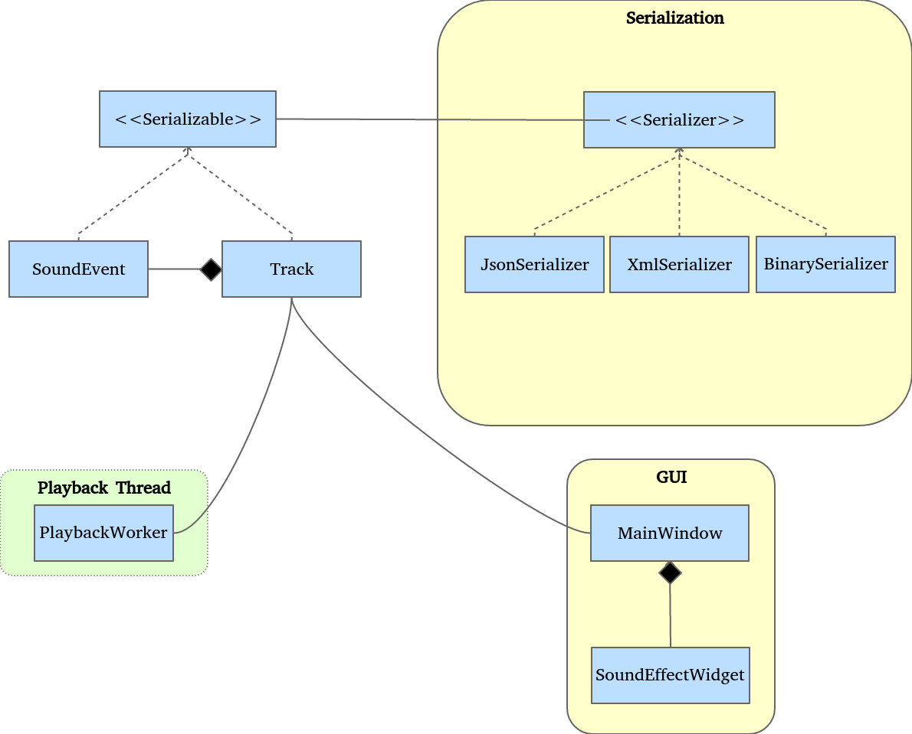

# ドラムマシンプロジェクトの構築

いつものように、コードに飛び込む前に、プロジェクトの構造を勉強してみましょう。このプロジェクトの目的は、できるようになることです。

* ドラムマシンからサウンドトラックを再生して録音する
* このトラックをファイルに保存し、それをロードして再生します。

サウンドを再生するために、クリック（またはキーボードイベント）時に特定のドラムサウンドを再生する4つの大きなボタン（キック、スネア、ハイハット、シンバルクラッシュ）を配置します。これらのサウンドは、アプリケーションによってロードされた.wavファイルになります。ユーザーは自分の一連の音を録音して再生することができます。

シリアライズの部分では、トラックを1つのファイル形式で保存するだけでなく、3つのファイル形式で保存したいと考えています。

* JSON (JavaScript Object Notation)
* XML (eXtensible Markup Language)
* Binary

3つのフォーマットを網羅した方が楽しいだけでなく、それぞれの利点や限界、Qtのフレームワークの中でどのようにフィットするのかを理解する機会にもなります。私たちが実装しようとしているアーキテクチャは、将来の進化に対応できるように柔軟性を持たせようとしています。プロジェクトがどのように進化していくかは、決してわかりません。

クラスの編成はこんな感じです。

これらのクラスの役割を見直してみましょう。

* SoundEvent クラスは、トラックの基本的な構成要素です。タイムスタンプ（いつサウンドが再生されたか）と soundId 変数（どのサウンドが再生されたか）を含むシンプルなクラスです。
* Trackクラスには、SoundEventsのリスト、デュレーション、状態（再生、録音、停止）が含まれています。ユーザーがサウンドを再生するたびに、SoundEventクラスが作成され、Trackクラスに追加されます。
* PlaybackWorker クラスは、別のスレッドで動作するワーカークラスです。Track クラスの soundEvents をループし、そのタイムスタンプに到達したときに適切なサウンドをトリガーします。
* Serializable クラスは、シリアル化したい各クラス（ここでは SoundEvent と Track）によって実装されなければならないインターフェースです。
* Serializerクラスは、各フォーマット固有の実装クラスが実装しなければならないインターフェースです。
* JsonSerializer、XmlSerializer、BinarySerializerはSerializerクラスのサブクラスで、Serializableインスタンスをシリアライズ/デシリアライズするフォーマット固有の仕事をします。
* SoundEffectWidgetクラスは、1つのサウンドを再生するための情報を保持するウィジェットです。これは、4つのサウンドのうちの1つのボタンを表示します。また、サウンドをオーディオカードに送信する QSoundEffect クラスも所有しています。
* MainWindow クラスはすべてのものを保持しています。Track クラスを所有し、PlaybackWorker スレッドをスポーンし、シリアライズ/デシリアライズをトリガーします。

出力形式は簡単にスワップできるようにする必要があります。これを実現するために、SerializableクラスとSerializerクラスが独立して進化できるようにするために、ブリッジデザインパターンの修正版に頼ることにします。

プロジェクト全体は、モジュール間の独立性という概念を中心に展開しています。再生中にその場で音を入れ替えることができるようになっています。例えば、あなたが素晴らしいビートを聴いていて、別のスネアサウンドを試したいとします。スネアサウンドを保持している SoundEffectWidget クラスに .wav ファイルをドラッグ＆ドロップするだけで、スネアサウンドを置き換えることができます。

***

**[戻る](../index.html)**
