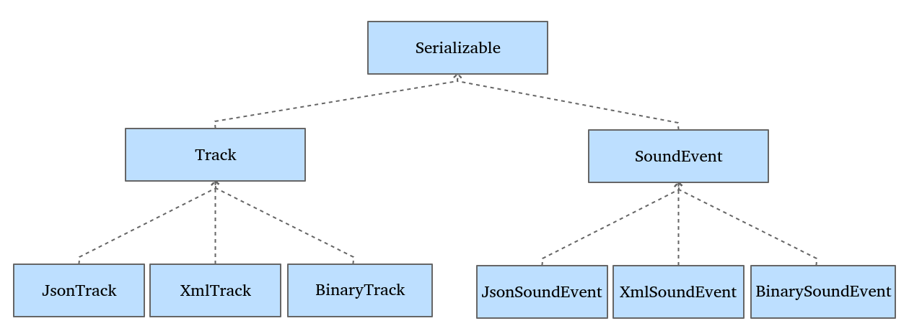
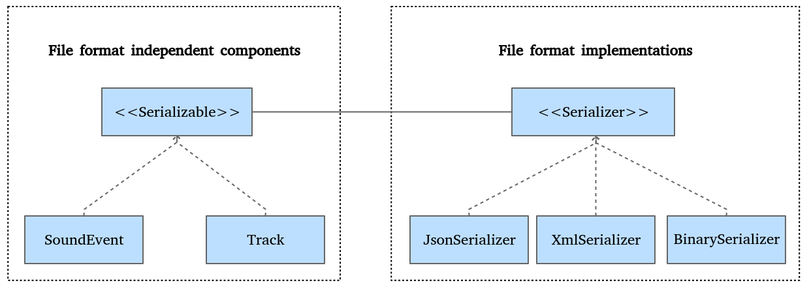

# JSON形式でのオブジェクトのシリアライズ

TrackクラスとSoundEventクラスを共通のQt形式のQVariantに変換できるようになりました。これで、Track (とそのSoundEventオブジェクト) クラスをテキストまたはバイナリ形式のファイルに記述する必要があります。このサンプルプロジェクトでは、すべてのフォーマットを扱うことができます。保存したファイルのフォーマットを一行で切り替えることができるようになります。では、どこに特定のフォーマットのコードを置くのでしょうか？それが100万ドルの問題です。ここに主なアプローチがあります。



この命題では、特定のファイル・フォーマットのシリアライズ・コードは専用の子クラスの中にあります。さて、それはうまくいきますが、もし2つの新しいファイル・フォーマットを追加した場合、階層はどのようになるでしょうか？さらに、シリアル化する新しいオブジェクトを追加するたびに、異なるシリアル化ファイル形式を処理するための子クラスをすべて作成しなければなりません。この巨大な継承ツリーは、すぐに厄介なものになってしまいます。コードはメンテナンスできなくなります。そんなことはしたくないでしょう。そこで、ここでブリッジパターンが良い解決策になります。



ブリッジパターンでは、2つの継承階層でクラスをデカップリングします。

* ファイル形式から独立したコンポーネントです。SoundEventとTrackオブジェクトは、JSON、XML、またはバイナリ形式を気にしません。
* ファイル形式の実装。JsonSerializer、XmlSerializer、BinarySerializerは、一般的なフォーマットであるSerializableを扱い、SoundEventやTrackのような特定のコンポーネントではありません。

古典的なブリッジパターンでは、抽象化(Serializable)は実装者(Serializer)変数を含むべきであることに注意してください。呼び出し元は抽象化を扱うだけです。しかし、このプロジェクトの例では、MainWindow は Serializable の所有権と Serializer の所有権を持っています。これは、デザインパターンの力を利用しながら、機能クラスを分離しないようにするための個人的な選択です。

SerializableとSerializerのアーキテクチャは明確です。Serializableクラスはすでに実装されているので、Serializer.hという新しいC++ヘッダーファイルを作成することができます。

```C++
#include <QString>

#include "Serializable.h"

class Serializer
{
public:
    virtual ~Serializer() {}

    virtual void save(const Serializable& serializable,
        const QString& filepath,
        const QString& rootName = "") = 0;
    virtual void load(Serializable& serializable,
        const QString& filepath) = 0;
};
```

Serializer クラスはインターフェイスであり、純粋な仮想関数のみを持ち、データを持たない抽象クラスです。今回はsave()関数の話をしましょう。

* この関数は、Serializable をハードディスク上のファイルに保存します。
* Serializable クラスは const であり、この関数では変更できません。
* filepath関数は作成先のファイルを示します。
* Serializerの実装によっては、rootName変数を使用できるものもあります。例えば、Trackオブジェクトの保存を要求した場合、rootName変数は文字列trackにすることができます。これは、ルート要素の書き込みに使用されるラベルです。XML の実装ではこの情報が必要です。

load()関数もわかりやすいです。

* この関数は、ファイルからデータをロードして、Serializable クラスを埋めます。 
* Serializable クラスはこの関数によって更新されます。
* filepath 関数は、どのファイルを読み込むかを示します。

インターフェイスSerializerの準備が整い、いくつかの実装を待っています!まずはJSONを使ってみましょう。C++クラスJsonSerializerを作成します。以下がJsonSerializer.hのヘッダです。

```C++
#include "Serializer.h"

class JsonSerializer : public Serializer
{
public:
    JsonSerializer();
    void save(const Serializable& serializable,
    const QString& filepath,
    const QString& rootName) override;
    void load(Serializable& serializable,
    const QString& filepath) override;
};
```

ここでは難しいことはありません。save() と load() の実装を提供しなければなりません。ここに save() の実装があります。

```C++
void JsonSerializer::save(const Serializable& serializable,
    const QString& filepath, const QString& /*rootName*/)
{
    QJsonDocument doc =
        QJsonDocument::fromVariant(serializable.toVariant());
    QFile file(filepath);
    file.open(QFile::WriteOnly);
    file.write(doc.toJson());
    file.close();
}
```

Qtフレームワークでは、QJsonDocumentクラスを使ってJSONファイルを読み書きする素敵な方法を提供しています。QVariant クラスから QJsonDocument クラスを作成することができます。QJsonDocument が受け入れる QVariant は QVariantMap、QVariantList、または QStringList でなければならないことに注意してください。TrackクラスとSoundEventのtoVariant()関数がQVariantMapを生成してくれるので心配ありません。あとは、保存先のファイルパスを指定してQFileファイルを作成すればOKです。これをQJsonDocument::toJson()関数でUTF-8エンコードされたテキスト表現に変換します。この結果をQFileファイルに書き込み、ファイルを閉じます。

***

## Tips

QJsonDocument::toJson() 関数は、Indented または Compact JSON フォーマットを生成することができます。デフォルトでは、フォーマットは QJsonDocument::Indented です。

***

load()の実装も短い。

```C++
void JsonSerializer::load(Serializable& serializable,
    const QString& filepath)
{
    QFile file(filepath);
    file.open(QFile::ReadOnly);
    QJsonDocument doc = QJsonDocument::fromJson(file.readAll());
    file.close();
    serializable.fromVariant(doc.toVariant());
}
```

ソースファイルパスでQFileを開きます。QFile::readAll()で全てのデータを読み込みます。そして、QJsonDocument::fromJson()関数でQJsonDocumentクラスを作成します。最後に、QVariantクラスに変換されたQJsonDocumentでSerializableを埋めることができます。QJsonDocument::toVariant()関数は、JSONドキュメントの性質に応じてQVariantListまたはQVariantMapを返すことができることに注意してください。

このJsonSerializerで保存されたTrackクラスの例です。

```json
{
    "duration": 6205,
    "soundEvents": [
        {
        "soundId": 0,
        "timestamp": 2689
        },
        {
        "soundId": 2,
        "timestamp": 2690
        },
        {
        "soundId": 2,
        "timestamp": 3067
        }
    ]
}
```

ルート要素はJSONオブジェクトで、2つのキーを持つマップで表されます。

* Duration: これは単純な整数値
* soundEvents: これはオブジェクトの配列です。各オブジェクトは以下のキーを持つマップです。
  * soundId: これは整数
  * timestamp: これも整数

***

**[戻る](../index.html)**
