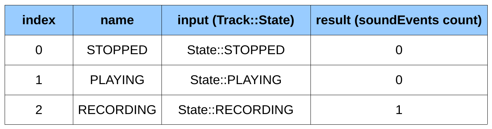

# データセットを用いた因数分解検定の記述

ここからは、トラッククラスのテストに注目していきます。ここでは、トラッククラスが持つ様々な状態に焦点を当てていきます。STOPPED、PLAYING、RECORDING です。それぞれの状態について、適切な状態（RECORDING）でなければ、SoundEvents を追加することができないことを確認したいと思います。

そのためには、以下のようなテスト関数を書けばいいのです。

* testAddSoundEvent(): この関数は、トラックをSTOPPED状態にし、track.addSoundEvent(0)を呼び出し、track.soundEvents().size == 0をチェックします。
* testAddSoundEvent(): この関数は、トラックを再生状態にし、track.addSoundEvent(0)を呼び出し、track.soundEvents().size == 0をチェックします。
* testAddSoundEvent(): この関数は、トラックをレコーディング状態にし、track.addSoundEvent(0)を呼び出し、track.soundEvents().size == 1をチェックします。

ご覧のように、ロジックは同じで、入力と出力を変更するだけです。これを因数分解するために、Qt Test にはもう一つのモジュール、データセットが用意されています。

データセットは2次元の表として見ることができ、各行がテストで、列が入力と期待される出力です。Track状態のテストでは、次のようになります。



このアプローチでは、addSoundEvent() テスト関数を1つ書き、Qt Testがこのテーブルを反復処理して結果を比較します。今のところ、これは魔法のように思えます。それでは実装してみましょう。

TestJsonSerializer クラスで使用されているのと同じパターン（QObject を継承し、QTest を含む）に従って、TestTrack という名前の新しい C++ クラスを作成します。TestTrack.h を以下のように更新します。

```C++
class TestTrack : public QObject
{
    Q_OBJECT
public:
    explicit TestTrack(QObject *parent = 0);

private slots:
    void addSoundEvent_data();
    void addSoundEvent();
};
```

ここでは2つの機能を追加しました。

* addSoundEvent_data(): これは、実際のテスト用のデータセットを埋める関数です。
* addSoundEvent(): テストを実行する関数です。

ご覧のように、与えられた xxx() 関数のデータセットを埋める関数は、xxx_data() という名前でなければなりません。それでは、addSoundEvent_data()の実装を見てみましょう。

```C++
void TestTrack::addSoundEvent_data()
{
    QTest::addColumn<int>("trackState");
    QTest::addColumn<int>("soundEventCount");

    QTest::newRow("STOPPED")
        << static_cast<int>(Track::State::STOPPED)
        << 0;
    QTest::newRow("PLAYING")
        << static_cast<int>(Track::State::PLAYING)
        << 0;
    QTest::newRow("RECORDING")
        << static_cast<int>(Track::State::RECORDING)
        << 1;
}
```

ご覧のように、データセットはテーブルのように構成されています。まず、テーブルの構造を trackState と soundEventCount カラムで定義することから始めます。QTest::addColumn は、変数の型（どちらの場合も int）を知るためにテンプレート化に依存していることに注意してください。

その後、QTest::newRow()関数を使用して、テスト名をパラメータとして渡して、テーブルに行が追加されます。QTest::newRow構文は << 演算子をサポートしているので、指定した行のすべてのデータを簡単にまとめることができます。

データセットに追加された各行は、その行のデータが利用可能になるaddSoundEvent()関数の実行に対応していることに注意してください。

ここで、addSoundEvent()に注目してみましょう。

```C++
void TestTrack::addSoundEvent()
{
    QFETCH(int, trackState);
    QFETCH(int, soundEventCount);

    Track track;
    switch (static_cast<Track::State>(trackState)) {
    case Track::State::STOPPED:
        track.stop();
        break;
    case Track::State::PLAYING:
        track.play();
        break;
    case Track::State::RECORDING:
        track.record();
        break;
    default:
        break;
    }

    track.addSoundEvent(0);
    track.stop();

    QCOMPARE(track.soundEvents().size(),
             static_cast<size_t>(soundEventCount));
}
```

addSoundEvent()はQTestによって実行され、データセットのデータが供給されるので、データベース上のカーソルで行うように、データセットの現在の行に安全にアクセスすることができます。QFETCH(int, trackState)は、2つのことを行う便利なマクロです。

* trackStateという名前のint変数を宣言します。
* データセットの現在のカラムインデックスデータを取得し、その内容をtrackStateに格納します。

soundEventCount にも同じ原理が適用されます。これで、希望するトラックの状態と予想されるサウンドイベント数がわかったので、実際のテストに進むことができます。

1. トラックを trackState に従って適切な状態にします。呼び出し元の命令（stop(), play(), record()）に基づいて、Track キーワードが trackState 変数を単独で処理するため、Track::setState() 関数はプライベートであることを覚えておいてください。
2. TrackにSoundEventを追加してみる。
3. トラックを停止します。
4. トラック内のSoundEventの数と、SoundEventCountで期待される数を比較します。

main.cppにTestTrackクラスを追加することを忘れないでください。

```C++
#include "TestJsonSerializer.h"
#include "TestTrack.h"

...

int main(int argc, char *argv[])
{
    ...
    map<QString, unique_ptr<QObject>> tests;
    tests.emplace("jsonserializer",
                  make_unique<TestJsonSerializer>());
    tests.emplace("track",
                  make_unique<TestTrack>());
    ...
}
```

これでテストを実行して、addSoundEvent()の3つのテストがコンソールに結果を出力するのを見ることができます。

```
 PASS : TestTrack::addSoundEvent(STOPPED)
 PASS : TestTrack::addSoundEvent(PLAYING)
 PASS : TestTrack::addSoundEvent(RECORDING)
```

データセットは、1つのテストのためのデータのバリエーションを因数分解することで、テストの書き込みを鈍らせません。

また、コマンドラインを使って、データセットの特定のエントリに対する単一のテストを実行することもできます。

```shell
$ ./drum-machine-test <testfunction>:<dataset entry>
```

TestTrackからテスト関数addSoundEvent()をRECORDINGの状態だけで実行したいとします。実行するコマンドラインは以下の通りです。

```shell
$ ./drum-machine-test -select track addSoundEvent:RECORDING
```

***

**[戻る](../index.html)**
