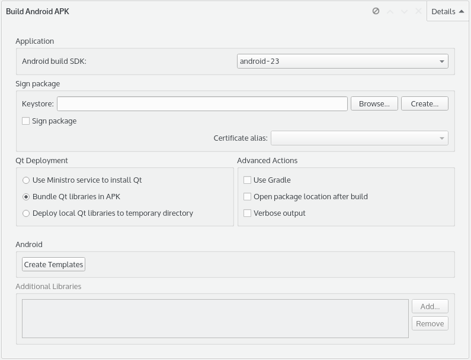
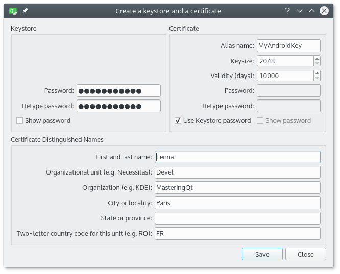
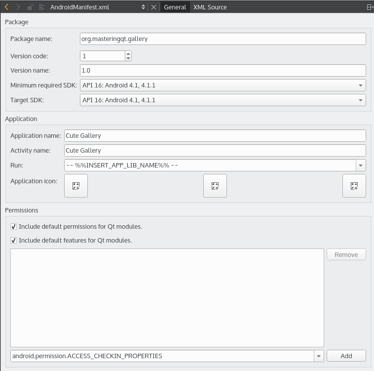
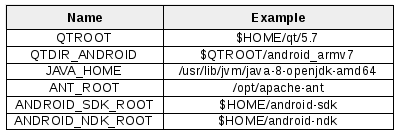

# Android用パッケージ

このセクションの目的は、gallery-mobileアプリケーション用のスタンドアロンAPKファイルを生成することです。Android用のアプリケーションをパッケージ化してデプロイするには、複数のステップが必要です。

1. Android ビルドの詳細を設定します。
2. 鍵ストアと証明書を生成します。
3. テンプレートからAndroidマニフェストをカスタマイズします。
4. パッケージ化を自動化するスクリプトを作成します。

Qt Creatorから直接ほとんどの作業を行うことができます。フードの下では、Qtツールであるandroiddeployqtが呼び出され、APKファイルが生成されます。**プロジェクト｜Android for armeabi-v7a｜ビルドステップ**に移動します。特別なビルドステップが表示されるはずです。**Build Android APK**と表示されるはずです。詳細は以下のスクリーンショットのようになります。



まず、どのAndroid APIレベルを使用して**アプリ**を生成するかを選択します。私たちの場合、Android APIレベルは**android-23**を選択しました。常に利用可能な最新のSDKバージョンでアプリケーションをビルドするようにしてください。

アプリケーションをPlayストアで公開するには、パッケージに署名する必要があります。アプリケーションをアップデートするには、現在のバージョンと新しいバージョンの署名が同じでなければなりません。この手順は、アプリケーションの将来のバージョンが本当にあなたによって作成されたものであることを確認するための保護です。最初にキーストアを作成しておけば、次回からは［**参照...**］ボタンで再利用できるようになります。とりあえず、**Sign package |Keystore**行の**Create...**ボタンをクリックします。すると、以下のようなポップアップが表示されます。



以下の手順に従って、新しいキーストアを生成してください。

1. キーストアはパスワードで保護されている必要があります。パスワードを忘れないようにしてください。

2. 証明書の**エイリアス名**を指定します。**Keysize**、**Validity(days)**はデフォルトの値で構いません。証明書に別のパスワードを指定したり、鍵ストアのパスワードを使用したりすることができます。
3. **Certificate Distinguished Names**グループには、あなたとあなたの会社に関する情報を入力してください。
4. キーストアファイルを安全な場所に保存します。
5. キーストアのパスワードを入力して、配置の選択を確認します。

次の部分は、**Qt のデプロイ**に関するものです。確かに、アプリケーションにはQtのライブラリが必要です。Qtは3種類のデプロイメントをサポートしています。

* Qtの依存関係を**Ministro**に依存したミニマルなAPKを作成します。Ministroは、PlayストアからダウンロードできるAndroidアプリケーションです。Android上のすべてのQtアプリケーションのためのQt共有ライブラリのインストーラ/プロバイダとして機能します。
* Qt ライブラリを埋め込むスタンドアロンバンドル APK を作成します。
* Qtライブラリが特定のディレクトリにあるという事実に依存するAPKを作成します。ライブラリは最初のデプロイ時に一時ディレクトリにコピーされます。

開発とデバッグの段階では、パッケージ化の時間を短縮するために**一時ディレクトリ**の方法を選択する必要があります。デプロイメントの場合は、**Ministro**または**バンドル**オプションを使用することができます。私たちのケースでは、完全なAPKを生成するためにスタンドアロンバンドルを選択しました。

**詳細アクション** ペインには、3 つのオプションがあります。

* **Use Gradle**: このオプションは、Android StudioなどのIDEでJava部分をカスタマイズする場合に便利なGradleラッパーとスクリプトを生成します。
* **Open package location after build**: このオプションは、androiddeployqtによって生成されたパッケージのあるディレクトリを開きます。
* **Verbose Output**: このオプションは、androiddeployqt処理に関する追加情報を表示します。

Androidビルドの詳細と署名オプションが完成しました。これでAndroidマニフェストをカスタマイズすることができます。**テンプレートの作成**をクリックし、gallery-mobile.proファイルを選択し、**完了**をクリックします。ウィザードは、いくつかのファイル（例えば、AndroidManifest.xmlなど）を含むandroidのサブディレクトリを作成します。gallery-mobile.proファイルは、これらのファイルで自動的に更新されなければなりません。ただし、次のスニペットのようにandroidスコープを追加することを忘れないでください。

```QMake
TEMPLATE = app
...
android {
    contains(ANDROID_TARGET_ARCH,x86) {
        ANDROID_EXTRA_LIBS = \
            $$[QT_INSTALL_LIBS]/libQt5Sql.so
    }

    DISTFILES += \
        android/AndroidManifest.xml \
        android/gradle/wrapper/gradle-wrapper.jar \
        android/gradlew \
        android/res/values/libs.xml \
        android/build.gradle \
        android/gradle/wrapper/gradle-wrapper.properties \
        android/gradlew.bat

    ANDROID_PACKAGE_SOURCE_DIR = $$PWD/android
}
```

AndroidManifest.xmlファイルを編集できるようになりました。Qt Creatorには専用のエディタが用意されています。プレインテキストエディタでも注意しながら編集できます。階層化されたプロジェクトビュー：**gallery-mobile**｜**その他のファイル**｜**android**から開くことができます。

Qt CreatorでのAndroidマニフェストです。



ここでは、最も重要なステップをご紹介します。

1. デフォルトの**パッケージ名**をあなたのものに置き換えてください。
2. **バージョンコード**は整数で、公式リリースごとに増加させなければなりません。
3. **バージョン名**はユーザーに表示されるバージョンです。
4. **Minimum required SDK**を選択します。古いバージョンのユーザーは、アプリケーションをインストールすることができません。
5. **ターゲットSDK**を使用してアプリケーションをコンパイルするSDKを選択します。
6. アプリケーション名とアクティビティ名を変更します。
7. 画面のDPI(Dots per Inch)に応じて**アプリケーションのアイコン**を選択します。左から順に、低、中、高DPIのアイコンが表示されます。
8. 最後に、アプリケーションによって必要な場合は、いくつかのAndroidの権限を追加することができます。

すでにQt Creatorから署名済みのアプリケーションをビルドしてデプロイすることができます。Android携帯やエミュレータ上に新しいアプリケーション名とアイコンが表示されているはずです。しかし、ここからはコマンドラインから簡単に署名付きAPKを生成してパッケージ化するスクリプトを作成していきます。

Android や Qt ツールだけでなく、スクリプト自体にもいくつかの環境変数が必要になります。以下に例を挙げてまとめてみました。



この例は bash スクリプトですが、Windows を使用している場合は .bat ファイルに変換してください。scripts ディレクトリに package-android.sh ファイルを作成します。

```shell
#!/bin/bash

DIST_DIR=dist/mobile-android
BUILD_DIR=build
APK_DIR=apk
KEYSTORE_PATH="$(pwd)/scripts/android-data"
ANDROID_BUILD_PATH="$(pwd)/$DIST_DIR/$BUILD_DIR/android-build"

mkdir -p $DIST_DIR && cd $DIST_DIR
mkdir -p $APK_DIR $BUILD_DIR

pushd $BUILD_DIR
$QTDIR_ANDROID/bin/qmake \
    -spec android-g++ \
    "CONFIG += release" \
    ../../../ch13-gallery-packaging.pro
make qmake_all
pushd gallery-core && make ; popd
pushd gallery-mobile && make ; popd
pushd gallery-mobile && make INSTALL_ROOT=$ANDROID_BUILD_PATH install ;
popd

$QTDIR_ANDROID/bin/androiddeployqt
    --input ./gallery-mobile/android-libgallery-mobile.so-deploymentsettings.json \
    --output $ANDROID_BUILD_PATH \
    --deployment bundled \
    --android-platform android-23 \
    --jdk $JAVA_HOME \
    --ant $ANT_ROOT/ant \
    --sign $KEYSTORE_PATH/android.keystore myandroidkey \
    --storepass 'masteringqt'
cp $ANDROID_BUILD_PATH/bin/QtApp-release-signed.apk ../apk/cute-gallery.apk
popd
```

このスクリプトを一緒に分析してみましょう。

1. メインパスの変数を設定します。出力ディレクトリはdist_dirです。すべてのファイルは dist/mobile-android/build ディレクトリに生成されます。最終的に署名されたAPKは、dist/mobile-android/apkディレクトリにコピーされます。
2. すべてのディレクトリを作成し、dist/mobile-android/buildに移動します。
3. Androidプラットフォームのリリースモードでqmakeを実行し、親プロジェクトのMakefileを生成します。
4. make qmake_all コマンドを実行して、サブプロジェクトの Makefiles を生成します。
5. make コマンドを実行して、必要な各サブプロジェクトを構築します。
6. gallery-mobileディレクトリのmake installコマンドを実行し、install_rootを指定して、APK生成に必要なすべてのバイナリとファイルをコピーします。

スクリプトの最後の部分は、APKを生成するためのQtツールであるandroiddeployqt binaryを呼び出します。以下のオプションを見てみましょう。

ここで使用する --deployment オプションは、Qt Creator で使用したモードのように bundled になっています。-signオプションには2つのパラメータを指定します：鍵ストアファイルのURLと証明書の鍵のエイリアスです。-storepassオプションは、鍵ストアのパスワードを指定するために使用します。この例では、パスワードは "masteringqt "です。

最後に、生成された署名付きAPKをdist/mobile-android/apkディレクトリにcute-gallery.apkという名前でコピーします。

***

**[戻る](../index.html)**
