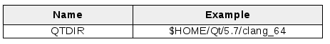

# Mac OS X用パッケージ

OS X では、アプリケーションはバンドルからビルドされ、実行されます。Finderでは、これらのバンドルは.app特別ディレクトリとして表示されます。

Qt Creatorからgallery-desktopを実行すると、アプリケーションはすでに.appファイルにバンドルされています。gallery-coreというカスタムライブラリを使用しているため、このgallery-desktop.appにはすべての依存関係が含まれておらず、Qt Creatorが処理してくれます。

私たちが目指しているのは、gallery-desktop（gallerycoreを含む）を.dmgファイルに完全にパッケージ化したスクリプトで、実行時にマウントされるMac OS Xのディスクイメージファイルであり、ユーザーが簡単にアプリケーションをインストールできるようにすることです。

これを実現するために、Qtは依存関係を収集して.dmgファイルを作成するmacdeployqtツールを提供しています。

まず、環境変数が正しく設定されていることを確認します。



以下の内容のscripts/package-macosx.shファイルを作成します。

```shell
#!/bin/bash

DIST_DIR=dist/desktop-macosx
BUILD_DIR=build

mkdir -p $DIST_DIR && cd $DIST_DIR
mkdir -p $BUILD_DIR

pushd $BUILD_DIR
$QTDIR/bin/qmake \
    -spec macx-clang \
    "CONFIG += release x86_64" \
    ../../../ch13-gallery-packaging.pro
make qmake_all
pushd gallery-core && make ; popd
pushd gallery-desktop && make ; popd

cp gallery-core/*.dylib \
    gallery-desktop/gallery-desktop.app/Contents/Frameworks/

install_name_tool -change \
    libgallery-core.1.dylib \
    @rpath/libgallery-core.1.dylib \
    gallery-desktop/gallery-desktop.app/Contents/MacOS/gallery-desktop
popd

$QTDIR/bin/macdeployqt \
    build/gallery-desktop/gallery-desktop.app \
    -dmg
mv build/gallery-desktop/gallery-desktop.dmg .
```

スクリプトを2つに分けることができます。最初の部分は、macdeployqt用のアプリケーションを準備します。

1. メインパスの変数を設定します。出力ディレクトリはdist_dirです。すべてのファイルは dist/desktop-macosx/build フォルダに生成されます。
2. すべてのディレクトリを作成し、dist/desktop-macosx/buildに移動します。
3. Mac OS X プラットフォームのリリース・モードで qmake を実行して、親プロジェクトの Makefile を生成します。
4. make qmake_all コマンドを実行して、サブプロジェクトの Makefile を生成します。
5. 必要な各サブプロジェクトを構築するために make コマンドを実行します。

以下の部分は、生成されたgallerydesktop.appにgallery-coreライブラリが含まれています。スクリプトに記載されている cp コマンドと、それ以降のすべてを実行しないと、gallery-desktop のバイナリ内容にかなり驚かされるかもしれません。以下のコマンドを実行して見てみましょう。

```shell
    $ otool -L dist/desktop-macosx/build/gallery-desktop/gallerydesktop.app/Contents/MacOS/gallery-desktop
    dist/desktop-macosx/build/gallery-desktop/gallerydesktop.app/Contents/MacOS/gallery-desktop:
    libgallery-core.1.dylib (compatibility version 1.0.0, current version
1.0.0)
    @rpath/QtWidgets.framework/Versions/5/QtWidgets (compatibility
version 5.7.0, current version 5.7.0)
    ...
    /usr/lib/libSystem.B.dylib (compatibility version 1.0.0, current
version 1226.10.1)
```

ご覧のように、libgallery-core.1.dylib はローカルパスで解決されますが、QtWidget の @rpath (つまり Contents/Frameworks/) で行われているように、特別な依存関係パスでは解決されません。これを緩和するために、package-macosx.sh は gallery-desktop.app/Contents/Frameworks/ にある .dylib ファイルをコピーし、バイナリの依存性インデックスを install_name_tool で再生成します。

最後に、package-macosx.shで、更新されたgallery-desktop.appとターゲットのdmg形式を指定してmacdeployqtを呼び出します。結果として、gallery-desktop.dmgをユーザーコンピュータにデプロイすることができます。

***

**[戻る](../index.html)**
