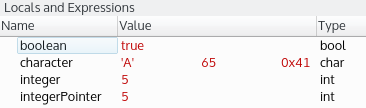
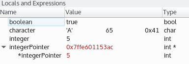
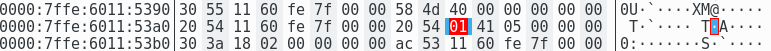
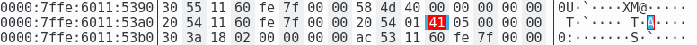
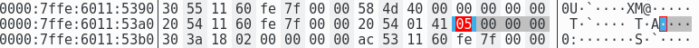
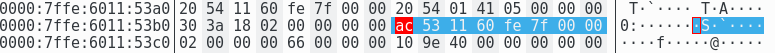

# Qt Creatorでメモリを調べる

このセクションでは、以下のコードスニペットを使用します。

```C++
bool boolean = true;
int integer = 5;
char character = 'A';
int* integerPointer = &integer;

qDebug() << "boolean is:" << boolean;
qDebug() << "integer is:" << integer;
qDebug() << "character is:" << character;
qDebug() << "integerPointer is:" << integerPointer;
qDebug() << "*integerPointer is:" << *integerPointer;
qDebug() << "done!";
```

3つのプリミティブ型、boolean、integer、characterを宣言しました。また、integer変数を参照するintegerPointerポインタを追加しました。最後の行にブレークポイントを置いて、デバッグを開始します。デバッグペインには、**ローカルと式**ビューがあるはずです。これは、**ウィンドウ→ビュー→ローカルと式**で簡単に追加/削除できます。以下はそのスクリーンショットです。



すべてのローカル変数が値とともに表示されていることがわかります。文字行には、文字 '**A**' の 3 つのフォーマット (ASCII、整数、16 進数) が表示されています。また、integerPointer 行にはポインタのアドレスではなく、自動的に参照された値が表示されていることに気づくかもしれません。これを無効にするには、**ローカルと式** ウィンドウの背景を右クリックして、**ポインタを自動的に参照解除** を選択します。次のスクリーンショットのように、ポインタのアドレスと参照解除された値が表示されます。



コンソール出力には以下の情報が表示されます。

```shell
boolean is: true
integer is: 5
character is: A
integerPointer is: 0x7ffe601153ac
*integerPointer is: 5
```

コンソール出力で同じ情報を取得していることがわかります。**ローカルとエクスプレッション**の表示は、時間の節約に役立ちます。qDebug()関数を使ってログを取らずに多くの情報を表示することができます。

Qt Creatorには便利なメモリエディタが用意されています。**Locals and Expressions** ウィンドウで変数名を右クリックして **Open Memory Editor | Open Memory Editor at Object's Address** を選択すると開くことができます。

メモリエディタの中で、ブーリアン変数の値を見てください。



16進数エディタが3つのパーツ（左から右へ）で表示されます。

* データのメモリアドレス。
* データの16進数表現。
* データの ASCII 表現。

16進数表現での選択が変数に対応しています。ブール変数がメモリ内で1バイトで表現されていることが確認できます。値が真なので、メモリ表現は**0x01**です。

**メモリエディタ**ツールを使って、文字のメモリを調べてみましょう。



また、この文字は1バイトでメモリに格納されています。16 進数表現は **0x41** です。この文字は、よく知られているASCII形式でエンコードされています。右側には、ASCII 表現では「**A**」が表示されていることに注意してください。

ここに整数変数の**メモリエディタ**の場所があります。



注意すべき興味深い事実が2つあります。整数は4バイトで格納されています。値**05**は、**05 00 00 00**として16進数で格納されます。バイトの順番は、お使いのプロセッサのエンディアンによって異なります。ここでは、リトルエンディアンのインテルCPUを使用しています。ビッグエンディアンのメモリストレージを持つ別のCPUアーキテクチャでは、変数は**00 00 00 05**として表示されます。

アプリケーションのメモリに飛び込む前に、最後の3つのスクリーンショットをよく見てください。この場合、3つの変数がスタックメモリ内で連続していることに気づくかもしれません。この動作はOSの実装によっては保証されません。

integerPointer変数のメモリエディタを開いてみてください。コンテキストメニューには2つの方法があります。

* **オブジェクトのアドレスでメモリエディタを開く**オプションは、ポインタをディファレンスして、ポイントされた値を直接表示します。整数メモリ表示と同じ結果が得られます。
* **ポインタのアドレスでメモリエディタを開く**オプションは、ポインタが指し示されている場所へのメモリアドレスである生のポインタデータを表示します。

ここでは、integerPointerのポインタのアドレスを表示するメモリエディタツールです。



私たちは64ビットOS上にいるので、私たちのポインタは8バイトに格納されています。このポインタのデータは、16進数で ac 53 11 60 fe 7f 00 00 00 です。これは、**ローカルとエクスプレッション**とコンソール出力で表示されるメモリアドレス 0x7ffe601153ac のリトルエンディアン表現です。

メモリを表示していますが、変更することもできます。以下の手順に従ってください。

1. 現在のブレークポイントを削除し、最初の qDebug() 行に新しいブレークポイントを追加します。
2. デバッグを再開して、ローカルと式を見てください。変数の値をダブルクリックすると、その値を編集することができます。メモリエディタウィンドウがすぐにその表現を更新することに注意してください。
3. 私たちの場合、ブーリアン値を false、文字を 68 (つまり 'D' です)、整数を 9 に設定しました。変更内容に自信が持てたら、デバッグを続けます。

以下は、私たちの変更を反映した最終的なコンソール出力です。

```shell
boolean is: false
integer is: 9
character is: D
integerPointer is: 0x7fff849203dc
*integerPointer is: 9
done!
```

**メモリエディタ**は強力なツールです。ソースコードを変更したり、アプリケーションを再コンパイルすることなく、実行時に変数の値を表示したり変更したりすることができます。

***

**[戻る](../index.html)**
