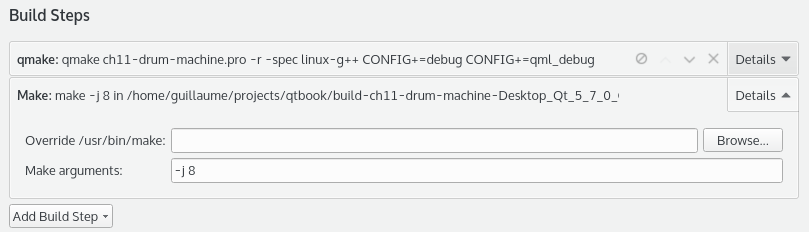

# コンパイル速度の向上

マルチコアコンピュータでのコンパイルを高速化することができます。デフォルトでは、Qt Creator を使ってプロジェクトをビルドする際には、1つのジョブ（つまり1つのコア）しか使用しません。しかし、make は複数のジョブを使ったコンパイルをサポートしています。make -j N オプションを使って、一度に N 個のジョブを許可することができます。パッケージングスクリプトの更新を忘れずに

Qt Creatorからプロジェクトをビルドしている場合は、**Projects → Build Steps → Make**でこのオプションを設定することができます。**詳細**をクリックして、**Make arguments**フィールドで、以下のスクリーンショットのように、コンパイル中に8つのジョブを許可するために、-j 8という値を入力します。

***

**[戻る](../index.html)**
