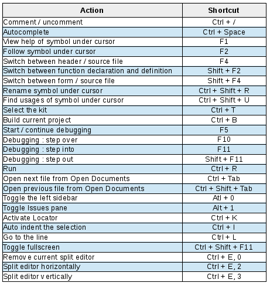

# ロケーターで検索

Qt Creator を使って生産性を向上させるもう一つの方法は、キーボードショートカットを使うことです。Qt Creator にはたくさんの素晴らしいキーボードショートカットが用意されています。ここではその中から選んだものを紹介します。

私たちのお気に入りの一つは、ロケーターです。Ctrl + Kを押して、それをアクティブにします。その後、いくつかの機能を楽しむことができます。

* ファイル名を入力して（部分的に入力しても構いません）、Enter キーを押してこのファイルを開きます。ロケーターが複数のファイルを表示している場合は、上下の矢印を使用して移動できます。
* 検索の前に . (ドットとスペースの後にドット)をプレフィックスにして、現在のドキュメント内のC++シンボルを検索します。例えば、第1章のTask.cppファイルで、.setでロケータを使用してみて、Enterキーを押してTask::setName()関数に移動します。
* 特定の行に移動するには l (L の後にスペース) を入力します。例えば、"l 37 "と入力すると、現在のファイルの37行目に移動します。

ロケーターは多くの機能を提供しています; 次回Ctrl + Kを押すときに見てください!

***

**[戻る](../index.html)**
