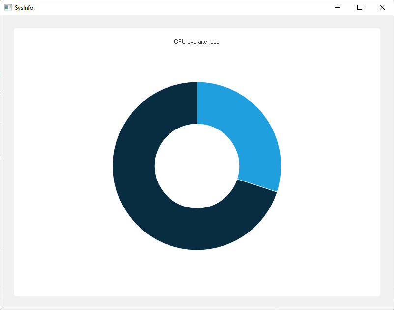

# QChartsを使ったCpuWidget

基底クラスSysInfoWidgetの準備ができたので、最初の子クラスを実装してみましょう。CpuWidgetを実装します。Qt Charts APIを使って、見た目の良いウィジェットを表示します。
平均的なCPU負荷を中心に穴の開いた円グラフで表示し、食べられた部分がCPUの使用率となるドーナツのようにします。まずはCpuWidgetという名前のC++クラスを新たに追加し、SysInfoWidgetを継承させます。

```C++
#include "sysinfowidget.h"

class CpuWidget : public SysInfoWidget
{
public:
    explicit CpuWidget(QWidget* parent = nullptr);
};
```

コンストラクタでは、必要な唯一のパラメータはQWidget* parentだけです。SysInfoWidgetクラスのstartDeleyMsおよびupdateSeriedDelayMs変数にデフォルト値を提供したので、可能な限り最良の動作ができます。SysInfoWidgetをサブクラス化するときにこの変数を覚えておく必要はありませんが、必要に応じて簡単にオーバーライドできます。

次のステップは、SysInfoWidgetクラスのupdateSeries()関数をオーバーライドして、Qt Charts APIを使い始めることです。

```C++
#include <QtCharts/QPieSeries>

#include "sysinfowidget.h"

class CpuWidget : public SysInfoWidget
{
    Q_OBJECT
public:
    explicit CpuWidget(QWidget* parent = nullptr);
    
    // SysInfoWidget interface
protected slots:
    void updateSeries() override;
    
private:
    QtCharts::QPieSeries* mSeries;
};
```

SysInfoWidget::updateSeries()スロットをオーバーライドしたので、CpuWidgetがSysInfoWidgetのmRefreshTimer::timeout()シグナルに応答できるようにQ_OBEJCTマクロをインクルードする必要があります。

Qt ChartsモジュールからQPieSeriesをインクルードして、mSeriesという名前のメンバのQPieSeries*を作成できるようにしています。QPieSeriesはQAbstractSeriesのサブクラスであり、すべてのQt Chartsシリーズ(QLineSeries、QAreaSeries、QPieSeriesなど)の基底クラスとなっています。Qt Chartsでは、QAbstractSeriesサブクラスは表示したいデータを保持し、どのように描画されるべきかを定義しますが、レイアウト内のどこにデータが表示されるべきかを定義するものではありません。

CpuWidget.cppに進んで、描画が行われる場所をQtに伝える方法を調べてみましょう。

```C++
using namespace QtCharts;

CpuWidget::CpuWidget(QWidget *parent) :
    SysInfoWidget(parent),
    mSeries(new QPieSeries(this))
{
    mSeries->setHoleSize(0.35);
    mSeries->append("CPU Load", 30.0);
    mSeries->append("CPU Free", 70.0);

    QChart* chart = chartView().chart();
    chart->addSeries(mSeries);
    chart->setTitle("CPU average load");
}
```

すべてのQt ChartsクラスはQtCharts名前空間で定義されています。そのため、using namespace QtChartsから始めます。

ます、コンストラクタのイニシャライザリストでmSeriesを初期化します。その後、設定を進めていきます。mSeries->setHoleSize(0.35)でドーナツを切り分け、2つのデータセットをmSeriesに追加します。これは偽のCPU負荷とCPUフリーであり、パーセントで表されます。
mSeriesは、関数でその描画を管理するクラスQChartsにリンクする準備ができました。

QChartクラスはSysInfoWidget::chartView()関数から取得します。chart->addSeries(mSeries)をコールすると、chartはmSeriesの所有権を取得し、シリーズタイプに応じてそれを描画します(この例ではQPieSeries)。QChartはQWidgetではなく、QGraphicsWidgetのサブクラスです。QGraphicsWidgetはより軽量なQWidgetと表現できますが、いくつかの違いがあります(座標やジオメトリはintegerの代わりに、doubleやfloatで定義され、QWidget属性のサブセットがサポートされています:カスタムドラッグ、ドロップ、フレームワークなど)。QGraphicsWidgetクラスはQQraphicsSceneクラスに追加するように設定されています。

SysInfoアプリケーションでは、SysInfoWidget内のQVBoxLayoutにQChartを表示する必要があります。ここで便利なのがQChartViewクラスです。QWidgetのレイアウトにチャートを追加することができます。

今までのQPirSeriesは抽象的な感じがしていましたが、ここではQPieSeriesをメインウィジェットに追加してみましょう。これをMainWindowファイルに追加して、どのように見えるか見てみましょう。

```C++
// In MainWindow.h

#include "cpuwidget.h"

...

private:
    Ui::MainWindow *ui;
    CpuWidget mCpuWidget;
};

// In MainWindow.cpp

MainWindow::MainWindow(QWidget *parent)
    : QMainWindow(parent),
      ui(new Ui::MainWindow),
      mCpuWidget(this)
    
{
    ui->setupUi(this);
    SysInfo::instance().init();
    ui->centralwidget->layout()->addWidget(&mCpuWidget);
}
```

MainWindow.hファイルでmCpuWidgetを宣言して初期化し、MainWindow->centralWidget->lauoutに追加します。これでアプリケーションを実行すると、以下のように表示されるはずです。

**※centralWidget内に水平または垂直のレイアウトを作っておかないとエラーになります。**

**※menuBarとstatusBarは削除してあります。**



見た目はかっこよくても、このドーナツは静的でCPU使用率が反映されていません。SysInfoとSysInfoWidgetクラスで構築したアーキテクチャのおかげで、残りの部分はすぐに実装できます。

CpuWidget.cppファイルに戻り、以下のような内容でupdateSeries()関数を実装します。

```C++
#include "sysinfo.h"

...

void CpuWidget::updateSeries()
{
    double cpuLoadAverage = SysInfo::instance().cpuLoadAverage();
    mSeries->clear();
    mSeries->append("Load", cpuLoadAverage);
    mSeries->append("Free", 100.0 - cpuLoadAverage);
}
```

まず、SysInfoシングルトンへの参照を取得します。次に、現在の平均CPU負荷をcpuLoadAverage変数で取得します。このデータをmSeriesにフィードバックしなければなりません。
mSeriesオブジェクトはQPieChartsであり、現在のCPU平均負荷のスナップショットが欲しいだけであることを意味しています。過去の履歴はこの種のグラフでは意味がありません。なので、mSeries->clear()構文でmSeriesデータをクリアし、cpuLoadAverage変数とフリー部分(100.0 - cpuLoadAverage)を追加しています。

注意すべき点は、CpuWidgetクラスではリフレッシュを気にする必要がないということです。すべての作業はSysInfoWidgetサブクラスで行われ、QTimerクラスのすべての機能を備えています。SysInfoWidgetサブクラスでは、どのようなデータを表示するのが、どのようなグラフを使って表示するのか、という重要な特定のコードだけに集中する必要があります。CpuWidgetクラス全体を見てみると、非常に短いです。次のSysInfoWidgetサブクラスであるMemoryWidgetも非常に簡潔で、実装も簡単です。

***
**[戻る](../index.html)**
