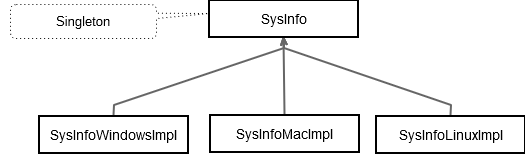

# クロスプラットフォームプロジェクトの設計

ヴィジュアルゲージやチャートウィジェットを表示するので、ch02-sysinfoという新しいQtウィジェットアプリケーションを作成します。第1章の「Qt入門」で説明したように、Qt Creatorがmain.cpp、MainWindow.h、MainWindow.cpp、MainWindow.uiというファイルを生成してくれます。

C++のコードに入る前に、ソフトウェアのアーキテクチャについて考えなければなりません。このプロジェクトでは、複数のデスクトップ・プラットフォームを扱うことになります。C++とQtの組み合わせのおかげで、ソースコードのほとんどはすべてのターゲットで共通になります。しかし、OS(オペレーティングシステム)からCPUとメモリ使用量の両方を取得するために、いくつかのプラットフォーム固有のコードを使用することになります。

このタスクを成功させるために、2つのデザインパターンを使用します。

* **ストラテジ・パターン**: これは機能(例えば、CPU使用率の取得)を記述したインターフェースであり、特定の動作(Windows/Mac OS/LinuxでのCPU使用率の取得)は、このインターフェースを実装するサブクラスによって実行されます。
* **シングルトン・パターン**: このパターンは、特定クラスが単一のインスタンスであることを保証します。このインスタンスには、一意のアクセスポイントを使用して簡単にアクセスできます。

次の図に示すように、クラスSysInfoはストラテジパターンとのインターフェースであり、シングルトンでもあります。ストラテジパターンからの具象動作は、SysInfoのサブクラスであるSysInfoWindowsImpl、SysInfoMacImpl、SysInfoLinuxImplのクラスで行われます。



UI部分はSysInfoクラスのみを知っていてそれを使用します。プラットフォーム固有の実装クラスはSysInfoクラスによってインスタンス化され、呼び出し元はSysInfoの子クラスについて何も知る必要がありません。SysInfoクラスはシングルトンなので、すべてのウィジェットがアクセスしやすくなります。

まずSysInfoクラスを作成するところから始めましょう。Qt Creatorでは、階層ビューのプロジェクト名を右クリックしてアクセスできるコンテキストメニューから、新しくC++クラスを作成することができます。そこから**Add New**オプションをクリックするか、メニューの**ファイル**|**ファイル/プロジェクトの新規作成**|**ファイルとクラス**を選択します。次に、以下の手順を実行します。

1. **C++ クラス**を選択し、**選択**をクリックします。
2. クラス名フィールドにSysInfoを設定します。このクラスは他のクラスを継承しないので、**基底クラス**フィールドを使用する必要はありません。
3. **次へ**をクリックし、**完了**をクリックして空のC++クラスを生成します。

ここで、3つの純粋仮想関数を追加してインターフェースを指定します。
init()、cpuLoadAverage()、memoryUsed()の3つです。

```C++
// In SysInfo.h
class SysInfo
{
public:
    SysInfo();
    virtual ~SysInfo();

    virtual void init() = 0;
    virtual double cpuLoadAverage() = 0;
    virtual double memoryUsed() = 0;
};

// In SysInfo.cpp
SysInfo::SysInfo()
{

}

SysInfo::~SysInfo()
{

}
```

これらの関数はそれぞれ特定の役割を持っています。

* **init()**: この関数は、派生クラスがOSプラットフォームに応じて任意の初期化処理を実行できるようにします。
* **cpuLoadAverage()**: この関数は、OS固有のコードを呼び出して平均CPU不可を取得し、それをパーセンテージ値として返します。
* **memoryUsed()**: この関数は、使用されたメモリを取得するためにOS固有のコードを呼び出し、それをパーセンテージ値として返します。

キーワードvirtualは、この関数が派生クラスでオーバーライドできることを示します。= 0構文は、この関数が純粋仮想関数であることを意味し、具象な派生クラスでオーバーライドする必要があります。さらに、これにより、SysInfoはインスタンス化できない抽象クラスになります。

また、空の仮想デストラクタも追加しました。このデストラクタは、基底クラスポインタから派生クラスのインスタンスを削除した場合に、基底クラスのデストラクタだけでなく派生クラスのデストラクタも確実に呼び出されるように、仮想関数である必要があります。

これで、SysInfoクラスは抽象クラスとなり、派生の準備ができたので、Windows、Mac OS、Linuxの3つの実装について説明します。他の2つを使用しない場合は、1つの実装のみを実行することもできます。これについてはお任せします。SysInfoクラスは、実装を追加した後でシングルトンに変換されます。

***
**[戻る](../index.html)**
