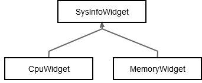

# Qt Chartsを探る

コア部分の準備ができました。いよいよこのプロジェクトのUIを作成するときが来ましたが、Qt Chartsはこの作業を助けてくれます。Qt Chartsは、折れ線グラフ、エリアチャート、スプラインチャート、円グラフなど、使いやすいチャートコンポーネントのセットを提供するモジュールです。

Qt Chartsは以前は商用専用のQtモジュールでした。Qt 5.7からは、オープンソースユーザ向けにGPLv3ライセンスでQtに含まれるようになりました。Qt 5.6で行き詰まった場合は、ソースから自分でモジュールをビルドすることができます。詳細は<https://github.com/qtproject/qtcharts>にあります。

現在の目標は、CPUとメモリの使用状況をQtチャートで表示するために、CpuWidgetとMemoryWidgetという2つのQtウィジェットを作成することです。この2つのウィジェットは共通のタスクが多いので、まず抽象クラスSysInfoWidgetを作成します。



その後、2つの実際のウィジェットがSysInfoWidgetクラスを継承し、それぞれのタスクを実行します。

QWidgetをベースクラスとしてSysInfoWidgetという名前の新しいC++クラスを作成します。いくつかの拡張機能はSysInfoWidget.hファイルで処理する必要があります。

```C++
#include <QWidget>
#include <QTimer>
#include <QtCharts/QChartView>

class SysInfoWidget : public QWidget
{
    Q_OBJECT
public:
    explicit SysInfoWidget(QWidget *parent = nullptr,
                           int startDeleaMs = 500,
                           int updateSeriesDelayMs = 500);

protected:
    QtCharts::QChartView& chartView();

protected slots:
    virtual void updateSeries() = 0;

private:
    QTimer mRefreshTimer;
    QtCharts::QChartView mChartView;
};
```

QChartViewは多くの種類のチャートを表示できる汎用ウィジェットです。このクラスはQChartViewのレイアウトと表示を処理します。QTimerはスロット関数updateSeries()を定期的に呼び出します。これは純粋仮想なスロットです。SysInfoWidgetクラスが抽象化されているのはこのためです。スロットのupdateSeries()は、システム値を取得し、チャートをどのように描画するかを定義するために子クラスによってオーバーライドされます。startDelayMsとupdateSeriesDelayMsのパラメータはデフォルト値を持っており、必要に応じて呼び出し元がカスタマイズできることに注意してください。

これで、SysInfoWidget.cppファイルに進み、子ウィジェットを作成する前にSysInfoWidgetクラスを正しく準備することができます。

```C++
#include <QVBoxLayout>

using namespace QtCharts;

SysInfoWidget::SysInfoWidget(QWidget *parent,
                             int startDeleaMs,
                             int updateSeriesDelayMs) :
    QWidget(parent),
    mChartView(this)
{
    mRefreshTimer.setInterval(updateSeriesDelayMs);
    connect(&mRefreshTimer, &QTimer::timeout,
            this, &SysInfoWidget::updateSeries);
    QTimer::singleShot(startDeleaMs,
                       [this] { mRefreshTimer.start(); });

    mChartView.setRenderHint(QPainter::Antialiasing);
    mChartView.chart()->legend()->setVisible(false);

    QVBoxLayout* layout = new QVBoxLayout(this);
    layout->addWidget(&mChartView);
    setLayout(layout);
}

QChartView &SysInfoWidget::chartView()
{
    return mChartView;
}
```

SysInfoWidgetコンストラクタ内のすべてのタスクは、子ウィジェットであるCpuWidgetとMemoryWidgetで必要とされる共通のタスクです。最初のステップはmRefreshTimerの初期値で、タイマ間隔とタイムアウトシグナルが発生したときに呼び出すスロットを定義します。その後、スタティック関数QTimer::singleShot()がstartDelayMsで定義された遅延の後に実際のタイマを開始します。ここでも、Qtとラムダ関数を組み合わせることで、わずかな行数で強力なコードが得られます。次の部分では、チャートの描画を滑らかにするアンチエイリアシングを行います。チャートの凡例を非表示にして、最小限の表示にしています。最後は、SysInfoWidgetクラスのQChartViewウィジェットを表示するためのレイアウトを処理します。

***
**[戻る](../index.html)**
