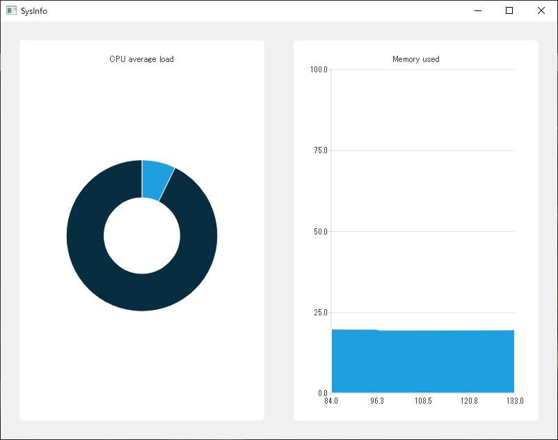
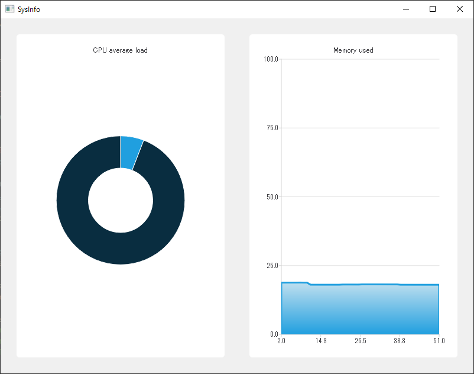

# QChartsを使ったメモリ使用画面

2番目のSysInfoWidgetはMemoryWidgetクラスです。このウィジェットはデータの履歴を表示し、メモリ消費が時間の経過とともにどのように変化していくかを見ることができます。このデータを表示するには、Qt ChartsモジュールのQLineSeriesクラスを使用します。MemoryWidgetクラスを作成し、CpuWidgetで使用したのと同じパターンに従います。

```C++
#include <QtCharts/QLineSeries>

#include "sysinfowidget.h"

class MemoryWidget : public SysInfoWidget
{
    Q_OBJECT
public:
    explicit MemoryWidget(QWidget *parent = nullptr);

    // SysInfoWidget interface
protected slots:
    void updateSeries();
    
private:
    QtCharts::QLineSeries* mSeries;
    qint64 mPointPositionX;
};
```

QPieSeries\*の代わりに、mSeriesはQLineSeries\*の型で、MemoryWidget.cppと同様の方法でchartオブジェクトにリンクされます。

```C++
#include "memorywidget.h"
#include <QtCharts/QAreaSeries>

using namespace QtCharts;

const int CHART_X_RANGE_COUNT = 50;
const int CHART_X_RANGE_MAX = CHART_X_RANGE_COUNT - 1;

MemoryWidget::MemoryWidget(QWidget *parent) :
    SysInfoWidget(parent),
    mSeries(new QLineSeries(this)),
    mPointPositionX(0)
{
    QAreaSeries* areaSeries = new QAreaSeries(mSeries);

    QChart* chart = chartView().chart();
    chart->addSeries(areaSeries);
    chart->setTitle("Memory used");
    chart->createDefaultAxes();
    chart->axes(Qt::Horizontal)[0]->setGridLineVisible(false);
    chart->axes(Qt::Horizontal)[0]->setRange(0, CHART_X_RANGE_MAX);
    chart->axes(Qt::Vertical)[0]->setRange(0, 100);
}

void MemoryWidget::updateSeries()
{
}
```

mSeriesデータは、いつものようにイニシャライザリストで初期化されます。mPointPositionXはunsigned long long（Qtの記法qint64を使用）変数で、データセットの最後のX位置を追跡します。この巨大な値は、mPointPositionXが決してオーバーフローしないようにするために使われます。

次に、QAreaSeries\* areaSeries = new QareaSeries(mSeries) で初期化されたときに mSeries の所有権を取得する中間の areaSeries を使用します。そして areaSeries は chart->addSeries(areaSeries) でチャートオブジェクトに追加されます。私たちは QChart の中に一本の線を表示したいわけではありません。その代わりに、使用されたメモリのパーセンテージを表す領域を表示したいのです。そのために areaSeries 型を使用しています。それでも、updateSeries() 関数で新しいポイントをデータセットに追加する際には、mSeries データを更新します。areaSeries 型は、それらを自動的に処理してチャートオブジェクトに送ります。

chart->addSeries(areaSeries)の後、チャート表示の設定を行います。

* chart->createDefaultAxes() 関数は、 areaSeries 型に基づいて X 軸と Y 軸を作成します。3D 系列を使用している場合は、createDefaultAxes() 関数で Z 軸を追加しているはずです。
* X 軸の目盛り値を chart->axisX()->setVisible(false) で非表示にします（中間値は軸の下部に表示されます）。MemoryWidgetクラスでは、この情報は関係ありません。
* 表示したいポイント数（表示履歴のサイズ）を定義するには、 chart->axisX()->setRange(0, CHART_X_RANGE_MAX) をコールします。ここでは、後からこの値を変更しやすくするために定数を使用しています。ファイルの先頭に値があるので、この値を更新するために MemoryWidget.cpp のどこに値が使われているのかを探す手間が省けます。
* chart->axisY()->setRange(0, 100) は、SysInfo::memoryUsed() 関数で返された値を元に、Y 軸の最大範囲をパーセンテージで定義します。

これでチャートは適切に設定されました。これで、updateSeries() の本体を実装してフィードを送信しなければなりません。

```C++
void MemoryWidget::updateSeries()
{
    double memoryUsed = SysInfo::instance().memoryUsed();
    mSeries->append(mPointPositionX++, memoryUsed);
    if (mSeries->count() > CHART_X_RANGE_COUNT) {
        QChart* chart = chartView().chart();
        chart->scroll(chart->plotArea().width() / CHART_X_RANGE_MAX, 0);
        mSeries->remove(0);
    }
}
```

まず最新のメモリ使用率を取得し、それを X 座標の mPointPositionX（次の updateSeries() の呼び出しのためにポストインクリメントします）と Y 座標の memoryUsed で mSeries に追加します。mSeries の履歴を残したいので、mSeries->clear() は決して呼ばれません。しかし、CHART_X_RANGE_COUNT ポイントを複数追加した場合はどうなるでしょうか？チャート上に見える "ウィンドウ "は静的なもので、ポイントは外に追加されます。つまり、最初の CHART_X_RANGE_MAX ポイントのメモリ使用量だけが表示され、その後は何も表示されないということです。

幸いなことに、QChart はビュー内をスクロールして可視ウィンドウを移動させる機能を提供しています。我々は、データセットが可視ウィンドウよりも大きい場合にのみ、このケースの処理を開始します。そして、ウィジェットが無限のデータセットを保存しないようにするために、mSeries->remove(0)でインデックス0のポイントを削除します。メモリ使用量を監視して、それ自体がメモリリークしているSysInfoアプリケーションはちょっと悲しいですからね。

chart->scroll(chart->plotArea().width() / CHART_X_RANGE_MAX, 0) という構文は、X軸上の最新の点までスクロールし、Y軸上には何も表示しません。chart->scroll(dx, dy) は、我々の系列座標で表現された座標を期待しています。これが、char->plotArea() を X 軸の単位である CHART_X_RANGE_MAX で割った値を取得しなければならない理由です。

これで、MainWindow に MemoryWidget クラスを追加することができるようになりました。

```C++
// In MainWindow.h

#include "cpuwidget.h"
#include "memorywidget.h"

...

private:
    Ui::MainWindow *ui;
    CpuWidget mCpuWidget;
    MemoryWidget mMemoryWidget;
};

//In MainWindow.cpp

MainWindow::MainWindow(QWidget *parent)
    : QMainWindow(parent),
      ui(new Ui::MainWindow),
      mCpuWidget(this),
      mMemoryWidget(this)
{
    ui->setupUi(this);
    SysInfo::instance().init();
    ui->centralwidget->layout()->addWidget(&mCpuWidget);
    ui->centralwidget->layout()->addWidget(&mMemoryWidget);
}
```

CpuWidget の場合と同じように、mMemoryWidget という名前の新しいメンバーを MainWindow に追加し、それを ui->centralWidget->layout()->addWidget(&mMemoryWidget) 構文で centralWidget レイアウトに追加します。

コンパイルしてアプリケーションを実行し、数秒待ちます。これに近いものが表示されるはずです。



MemoryWidgetクラスは問題なく動作しますが、ちょっとくすんだ感じがします。Qt を使えば簡単にカスタマイズできます。目標はメモリ領域の上部に太い線を入れて、上から下にグラデーションをつけることです。MemoryWidget.cpp ファイルの areaSeries クラスを修正するだけです。

```C++
#include <QtCharts/QAreaSeries>
#include <QLinearGradient>
#include <QPen>

#include "sysinfo.h"

using namespace QtCharts;

const int CHART_X_RANGE_COUNT = 50;
const int CHART_X_RANGE_MAX = CHART_X_RANGE_COUNT - 1;
const int COLOR_DARK_BLUE = 0x209fdf;
const int COLOR_LIGHT_BLUE = 0xbfdfef;
const int PEN_WIDTH = 3;

MemoryWidget::MemoryWidget(QWidget *parent) :
    SysInfoWidget(parent),
    mSeries(new QLineSeries(this)),
    mPointPositionX(0)
{
    QPen pen(COLOR_DARK_BLUE);
    pen.setWidth(PEN_WIDTH);

    QLinearGradient gradient(QPointF(0, 0), QPointF(0, 1));
    gradient.setColorAt(1.0, COLOR_DARK_BLUE);
    gradient.setColorAt(0.0, COLOR_LIGHT_BLUE);
    gradient.setCoordinateMode(QGradient::ObjectBoundingMode);

    QAreaSeries* areaSeries = new QAreaSeries(mSeries);
    areaSeries->setPen(pen);
    areaSeries->setBrush(gradient);

    QChart* chart = chartView().chart();
    ...
}
```

QPen のペン機能は QPainter API の一部です。これは Qt が GUI 描画のほとんどを行うための基盤となっています。これには QWidget API 全体 (QLabel, QPushButton, QLayout など) が含まれます。ペンについては、色と幅を指定して areaSeries->setPen(pen) で areaSeries クラスに適用するだけです。

グラデーションの原理は同じです。垂直グラデーションの両端の色を指定する前に、開始点 (QPointF(0, 0)) と最終点 (QPointF(0, 1)) を定義します。QGradient::ObjectBoundingModeパラメータは、開始/終了座標がどのようにオブジェクトにマッピングされるかを定義します。QAreaSeriesクラスでは、グラデーションの座標がQAreaSeriesクラス全体と一致するようにしたいと思います。これらの座標は正規化された座標で、0 が形状の開始点、1 が形状の終了点となります。

* [0.0]座標はQAreaSeriesクラスの左上隅を指します。
* [1.0]座標はQAreaSeriesクラスの左下隅を指します。

最後にビルドして実行すると、SysInfoアプリケーションはこのようになります。



SysInfoアプリケーションが完成しました。自分好みにウィジェットをカスタマイズしたい場合は、QGradient クラスと QPainter API を利用してみてください。

***
**[戻る](../index.html)**
