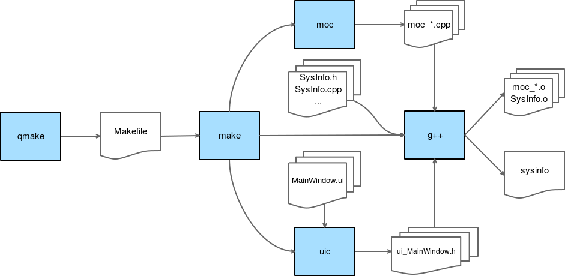

# qmakeの内部

先ほども述べたように、qmakeはQtフレームワークのコンパイルシステムの基礎となるものです。Qt Creatorでは、ビルドボタンをクリックするとqmakeが起動されます。qmakeが具体的に何をしているのか、CLI(Command Line Interface)上で自分で呼び出して勉強してみましょう。

生成されたファイルを保存する一時ディレクトリを作成します。ここではLinuxで作業をしていますが、これはどのOSにも移植可能です。ここでは/tmp/sysinfoを選択しました。CLIを使用して、この新しいディレクトリに移動し、以下のコマンドを実行します。

```shell
/path/to/qt/installation/5.7/gcc_64/bin/qmake -makefile -o Makefile /path/to/sysinfoproject/ch02-sysinfo.pro
```

このコマンドはqmakeを-makefileモードで実行して、sysinfo.proファイルに基づいたMakefileを生成します。Makefile の内容に目を通すと、これまでの .pro のセクションで説明した多くのことがわかるでしょう。Qtモジュールへのリンク、異なるモジュールのヘッダ、プロジェクトのヘッダやソースファイルのインクルードなどです。

では、makeコマンドで、このMakefileをビルドしてみましょう。

このコマンドは、(.pro ファイルの TARGET 値に基づいて) バイナリ ch02-sysinfo を生成します。現在/tmp/sysinfoに存在するファイルのリストを見て見ましょう。

```shell
 $ ls -1
 ch02-sysinfo
 CpuWidget.o
 main.o
 MainWindow.o
 Makefile
 MemoryWidget.o
 moc_CpuWidget.cpp
 moc_CpuWidget.o
 moc_MainWindow.cpp
 moc_MainWindow.o
 moc_MemoryWidget.cpp
 moc_MemoryWidget.o
 moc_SysInfoWidget.cpp
 moc_SysInfoWidget.o
 SysInfoLinuxImpl.o
 SysInfo.o
 SysInfoWidget.o
 ui_MainWindow.h
```

これは非常に興味深いことで、通常の .o 拡張子 (SysInfo.o, SysInfoWidget.o など) でコンパイルされたすべてのソースがありますが、他にも moc_ で始まるファイルがたくさんあります。ここにQtフレームワークのもう一つの要となるものがあります。メタオブジェクトコンパイラです。

シグナル/スロットシステムを使うたびに、ヘッダにマクロ Q_OBJECT を含めなければなりません。シグナルをエミットしたりスロットで受信したりするたびに、それを処理するための特別なコードを書かなくても、Qtがそれを処理してくれます。これは、シグナルとスロットを適切に処理するために Qt が必要とするすべてのものを含むクラスの中間実装 (moc_*.cpp ファイル) を生成することによって行われます。

百聞は一見にしかずです。標準的なqmakeプロジェクトの完全なコンパイルパイプラインは以下の通りです。



青色のボックスはコマンドを指し、波線のボックスはドキュメント（ソースまたは最終的なバイナリ）です。手順を見ていきましょう。

1. qmake コマンドは、プロジェクト .pro ファイルと共に実行されます。プロジェクトファイルを元にMakefileを生成します。
2. make コマンドが実行され、他のコマンドを呼び出して中間ファイルを生成します。
3. uic コマンドは User Interface Compiler の略です。すべての .ui ファイル (基本的にはインターフェイスの XML 記述です) を受け取り、対応する ui_*.h ヘッダーを生成し、自分の .cpp にインクルードします (ch02-sysinfo プロジェクトでは MainWindow.cpp にあります)。
4. moc コマンドは Q_OBJECT マクロを含むすべてのクラスを受け取り（スーパークラス QObject とペアになっている）、中間の moc_*.cpp ファイルを生成し、シグナル/スロットフレームワークを動作させるために必要なすべてのものを含めます。
5. g++ コマンドが実行され、すべてのソースファイルと中間の moc ファイルを .o ファイルにコンパイルしてから、最終的にすべてをバイナリ ch02-sysinfo にリンクします。

## Tip

クラスの作成後にQ_OBJECTマクロを追加すると、時々コンパイラがシグナルやスロットについて文句を言うことがあることに注意してください。これを修正するには、単に Build → Run qmake から qmake コマンドを実行してください。
これは、新しい中間mocファイルの生成を含むようにMakefileを再生成しなければならないことに起因していることがわかります。

一般的に、開発者コミュニティではソースコード生成は悪しき慣習とみなされています。
Qt はこの話題で長い間批判されてきました。私たちはいつも、機械が私たちの背後で何らかのブードゥー教のようなことをしているのではないかと危惧しています。残念ながら、C++にはコード内省（すなわちリフレクション）を行う実用的な方法がなく、シグナルとスロットのメカニズムは、シグナルとスロットを解決するためにクラスに関する何らかのメタデータを必要とします。これは部分的にはC++のテンプレートシステムで実現できたかもしれませんが、この解決策はQtには読みやすく、移植性が高く、使い勝手が良く、ロバストなものではないように思えました。また、テンプレートのための優れたコンパイラのサポートも必要です。これは、C++コンパイラのワイルドな世界では想定できません。

moc システムは現在完全に成熟しています。問題を引き起こす可能性のある非常に特殊な極端なケースがいくつかありますが（Visual Studio で非常に特殊な状況での問題が報告されています）、それでも、この機能の利点は、遭遇する可能性のある問題を大きく上回っていると考えています。シグナル/スロットシステムは、作業をする上で驚異的なものであり、Qt の始まりを見れば、このシステムは最初のリリースから存在しています。Qt 5 のファンクタ記法（コンパイル時に connect() の有効性をチェックしてくれる）を C++11 のラムダ式と組み合わせたことで、これは本当に楽しいものになりました。

***
**[戻る](../index.html)**
