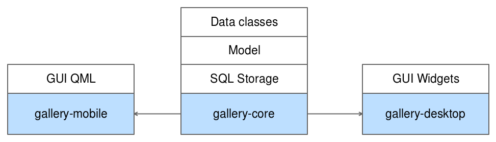

# メンテナンス可能なプロジェクトの設計

メンテナンス可能なプロジェクトを設計するための最初のステップは、プロジェクトを明確に定義されたモジュールに適切に分割することです。一般的なアプローチは、エンジンとユーザーインターフェイスを分離することです。この分離は、コードの異なる部分間の結合を減らし、よりモジュール化することを強制します。

これはまさに、私たちがギャラリーアプリケーションで取るアプローチです。プロジェクトは3つのサブプロジェクトに分けられます。



サブプロジェクトは以下の通りです。

* **gallery-core**: これはアプリケーションロジックのコアを含むライブラリです。データクラス（またはビジネスクラス）、永続的なストレージ（SQLで）、単一のエントリーポイントを介してUIでストレージを利用できるようにするモデルです。
* **gallery-desktop**: これは、データを取得してユーザーに表示するために gallery-core ライブラリに依存する Qt ウィジェットアプリケーションです。このプロジェクトについては、第4章「デスクトップUIを制覇する」で解説します。
* **gallery-mobile**: モバイルプラットフォーム（AndroidとiOS）を対象としたQMLアプリケーションです。gallery-coreにも依存します。このプロジェクトは第5章「モバイルUIを制する」で解説します。

見てわかるように、各レイヤーは一つの責任を持っています。この原則は、プロジェクトの構造とコード組織の両方に適用されます。この3つのプロジェクトを通して、私たちはこの章のモットーに忠実に生きようと努力します。"プロジェクトを分割してコードを支配しよう」です。

このようにQtプロジェクトを分割するために、別の種類のプロジェクト、Subdirsプロジェクトを作成します。

1. **ファイル** | **新規ファイルまたはプロジェクト**をクリックします。
2. **プロジェクト**の種類で、**その他のプロジェクト** | **Subdirsプロジェクト** | **選択** を選択します。
3. 名前をch03-gallery-coreとし、**選択**をクリックします。
4. 最新の Qt デスクトップキットを選択し、**次へ** | **完了とサブプロジェクトの追加**をクリックします。

ここでは、Qt Creatorが親プロジェクトであるch03-gallery-coreを作成し、3つのサブプロジェクト（gallery-core、gallery-desktop、gallery-mobile）をホストします。親プロジェクトにはコードもコンパイルユニットもありませんが、複数の.proプロジェクトをグループ化して、それらの間の依存関係を表現するのに便利なだけです。

次は最初のサブディレクトリプロジェクトの作成ですが、これはQt Creatorが**Finish & Add Subproject**をクリックしたときにすぐに提案してくれたものです。まずはgallery-coreから始めます。

1. プロジェクトタブでライブラリを選択します。
2. C++ライブラリを選択します。
3. 共有ライブラリの種類を選択し、gallery-core という名前を付けて、**次へ** をクリックします。
4. モジュール、QtCore、QtSqlを選択し、**次へ**をクリックします。
5. クラス名フィールドにAlbumと入力し、**次へ**をクリックします。Qt Creatorは、このクラスを例にしてライブラリの基本骨格を生成します。
6. プロジェクトが ch03-gallerycore.pro のサブプロジェクトとして正しく追加されていることを確認し、「完了」をクリックします。

gallery-coreのコードを掘り下げる前に、Qt Creatorが作ってくれたものを勉強してみましょう。親の .pro ファイル ch03-gallery-core.pro を開きます。

```QMake
TEMPLATE = subdirs
SUBDIRS += \
    gallery-core
```

これまで、.proファイルではTEMPLATE = app構文を使用していました。
subdirs プロジェクトテンプレートは、コンパイルするサブプロジェクトを検索するように Qt に指示します。ch03-gallery-core.pro に gallery-core プロジェクトを追加すると、Qt Creator はそれを SUBDIRS 変数に追加しました。ご覧のように、SUBDIRSはリストなので、好きなだけサブプロジェクトを追加することができます。

ch03-gallery-core.proをコンパイルすると、Qtは各SUBDIRSの値をスキャンしてコンパイルします。これでgallery-core.proに切り替えることができました。

```QMake
QT += sql
QT -= gui
TARGET = gallery-core
TEMPLATE = lib
DEFINES += GALLERYCORE_LIBRARY
SOURCES += Album.cpp
HEADERS += Album.h\
    gallery-core_global.h
unix {
    target.path = /usr/lib
    INSTALLS += target
}
```

これがどのように動くのか見てみましょう。

* QTはsqlモジュールを追加し、guiモジュールを削除しました。デフォルトでは、QtGuiは常に含まれているので、明示的に削除する必要があります。

* TEMPLATEの値がまた違っています。libを使ってqmakeに、gallery-coreという名前の共有ライブラリを出力するMakefileを生成するように指示しています（TARGET変数で指定しています）。

* DEFINES += GALLERY_CORE_LIBRARY 構文はコンパイルフラグで、ライブラリシンボルのインポートやエクスポートのタイミングをコンパイラに知らせるものです。この概念については、すぐに戻ってきます。

* HEADERS には、最初のクラス Album.h が含まれていますが、もう一つの生成されたヘッダもあります。gallery-core_global.h。このファイルは、クロスプラットフォームライブラリの痛みを和らげるために Qt によって提供された構文的な糖分です。

* unix { ... } スコープはライブラリのインストール先を指定します。このプラットフォームスコープは、Linux上でプロジェクトを作成したために生成されたものです。 デフォルトでは、システムライブラリのパス (/usr/lib) にライブラリをインストールしようとします。

UNIXスコープを完全に削除してください。ライブラリをシステム全体で利用できるようにする必要はありません。

クロスプラットフォームの共有オブジェクトの問題をよりよく理解するために、gallery-core_global.hを開くことができます。

```C++
#include <QtCore/qglobal.h>

#if defined(GALLERYCORE_LIBRARY)
#  define GALLERYCORE_EXPORT Q_DECL_EXPORT
#else
#  define GALLERYCORE_EXPORT Q_DECL_IMPORT
#endif
```

gallery-core.proファイルで定義されたGALLERYCORE_LIBRARYに再び遭遇します。Qt Creatorは便利なコードを生成しました：共有ライブラリでシンボルの可視性を処理するクロスプラットフォームの方法です。

アプリケーションが共有ライブラリにリンクする場合、共有ライブラリを使用するアプリケーションから見えるようにするには、シンボル関数、変数、またはクラスを特別な方法でマークする必要があります。シンボルのデフォルトの可視性は、プラットフォームによって異なります。一部のプラットフォームではデフォルトでシンボルが非表示になり、他のプラットフォームではシンボルが公開されます。もちろん、各プラットフォームとコンパイラには、このパブリック/プライベートの概念を表現する独自のマクロがあります。

#ifdef windows #elseのようなコードを省略するために、QtはQ_DECL_EXPORT（ライブラリをコンパイルする場合）およびQ_DECL_IMPORT（共有ライブラリを使用してアプリケーションをコンパイルする場合）を提供します。したがって、パブリックとしてマークするシンボル全体で、GALLERYCORESHARED_EXPORTマクロを使用する必要があります。

例はAlbum.hファイルにあります。

```C++
#ifndef ALBUM_H
#define ALBUM_H
#include "gallery-core_global.h"
class GALLERYCORESHARED_EXPORT Album
{
public:
 Album();
};
#endif // ALBUM_H
```

マクロにアクセスできるように、適切なgallery-core_global.hファイルをインクルードし、classキーワードの直後に使用します。これはコードをあまり汚さず、クロスプラットフォームにも対応しています。

### Info

もう一つの可能性は、静的にリンクされたライブラリを作ることです。扱う依存関係を少なくしたい場合には、このパスが面白いでしょう (単一のバイナリの方が常にデプロイが簡単です)。しかし、いくつかの欠点があります。

* コンパイル時間の増加: ライブラリを変更するたびに、アプリケーションも再コンパイルしなければなりません。
* よりタイトなカップリング、複数のアプリケーションはライブラリにリンクすることができません。それぞれのアプリケーションがライブラリを埋め込まなければなりません。

***
**[戻る](../index.html)**
