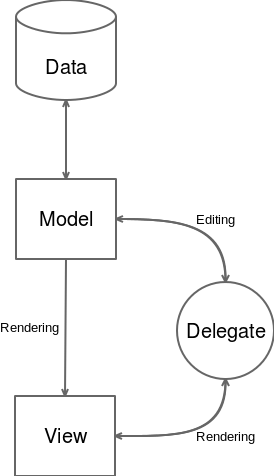
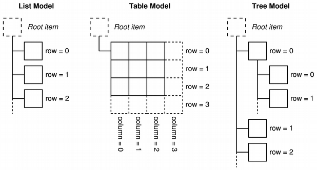

# モデルの実装

データは潜在的なクライアント（そのコンテンツを表示したり編集したりするアプリケーション）に公開する準備ができています。しかし、クライアントとデータベースの間の直接接続は、非常に強い結合を作ることになります。別のストレージタイプに切り替えることにした場合、少なくとも部分的にはビューを書き換えなければならないでしょう。

ここでモデルが私たちを助けてくれます。モデルはデータ(データベース)と通信する抽象的なレイヤーであり、このデータをデータ固有の、実装に依存しない形でクライアントに公開します。このアプローチはMVC (Model View Controller)コンセプトの直系の子孫です。MVCがどのように動作するかを再要約してみましょう。

* モデルはデータを管理します。モデルはデータの要求と更新を担当します。
* ビューはユーザーにデータを表示します。
* コントローラはモデルとビューの両方と対話します。コントローラはビューに正しいデータを与え、ビューから受け取ったユーザーのインタラクションに基づいてモデルにコマンドを送信する責任があります。

このパラダイムは、他のパーツを邪魔することなく、様々なパーツを入れ替えることを可能にします。複数のビューで同じデータを表示したり、データ層を変更したり、上のパーツに気づかれないようにしたりすることができます。

Qt はビューとコントローラを組み合わせてモデル/ビューアーキテクチャを形成します。ストレージとプレゼンテーションの分離はそのままに、完全なMVCアプローチよりも実装がシンプルになっています。編集やビューのカスタマイズを可能にするために、Qt はモデルとビューの両方に接続された Delegate という概念を導入しています。



QtのModel/Viewに関するドキュメントは本当に多岐にわたります。それにもかかわらず、詳細に迷うのは簡単です。ここでは、AlbumModel クラスを実装し、それがどのように動作するかを見ることで、物事をクリアにしようとします。

Qtには様々なModelサブクラスが用意されていますが、それらは全てQAbstractItemModelから拡張されています。実装を始める前に、どの基底クラスを拡張するかを慎重に選択しなければなりません。私たちのデータはリストのバリエーションであることを覚えておいてください。アルバムのリストがあり、それぞれのアルバムには写真のリストがあります。Qt が提供するものを見てみましょう。

* QAbstractItemModel: このクラスは最も抽象的なので、実装が最も複雑です。これを適切に使用するためには、多くの関数を再定義する必要があります。
* QStringListModel: このクラスは、ビューに文字列を供給するモデルです。あまりにも単純です。私たちのモデルはもっと複雑です（カスタムオブジェクトがあります）。
* QSqlTableModel（またはQSqLQueryModel）: このクラスは非常に興味深い候補です。これは自動的に複数の SQL クエリを処理します。一方で、非常に単純なテーブルスキーマに対してのみ動作します。例えば、picturesテーブルでは、外部キーがalbum_idであるため、このモデルを適用するのは非常に困難です。何行かのコードを節約できるかもしれませんが、丸いペグを四角い穴にねじ込むような感じになってしまいます。
* QAbstractListModel: このクラスは一次元のリストを提供するモデルを提供します。これは私たちの要求にうまくフィットし、多くのキーストロークを節約し、十分な柔軟性を持っています。

QAbstractListModel クラスを使用して、AlbumModel という名前の新しい C++ クラスを作成します。AlbumModel.h ファイルを以下のように更新します。

```C++
#include <QAbstractListModel>
#include <QHash>
#include <vector>
#include <memory>

#include "gallery-core_global.h"
#include "album.h"
#include "databasemanager.h"

class GALLERYCORE_EXPORT AlbumModel : public QAbstractListModel
{
    Q_OBJECT
public:
    enum Roles {
        IdRole = Qt::UserRole + 1,
        NameRole,
    }

    AlbumModel(QObject* parent = nullptr);

    QModelIndex addAlbum(const Album& album);


    // QAbstractItemModel interface
public:
    int rowCount(const QModelIndex &parent = QModelIndex()) const override;
    QVariant data(const QModelIndex &index, int role = Qt::DisplayRole) const override;

    // QAbstractItemModel interface
public:
    bool setData(const QModelIndex &index, const QVariant &value, int role) override;
    bool removeRows(int row, int count, const QModelIndex &parent) override;
    QHash<int, QByteArray> roleNames() const override;

private:
    bool isIndexValid(const QModelIndex& index) const;

private:
    DatabaseManager& mDb;
    std::unique_ptr<std::vector<std::unique_ptr<Album>>> mAlbums;
};
```

AlbumModel クラスは QAbstractListModel クラスを継承しており、2 つのメンバのみを持っています。

* mDb: これはデータベースへのリンクです。Model/View スキーマでは、モデルは mDb を介してデータ層と通信します。
* mAlbums: これは、データベースにヒットしすぎないようにするバッファーとして機能します。この型は、スマートポインターを使用してAlbumDao :: albums（）に書き込んだことを思い出させます。

AlbumModel クラスが持つ特定の関数は addAlbum() と isIndexValid() だけです。残りは QAbstractListModel 関数のオーバーライドです。モデルがどのように動作するのかを理解するために、これらの関数をそれぞれ見ていきます。

まず、AlbumModel.cpp ファイルの中で AlbumModel クラスがどのように構築されているかを見てみましょう。

```C++
AlbumModel::AlbumModel() :
    QAbstractListModel(parent),
    mDb(DatabaseManager::instance()),
    mAlbums(mDb.albumDao.albums())
{
}
```

mDb ファイルは DatabaseManager シングルトンアドレスで初期化され、その後、今では有名な AlbumDao::Albums() の動作を見ることができます。

vector 型が返され、mAlbums を初期化します。この構文により、std::move() 関数を明示的に呼び出すことなく、自動的に所有権が転送されます。データベースに保存されているアルバムがある場合、mAlbums はすぐにそのアルバムで埋められます。

モデルがビューと対話するたびに（変更を通知したり、データをサーブしたりするために）、mAlbumsが使用されます。メモリ内のみなので、読み込みは非常に高速になります。もちろん、mAlbum をデータベースの状態と首尾一貫して維持するように注意しなければなりませんが、すべては AlbumModel の内部機構の中に留まります。

先に述べたように、モデルはデータと対話するための中心的なポイントになることを目指しています。データが変更されるたびに、モデルはビューに通知するためのシグナルをエミットし、ビューがデータを表示したいと思うたびに、モデルに要求します。AlbumModel クラスは読み書きアクセスに必要なものをすべてオーバーライドします。読み込み関数は以下の通りです。

* rowCount(): この関数は、リストのサイズを取得するために使用されます。
* data(): この関数は、表示するデータに関する特定の情報を取得するために使用されます。
* roleNames(): この関数は、フレームワークに各「ロール」の名前を示すために使用されます。ロールとは何かをいくつかの段落で説明します。

編集機能は

* setData(): この関数は、データを更新するために使用されます。
* removeRows(): この関数は、データを削除するために使用されます。

ビューはモデルにデータを要求します。

アルバムのリストを表示するので、ビューが最初に知るべきことは、利用可能なアイテムの数です。これはrowCount()関数で行います。

```C++
int AlbumModel::rowCount(const QModelIndex &parent) const
{
    return mAlbums.size();
}
```

バッファオブジェクトである mAlbums->size() を使用すると完璧です。mAlbums はデータベースのすべてのアルバムですでに満たされているので、データベースに問い合わせる必要はありません。rowCount() 関数には未知のパラメータがあります。const QModelIndex& parent です。ここでは使用されませんが、AlbumModel クラスの旅を続ける前に、この型の下に何があるのかを説明しなければなりません。

QModelIndex クラスは Qt の Model/View フレームワークの中心的な概念です。これはモデル内のデータの位置を特定するために使用される軽量なオブジェクトです。ここではシンプルな QAbstractListModel クラスを使用していますが、Qt は 3 つの表現タイプを扱うことができます。



Qt の公式図よりも優れた説明はありません。

それでは、モデルを詳しく見ていきましょう。

* リストモデル: このモデルでは、データは1次元配列（行）に格納されます。
* テーブルモデル: このモデルでは、データは2次元配列（行と列）に格納されます。
* ツリーモデル: このモデルでは、データは階層的な関係（親/子）で格納されます。

これら全てのモデルタイプを扱うために Qt は QModelIndex クラスを開発しました。QModelIndex クラスは row()、column()、parent()/child() の各ユースケースに対応した関数を持っています。QModelIndex の各インスタンスは短命であることが意図されています。モデルが更新された場合、インデックスは無効になります。

モデルはデータタイプに応じたインデックスを生成し、そのインデックスをビューに提供します。ビューは、index.row()関数がデータベースの行に対応しているかベクトルインデックスに対応しているかを知る必要はなく、新しいデータをモデルに問い合わせるためにそれらを使用します。

data() の実装で index パラメータの動作を見ることができます。

```C++
QVariant AlbumModel::data(const QModelIndex &index, int role) const
{
    if (!isIndexValid(index)) {
        return QVariant();
    }
    const Album& album = *mAlbums->at(index.row());

    switch (role) {
    case Roles::IdRole:
        return album.id();

    case Roles::NameRole:
    case Qt::DisplayRole:
        return album.name();

    default:
        return QVariant();
    }
}
```

ビューは2つのパラメータを持つデータを要求します。index_と_role_です。indexについては既に説明しましたが、ここではroleの責任に焦点を当てることができます。

表示する場合は、おそらく複数のデータの集合体になると思います。例えば、画像を表示する場合、サムネイルと画像名で構成されます。これらのデータ要素はそれぞれビューが取得する必要があります。この必要性を満たすのがroleパラメータで、各データ要素をタグに関連付けて、ビューがどのカテゴリのデータが表示されているかを知ることができます。

Qt は様々なデフォルトのロール (DisplayRole, DecorationRole, EditRole など) を提供しており、必要に応じて独自のロールを定義することができます。これは AlbumModel.h ファイルの enum Roles で行ったことです。IdRole と NameRole を追加しました。

これで、data() 関数の本体に手が届くようになりました。まず、ヘルパー関数 isIndexValid() を使用して index の妥当性をテストします。この章のソースコードを見て、この関数が何をするのかを詳しく見てみましょう。ビューは特定のindexのデータを求めています。指定した index のアルバムの行を *mAlbums->at(index.row()) で取得します。

これにより、index.row（）インデックスでunique_ptr \<Album\>値が返され、それを間接参照してAlbum＆が作成されます。ここではconst修飾子が興味深いのは、読み込み関数なためです。また、album行を変更しても意味がありません。const修飾子は、コンパイル時にこのチェックを追加します。

roleパラメータのswitchは、どのデータカテゴリを返すかを指定します。
data()関数はQVariant値を返しますが、これはQtの型のアーミーナイフです。安全に album.id()、 album.name()、または、指定されたロールを処理しない場合は、デフォルトの QVariant() を返すことができます。

最後に取り上げる読み込み関数はroleNames()です。

```C++
QHash<int, QByteArray> AlbumModel::roleNames() const
{
    QHash<int, QByteArray> roles;
    roles[Roles::IdRole] = "id";
    roles[Roles::NameRole] = "name";
    return roles;
}
```

この抽象度では、どのようなタイプのビューがデータを表示するために使用されるかはわかりません。ビューがQMLで書かれている場合、データ構造に関するメタ情報が必要になります。roleNames()関数はこの情報を提供し、QMLを介してロール名にアクセスできるようにします。デスクトップ・ウィジェット・ビューのみを作成する場合は、この関数を無視しても問題ありません。現在構築しているライブラリはQMLで使用することになります。そのため、この関数をオーバーライドします。

これでモデルの読み込み部分は終了です。クライアントビューには、データを適切にクエリして表示するために必要なものがすべて揃っています。ここからは AlbumModel の編集部分を調査していきます。

新しいアルバムの作成から始めます。ビューは新しい Album オブジェクトを作成し、それを Album::addAlbum() に渡して適切に永続化します。

```C++
QModelIndex AlbumModel::addAlbum(const Album &album)
{
    int rowIndex = rowCount();
    beginInsertRows(QModelIndex(), rowIndex, rowIndex);
    unique_ptr<Album> newAlbum(new Album(album));
    mDb.albumDao.addAlbum(*newAlbum);
    mAlbums->push_back(move(newAlbum));
    endInsertRows();
    return index(rowIndex, 0);
}
```

インデックスは、モデル・データ内をナビゲートする方法です。この最初のことは、rowCount()でmAlbumsのサイズを取得することで、この新しいアルバムのインデックスが何になるかを決定することです。

ここからは、特定のモデル関数を使い始めます。beginInsertRows() および endInsertRows() です。これらの関数は、実際のデータの変更をラップします。これらの関数の目的は、興味のある人のために自動的にシグナルをトリガーすることです。

ここからは、特定のモデル関数を使い始めます。beginInsertRows() および endInsertRows() です。これらの関数は、実際のデータの変更をラップします。これらの関数の目的は、興味のある人のために自動的にシグナルをトリガーすることです。

* beginInsertRow(): この関数は、指定したインデックスに対して行が変更されようとしていることを通知します。
* endInsertRows(): この関数は、行が変更されたことを通知します。

beginInsertRows() 関数の最初のパラメータは、この新しい要素の parent です。モデルのルートは常に空の QModelIndex() コンストラクタです。AlbumModel では階層的な関係は一切扱いませんので、常に新しい要素をルートに追加するのが安全です。以下のパラメータは、最初と最後に修正されたインデックスです。呼び出しごとに1つの要素を挿入するので、rowIndexを2回提供しています。このシグナルの使用法を説明するために、例えばビューでは「5つの新しいアルバムを保存しています」というロードメッセージを表示しています。

endInsertRows() では、興味のあるビューは保存メッセージを非表示にして "Save finished" と表示するかもしれません。

これは最初は奇妙に見えるかもしれませんが、Qtが一般的な方法で多くのシグナリングを自動的に処理することを可能にしてくれます。これがどのようにうまく機能するかは、第4章「デスクトップUIの克服」でアプリケーションのUIを設計するときにすぐにわかるでしょう。

実際の挿入は、 beginInsertRows() 命令の後に始まります。まず、album 行のコピーを unique_ptr\<Album\> newAlbum で作成します。このオブジェクトは、mDb.albumDao.addAlbum(*newAlbum) でデータベースに挿入されます。AlbumDao::addAlbum() 関数は、その mId を SQLITE3 で挿入された最後の ID に設定することで、渡されたアルバムも変更することを忘れないでください。

最後に、newAlbum が mAlbums に追加され、その所有権も std::move() で転送されます。戻り値はこの新しいアルバムのインデックスオブジェクトで、QModelIndex オブジェクトにラップされた行を返します。

setData()で編集機能を続けてみましょう。

```C++
bool AlbumModel::setData(const QModelIndex &index, const QVariant &value, int role)
{
    if (!isIndexValid(index)
            || role != Roles::NameRole) {
        return false;
    }
    Album& album = *mAlbums->at(index.row());
    album.setName(value.toString());
    mDb.albumDao.updateAlbum(album);
    emit dataChanged(index, index);
    return true;
}
```

この関数は、ビューがデータを更新したいときに呼び出されます。シグネチャはdata()と非常に似ていますが、パラメータ値が追加されています。

本文も同じロジックに従います。ここでは、album行はAlbum&で、constキーワードはありません。編集可能な値は名前だけで、これはオブジェクト上で行われ、その後データベースに永続化されます。

私たちは、与えられたインデックス（開始インデックスと終了インデックス）のために行が変更されたことに興味を持っている人に通知するために、自分自身にdataChanged()シグナルをエミットする必要があります。この強力なメカニズムは、データのすべての状態を一元化し、可能なビュー（例えば、アルバムリストと現在のアルバムの詳細）が自動的にリフレッシュされることを可能にします。

この関数の戻り値は、単にデータ更新が成功したかどうかを示しています。本番アプリケーションでは、データベース処理が成功したかどうかをテストし、関連する値を返す必要があります。

最後に、最後に取り上げる編集関数は removeRows() です。

```C++
bool AlbumModel::removeRows(int row, int count, const QModelIndex &parent)
{
    if (row < 0
            || row >= rowCount()
            || count < 0
            || (row + count) > rowCount()) {
        return false;
    }
    beginRemoveRows(parent, row, row + count - 1);
    int countLeft = count;
    while (countLeft--) {
        cont Album& album = *mAlbums->at(row + countLeft);
        mDb.albumDao.removeAlbum(album.id());
    }
    mAlbums->erase(mAlbums->begin() + row, mAlbums->begin() + row + count);
    endRemoveRows();
    return true;
}
```

関数のシグネチャが見慣れたものになっているはずです。ビューが行を削除したい場合、ビューは開始行、削除する行の数、行の親を指定しなければなりません。

その後、addAlbum() で行ったのと同じように、2 つの関数で効果的な除去をラップします。

* 関数 beginRemoveRows() は、親、開始インデックス、最後のインデックスを期待しています。
* モデルフレームワーク内の自動シグナルを単純にトリガーする endRemoveRows() 関数

関数の残りの部分は、それほど難しいものではありません。削除する行をループし、それぞれについて、データベースから削除して mAlbums から削除します。メモリ内の mAlbums ベクトルからアルバムを取得し、mDb.albumDao.removeAlbum(album.id()) で実際のデータベースの削除を処理するだけです。

AlbumModelクラスが完全に網羅されました。これで新しい C++ クラスを作成して PictureModel という名前にすることができます。

PictureModel クラスについては、ここではあまり詳しく取り上げません。主要な部分は同じです (データクラス Album を Picture に置き換えるだけです)。しかし、大きな違いが一つあります。PictureModel は常に指定されたアルバムの画像を扱います。このデザインの選択は、2 つのモデルがシンプルなシグナルだけでどのようにリンクされるかを示しています。

PictureModel.h の更新版です。

```C++
#include <memory>
#include <vector>

#include <QAbstractListModel>

#include "gallery-core_global.h"
#include "picture.h"

class Album;
class DatabaseManager;
class AlbumModel;

class GALLERYCORE_EXPORT PictureModel : public QAbstractListModel
{
    Q_OBJECT
public:
    enum PictureRole {
        FilePathRole = Qt::UserRole + 1
    };
    PictureModel(const AlbumModel& albumModel, QObject* parent = nullptr);

    QModelIndex addPicture(const Picture& picture);

    // QAbstractItemModel interface
    int rowCount(const QModelIndex &parent = QModelIndex()) const override;
    QVariant data(const QModelIndex &index, int role) const override;
    bool removeRows(int row, int count, const QModelIndex &parent) override;

    void setAlbumId(int albumId);
    void clearAlbum();

public slots:
    void deletePicturesForAlbum();

private:
    void loadPictures(int albumId);
    bool isIndexValid(const QModelIndex& index) const;

private:
    DatabaseManager& mDb;
    int mAlbunId;
    std::unique_ptr<std::vector<std::unique_ptr<Picture>>> mPictures;
};
```

興味深いのはアルバムに関する部分です。ご覧のように、コンストラクタは AlbumModel を期待しています。このクラスは、指定されたアルバムのためだけに写真をリクエストできるように、現在の mAlbumId も保存しています。コンストラクタが実際に何をするのか見てみましょう。

```C++
PictureModel::PictureModel(const AlbumModel &albumModel, QObject *parent) :
    QAbstractItemModelPrivate(parent),
    mDb(DatabaseManager::instance()),
    mAlbunId(-1),
    mPictures(new vector<unique_ptr<Picture>>())
{
    connect(&albumModel, &AlbumModel::rowsRemoved,
            this, &PictureModel::deletePicturesForAlbum);
}
```

ご覧のように、 albumModel クラスはシグナルをスロット deletePicturesForAlbum() に接続するためにのみ使用されます。これはデータベースが常に有効であることを確認します。所有しているアルバムが削除された場合、ピクチャは削除されなければなりません。これは AlbumModel が rowsRemoved シグナルを出すときに自動的に行われます。

現在、mPictures はデータベースの全てのピクチャで初期化されていません。PictureModel は指定されたアルバムのピクチャに対してのみ動作するように制限しているため、どのアルバムを選択するかは PictureModel の構築時にはわかりません。読み込みは setAlbumId() でアルバムが選択された時にしかできません。

```C++
void PictureModel::setAlbumId(int albumId)
{
    beginResetModel();
    mAlbunId = albumId;
    loadPictures(mAlbunId);
    endResetModel();
}
```

アルバムが変更されると、PictureModel を完全にリロードします。リロードフェーズは beginResetModel() と endResetModel() 関数でラップされます。これらの関数は添付されているビューに対して、その状態もリセットされるべきであることを通知します。モデルから報告された以前のデータ (例えば QModelIndex) は無効になります。

loadPictures() 関数は非常に簡単です。

```C++
void PictureModel::loadPictures(int albumId)
{
    if (albumId <= 0) {
        mPictures.reset(new vector<unique_ptr<Picture>>());
        return;
    }
    mPictures = mDb.pictureDao.pictureForAlbum(albumId);
}
```

慣習として、負のアルバムIDが与えられた場合、ピクチャを消去することにしました。
そのためには、mPictures.reset(new vector\<unique_ptr\<Picture\>\>())という呼び出しでmPicturesを再初期化します。これは、所有しているベクトルのデストラクタを呼び出し、Picture要素に対しても同じことをします。mPictures が常に有効な vector オブジェクトを持つように強制しているのは、ヌル参照の可能性を避けるためです (例えば PictureModel::rowCount() の場合)。

その後、与えられた albumId のデータベースの写真を mPictures に代入するだけです。私たちはすべてのレベルでスマートポインタを使用しているので、ここでは特別なセマンティクスは見られません。それでも、mPictureはunique_ptr\<vector\<unique_ptr<Picture\>\>\>です。演算子 = が呼ばれると、unique_ptr ポインタがそれをオーバーロードして、2つのことが起こります。

* 右側の所有権(データベースから取り出された写真)はmPicturesに移されます。
* mPicturesの古いコンテンツは自動的に削除されます。

これは、mPictures.reset()を呼び出して、mPictures = move(mDb.pictureDao.picturesForAlbum(albumId))を呼び出すのと実質的に同じです。オーバーロードでは、すべてが合理化されていて、読みやすくなっています。

PictureModel は、モデルパラダイムがいかに柔軟なものであるかを示しています。強いカップリングを行わなくても、自分のユースケースに簡単に適応させることができます。結局のところ、AlbumModel は単一のシグナルに接続するためだけに使用されます。保持された参照はありません。クラスの残りの部分は、この章のソースコードにあります。

***

## まとめ

この章では、よく定義された gallery-core ライブラリを作成する旅をしました。プロジェクトをサブモジュールに分割するための.proファイルを使った高度なテクニックを学び、スマートポインタを使ってSQLITE3データベースにデータを永続化し、最後にQtのModel/Viewアーキテクチャがどのように機能するかを学びました。

これからは、Qtを使ったプロジェクトの編成に恐怖を感じることはないでしょう。次の章では、ここで止まっていたところに続きます。ライブラリの準備ができたので、素晴らしいギャラリーアプリケーションを持つ素晴らしいQWidgetsを作って、モデルの反対側を見てみましょう。ビューレイヤーです。

***

**[戻る](../index.html)**
