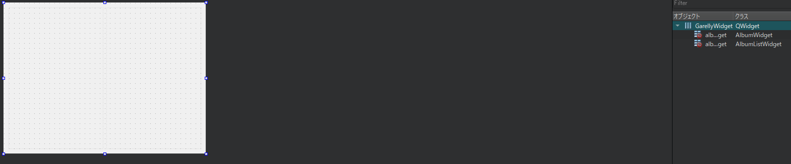

# ギャラリーアプリの構成

これで、AlbumListWidget、AlbumWidget、PictureWidgetが完成しました。記憶が正しければ、AlbumListWidgetとAlbumWidgetはGalleryWidgetというウィジェットの中に入っています。

では、GalleryWidget.uiファイルを見てみましょう。



このウィジェットには標準の Qt ウィジェットは含まれておらず、我々が作成したウィジェットのみが含まれています。Qtでは、Qtデザイナーで独自のウィジェットを使用するための2つの方法が用意されています。 

* **ウィジェットを宣伝する**: これは最も早く、簡単な方法です。
* **Qtデザイナーのためのウィジェットプラグインの作成**: こちらの方が強力ですが、より複雑です。

この章では、一般的な QWidget をプレースホルダとして配置し、それをカスタムのウィジェットクラスに昇格させる最初の方法を使用します。以下の手順で、Qt デザイナーから GalleryWidget.ui ファイルに albumListWidget と albumWidget オブジェクトを追加できます。

1. **Containers**から**Widget**をフォームにドラッグ＆ドロップします。
2. **プロパティエディタ**から**objectName**(例: albumListWidget)を設定します。
3. ウィジェットのコンテキストメニューから **Promote to...** を選択します。
4. プロモーションされるクラス名を設定します (例: AlbumWidget)。
5. ヘッダーファイルが正しいことを確認します (例: AlbumWidget.h)。
6. **追加**ボタンをクリックして、**プロモート**をクリックします。

ウィジェットのプロモーションに失敗した場合は、コンテクストメニューの**QWidgetに移動**でいつでも逆にすることができます。

GalleryWidgetのヘッダと実装には、本当にワクワクするようなものは何もありません。

 ただ、Album と Picture のモデルとモデル選択を albumListWidget と albumWidget に転送するためのセッターを提供しているだけです。また、このクラスは albumWidget からのシグナル pictureActivated も中継しています。必要に応じてソースコードを確認してください。

これで本章の最終回です。これからMainWindowを解析していきます。MainWindow.uiでは何もしていませんが、これはコードの中で処理されているからです。これが MainWindow.h です。

```C++
#include <QMainWindow>
#include <QStackedWidget>

QT_BEGIN_NAMESPACE
namespace Ui { class MainWindow; }
QT_END_NAMESPACE

class GalleryWidget;
class PictureWidget;

class MainWindow : public QMainWindow
{
    Q_OBJECT

public:
    MainWindow(QWidget *parent = nullptr);
    ~MainWindow();

private:
    Ui::MainWindow *ui;
    GalleryWidget* mGalleryWidget;
    PictureWidget* mPictureWidget;
    QStackedWidget* mStackedWidget;
};
```

displayGallery()とdisplayPicture()の2つのスロットを使って、ギャラリー(アルバムとサムネイルが表示されたアルバムリスト)とピクチャ(フルサイズ)の表示を切り替えます。QStackedWidgetクラスは、様々なウィジェットを含むことができますが、一度に1つだけ表示することができます。

MainWindow.cppファイルのコンストラクタの先頭を見てみましょう。

```C++
    ui->setupUi(this);

    AlbumModel* albumModel = new AlbumModel(this);
    QItemSelectionModel* albumSelectionModel =
    new QItemSelectionModel(albumModel, this);
    mGalleryWidget->setAlbumModel(albumModel);
    mGalleryWidget->setAlbumSelectionModel(albumSelectionModel);
```

まず、ui->setupUi()を呼び出してUIを初期化します。次に AlbumModel とその QItemSelectionModel を作成します。最後に、GalleryWidget のセッターを呼び出して、それらを AlbumListWidget と AlbumWidget オブジェクトにディスパッチします。

このコンストラクタの分析を続けます。

```C++
    PictureModel* pictureModel = new PictureModel(*albumModel, this);
    ThumbnailProxyModel* thumbnailModel = new ThumbnailProxyModel(this);
    thumbnailModel->setSourceModel(pictureModel);

    QItemSelectionModel* pictureSelectionModel =
        new QItemSelectionModel(pictureModel, this);

    mGalleryWidget->setPictureModel(thumbnailModel);
    mGalleryWidget->setPictureSelectionModel(pictureSelectionModel);
    mPictureWidget->setModel(thumbnailModel);
    mPictureWidget->setSelectionModel(pictureSelectionModel);
```

Pictureでの動作は、先ほどのAlbumでの動作に近いです。しかし、PictureModelから初期化されたThumbnailProxyModelとそのQItemSelectionModelもPictureWidgetと共有しています。

コンストラクタがシグナル/スロット接続を実行するようになりました。

```C++
    connect(mGalleryWidget, &GalleryWidget::pictureActivated,
        this, &MainWindow::displayPicture);

    connect(mPictureWidget, &PictureWidget::backToGallery,
        this, &MainWindow::displayGallery);
```

pictureActivated()関数を覚えていますか？これは、AlbumWidgetのサムネイルをダブルクリックしたときに出るシグナルです。これを displayPicture スロットに接続すると、画像がフルサイズで表示されるようになります。また、PictureWidgetのbackButtonをクリックしたときに出るBackToGalleryシグナルも忘れずに接続してください。再びギャラリー表示に切り替わります。

コンストラクタの最後の部分は簡単です。

```C++
    mStackedWidget->addWidget(mGalleryWidget);
    mStackedWidget->addWidget(mPictureWidget);
    displayGallery();

    setCentralWidget(mStackedWidget);
```

2 つのウィジェット mGalleryWidget と mPictureWidget を mStackedWidget クラスに追加します。アプリケーションの起動時にギャラリーを表示したいので、独自のスロット displayGallery() を呼び出します。最後に、メインウィンドウの中心となるウィジェットとして mStackedWidget を定義します。

この章の最後に、ユーザーが要求したときにディスプレイを切り替えることができる2つの魔法のスロットで何が起こるかを見てみましょう。

```C++
    void MainWindow::displayGallery()
    {
        mStackedWidget->setCurrentWidget(mGalleryWidget);
    }
    void MainWindow::displayPicture(const QModelIndex& /*index*/)
    {
        mStackedWidget->setCurrentWidget(mPictureWidget);
    }
```

バカみたいに簡単ですね。対応するウィジェットを選択するように mStackedWidget にリクエストするだけです。PictureWidget は他のビューと同じ選択モデルを共有しているので、index 変数を無視することもできます。

***

## まとめ

データと表現の間の本当の分離は、必ずしも簡単な作業ではありません。コアとGUIを2つの異なるプロジェクトに分割するのは良い習慣です。これにより、アプリケーションの中で分離されたレイヤーを設計することを余儀なくされます。一見すると、Qtのモデル/ビューシステムは複雑に見えるかもしれません。しかし、この章では、Qtがどれだけ強力で、どれだけ簡単に使えるかを教えてくれました。Qtフレームワークのおかげで、データベース内のデータの永続化が頭痛の種にならずにできるようになりました。

この章では、gallery-coreライブラリで築いた基礎の上に構築しました。次の章では、同じコアライブラリを再利用して、Qt Quickを使ったモバイルUIをQMLで作成します。

***

**[戻る](../index.html)**
