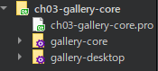
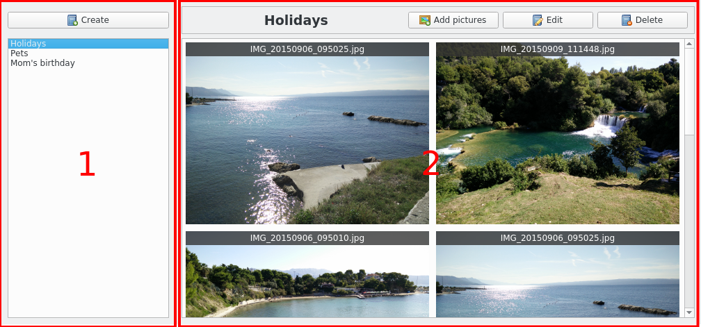
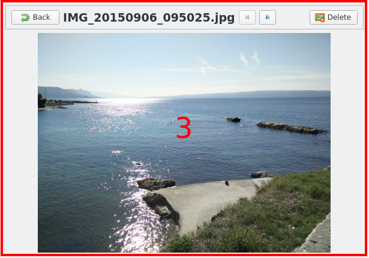
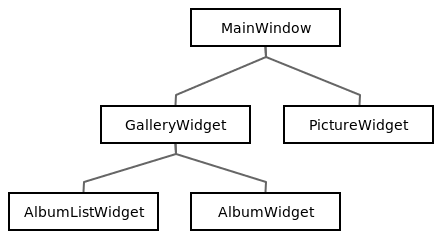

# コアな共有ライブラリと連携したGUIの作成

これで、gallery-core共有ライブラリの準備ができました。それでは、デスクトップGUIプロジェクトの作成方法を見ていきましょう。gallery-desktopというQtウィジェットアプリケーションのサブプロジェクトを作成します。最初の手順だけが従来のQtウィジェットアプリケーションと異なります。メインプロジェクト上で右クリックして、ch04-gallery-desktop → New subproject → Application → Qt Widgets Application → Chooseを選択します。

このような素敵なマルチプロジェクトの階層ができあがります。



このgallery-desktopアプリケーションをgallery-coreにリンクします。gallery-desktop.proファイルを自分で編集するか、Qt Creatorウィザードを使って以下のように編集します。プロジェクトを右クリックして、gallery-desktop → ライブラリの追加 → 内部ライブラリ → gallerycore → 次へ > 完了を選択します。更新されたgallery-desktop.proは以下の通りです。

```QMake
QT       += core gui

greaterThan(QT_MAJOR_VERSION, 4): QT += widgets

CONFIG += c++11

# You can make your code fail to compile if it uses deprecated APIs.
# In order to do so, uncomment the following line.
#DEFINES += QT_DISABLE_DEPRECATED_BEFORE=0x060000    # disables all the APIs deprecated before Qt 6.0.0

SOURCES += \
    main.cpp \
    mainwindow.cpp

HEADERS += \
    mainwindow.h

FORMS += \
    mainwindow.ui

# Default rules for deployment.
qnx: target.path = /tmp/$${TARGET}/bin
else: unix:!android: target.path = /opt/$${TARGET}/bin
!isEmpty(target.path): INSTALLS += target

win32:CONFIG(release, debug|release): LIBS += -L$$OUT_PWD/../gallery-core/release/ -lgallery-core
else:win32:CONFIG(debug, debug|release): LIBS += -L$$OUT_PWD/../gallery-core/debug/ -lgallery-core
else:unix: LIBS += -L$$OUT_PWD/../gallery-core/ -lgallery-core

INCLUDEPATH += $$PWD/../gallery-core
DEPENDPATH += $$PWD/../gallery-core
```

LIBS変数は、このプロジェクトでリンクするライブラリを指定します。構文は非常にシンプルです。L接頭辞でライブラリのパスを、-l接頭辞でライブラリ名を指定することができます。

```QMake
LIBS += -L<pathToLibrary> -l<libraryName>
```

デフォルトでは、Windows上でQtプロジェクトをコンパイルすると、debugとreleaseのサブディレクトリが作成されます。そのため、プラットフォームによって異なる LIBS 版が作成されます。

これで、アプリケーションは gallery-core ライブラリにリンクされ、どこにあるかを知っているので、ライブラリのヘッダファイルがどこにあるかを示さなければなりません。これが、gallery-core のソースパスを INCLUDEPATH と DEPENDPATH に追加しなければならない理由です。

これらのタスクをすべて正常に完了させるために、qmakeはいくつかの便利な変数を提供しています。

* \$\$OUT_PWD: 出力ディレクトリへの絶対パス
* \$\$\$PWD: 現在の.proファイルの絶対パス

qmake がデスクトップアプリケーションの前に共有ライブラリをコンパイルするようにするために、次のスニペットに従って ch04-gallery-desktop.pro ファイルを更新する必要があります。

```QMake
TEMPLATE = subdirs

SUBDIRS += \
    gallery-core \
    gallery-desktop

gallery-desktop.depends = gallery-core
```

depends属性は、gallery-desktopの前にgallery-coreをビルドしなければならないことを明示的に示しています。

***
## Tips

CONFIG += ordered に頼るのではなく、常に depends 属性を使用するようにしてください。depends属性は、qmakeがプロジェクトを並行して処理するのに役立ちます。

***

やみくもにコーディングを急ぐのではなく、時間をかけてUIアーキテクチャを考えていきます。gallery-core ライブラリから実装すべき機能がたくさんあります。これらの機能を独立した QWidgets に分割する必要があります。最終的なアプリケーションは以下のようになります。



##### 私たちの未来のギャラリーデスクトップはここにあります

写真を拡大して見ると、次のようになります。



##### サムネイルをダブルクリックするとフルサイズで表示されます。

主な UI コンポーネントをまとめると

* AlbumListWidget: このコンポーネントは、既存のすべてのアルバムをリストアップします。
* AlbumWidget: このコンポーネントは、選択されたアルバムとそのサムネイルを表示します。
* PictureWidget: このコンポーネントは、画像をフルサイズで表示します。

このように整理していきます。



各ウィジェットには定義された役割があり、特定の機能を処理します。

| クラス名 | 機能 |
| ---| --- |
| MainWindow | ギャラリーと現在の画像の切り替えを処理します |
| GalleryWidget | ・既存のアルバムを表示<br>・アルバムセレクション<br>・アルバム作成 |
| AlbumListWidget | ・既存のアルバムを表示<br>・アルバムセレクション<br>・アルバム作成 |
| AlbumWidget | ・既存の画像をサムネイルとして表示<br>・アルバムに写真を追加<br>・アルバム名の変更<br>・アルバム削除<br>・画像選択 |
| PictureWidget | ・選択した画像を表示します<br>・画像選択<br>・画像の削除 |

コアな共有ライブラリでは、標準コンテナ(vector)を使ったスマートポインタを使用していました。一般的にGUIプロジェクトでは、Qtコンテナとその強力な親子所有システムだけを使う傾向があります。このアプローチの方が私たちには適しているように思えます。この章ではGUIにはQtコンテナを使用します（スマートポインタは使用しません）。

これで無事にウィジェットの作成を開始することができました。すべてのウィジェットは Qt Designer Form Class から作成されています。記憶が曖昧な場合は、第 1 章「Qt入門」の「カスタム QWidget」のセクションを確認してください。

***

**[戻る](../index.html)**
