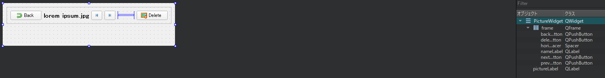

# PictureWidgetで画像を表示する

このウィジェットは画像をフルサイズで表示するために呼び出されます。また、前/次の画像に移動したり、現在の画像を削除したりするためのボタンを追加します。

PictureWidget.uiフォームの分析を始めましょう。デザインビューは次のとおりです。



詳細は以下の通りです。

* backButton: このオブジェクトはギャラリーの表示を要求します。
* deleteButton: このオブジェクトはアルバムから写真を削除します。
* nameLabel: このオブジェクトは、画像の名前を表示します。
* nextButton: このオブジェクトはアルバム内の次の画像を選択します。
* previousButton: このオブジェクトは、アルバム内の前の写真を選択します。
* pictureLabel: このオブジェクトは画像を表示します。

これで、ヘッダーの PictureWidget.hを見てみましょう。

```C++
#include <QWidget>
#include <QItemSelection>

namespace Ui {
class PictureWidget;
}

class PictureModel;
class QItemSelectionModel;
class ThumbnailProxyModel;

class PictureWidget : public QWidget
{
    Q_OBJECT

public:
    explicit PictureWidget(QWidget *parent = nullptr);
    ~PictureWidget();
    void setModel(ThumbnailProxyModel* model);
    void setSelectionModel(QItemSelectionModel* selectionModel);

signals:
    void backToGallery();

    // QWidget interface
protected:
    void resizeEvent(QResizeEvent *event) override;

private slots:
    void deletePicture();
    void loadPicture(const QItemSelection& selected);

private:
    void updatePixturePixmap();

private:
    Ui::PictureWidget *ui;
    ThumbnailProxyModel* mModel;
    QItemSelectionModel* mSelectionModel;
    QPixmap mPixmap;
};
```

驚くことではありませんが、PictureWidgetクラスにはThumbnailProxyModel\*とQItemSelectionModel\*のセッターがあります。シグナル backToGallery() は、ユーザが backButton オブジェクトをクリックしたときにトリガされます。これはMainWindowで処理され、ギャラリーを再表示します。resizeEvent()をオーバーライドすることで、常に画像を表示するための可視領域をすべて使用するようにしています。deletePicture()スロットは、ユーザーが対応するボタンをクリックした時に削除処理を行います。loadPicture()関数は、指定した画像でUIを更新するために呼び出されます。最後に、updatePicturePixmap()関数は、現在のウィジェットサイズに応じて画像を表示するヘルパー関数です。

このウィジェットは他のウィジェットと本当によく似ています。そのため、ここではPictureWidget.cppの完全な実装コードは載せません。必要であれば、完全なソースコードの例を確認してください。

PictureWidget.cppで、このウィジェットがどのようにして画像を常にフルサイズで表示することができるのか見てみましょう。

```C++
void PictureWidget::resizeEvent(QResizeEvent *event)
{
    QWidget::resizeEvent(event);
    updatePixturePixmap();
}

void PictureWidget::updatePixturePixmap()
{
    if (mPixmap.isNull()) {
        return;
    }
    ui->pictureLabel->setPixmap(mPixmap.scaled(ui->pictureLabel->size(),
                                               Qt::KeepAspectRatio));
}
```

なので、ウィジェットのサイズが変更されるたびに updatePicturePixmap() を呼び出しています。mPixmap変数はPictureModelのフルサイズ画像です。この関数は縦横比を保ったまま、ピクチャをpictureLabelのサイズに拡大縮小します。ウィンドウのサイズを自由に変更して、可能な限り大きなサイズで写真を楽しむことができます。

***

**[戻る](../index.html)**
