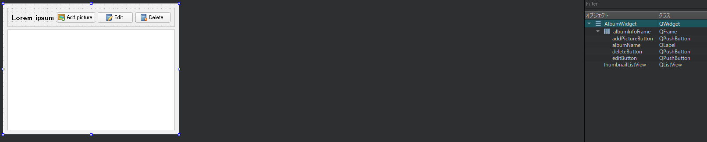

# 選択したアルバムを AlbumWidget で表示する

AlbumListWidgetから選択したアルバムのデータを表示します。いくつかのボタンでアルバムを操作できます。

以下は AlbumWidget.ui ファイルのレイアウトです。



一番上のフレームである、横長のレイアウトのalbumInfoFrameには、次のようなものが含まれています。

* albumName: このオブジェクトは、アルバムの名前を表示します（デザイナーの**Lorem ipsum**）。
* addPicturesButton: このオブジェクトは、ユーザーがファイルを選択して画像を追加することを可能にします。
* editButton: このオブジェクトはアルバムの名前を変更するために使用されます。
* deleteButton: このオブジェクトはアルバムを削除するために使用されます。

一番下の要素である thumbnailListView は QListView です。このリストビューは PictureModel からのアイテムを表します。デフォルトでは、QListViewはモデルからQt::DisplayRoleとQt::DecorationRoleを要求して、テキストの横に画像を表示することができます。

ヘッダーの AlbumWidget.h ファイルを見てみましょう。

```C++
#include <QWidget>
#include <QModelIndex>

namespace Ui {
class AlbumWidget;
}

class AlbumModel;
class PictureModel;
class QItemSelectionModel;
class ThumbnailProxyModel;

class AlbumWidget : public QWidget
{
    Q_OBJECT

public:
    explicit AlbumWidget(QWidget *parent = nullptr);
    ~AlbumWidget();

    void setAlbumModel(AlbumModel* albumModel);
    void setAlbumSelectionModel(QItemSelectionModel* albumSelectionModel);
    void setPictureModel(ThumbnailProxyModel* pictureModel);
    void setPictureSelectionModel(QItemSelectionModel* selectionModel);

signals:
    void pictureActivated(const QModelIndex& index);

private slots:
    void deleteAlbum();
    void editAlbum();
    void addPictures();

private:
    void clearUi();
    void loadAlbum(const QModelIndex& albumIndex);

private:
    Ui::AlbumWidget *ui;
    AlbumModel* mAlbumModel;
    QItemSelectionModel* mAlbumSelectionModel;

    ThumbnailProxyModel* mPictureModel;
    QItemSelectionModel* mPictureSelectionModel;
};
```

このウィジェットはAlbumとPictureのデータを扱う必要があるので、このクラスにはAlbumModelとThumbnailProxyModelのセッターがあります。また、他のウィジェットやビュー(つまり AlbumListWidget)とモデル選択を知り、共有したいと考えています。そのために、Album と Picture のモデル選択セッターも持っています。

シグナル pictureActivated() は、ユーザーがサムネイルをダブルクリックしたときに発生します。後ほど、MainWindow がこのシグナルに接続して画像をフルサイズで表示する方法を見てみましょう。

プライベートスロットである deleteAlbum()、editAlbum()、addPictures() は、ユーザーがこれらのボタンをクリックしたときに呼び出されます。

最後に、特定のアルバムのUIを更新するためにloadAlbum()関数が呼び出されます。
clearUi()関数は、このウィジェットのUIによって表示されるすべての情報をクリアするのに便利です。

AlbumWidget.cpp ファイルの実装の最初の部分を見てみましょう。

```C++
#include "albumwidget.h"
#include "ui_albumwidget.h"

#include <QInputDialog>
#include <QFileDialog>

#include "albummodel.h"
#include "picturemodel.h"

AlbumWidget::AlbumWidget(QWidget *parent) :
    QWidget(parent),
    ui(new Ui::AlbumWidget),
    mAlbumModel(nullptr),
    mAlbumSelectionModel(nullptr),
    mPictureModel(nullptr),
    mPictureSelectionModel(nullptr)
{
    ui->setupUi(this);
    clearUi();

    ui->thumbnailListView->setSpacing(5);
    ui->thumbnailListView->setResizeMode(QListView::Adjust);
    ui->thumbnailListView->setFlow(QListView::LeftToRight);
    ui->thumbnailListView->setWrapping(true);

    connect(ui->thumbnailListView, &QListView::doubleClicked,
            this, &AlbumWidget::pictureActivated);

    connect(ui->deleteButton, &QPushButton::clicked,
            this, &AlbumWidget::deleteAlbum);

    connect(ui->editButton, &QPushButton::clicked,
            this, &AlbumWidget::editAlbum);

    connect(ui->addPictureButton, &QPushButton::clicked,
            this, &AlbumWidget::addPictures);
}

AlbumWidget::~AlbumWidget()
{
    delete ui;
}
```

コンストラクタは、現在選択されているアルバムのサムネイルを表示するQListViewであるthumbnailListViewを設定します。ここでは、様々なパラメータを設定します。

* setSpacing()： このパラメータでは、デフォルトでは、アイテムはお互いに接着されています。あなたはそれらの間に間隔を追加することができます。
* setResizeMode(): このパラメータは、ビューがリサイズされたときにアイテムを動的に配置します。デフォルトでは、ビューがリサイズされてもアイテムは元の配置を維持します。
* setFlow(): このパラメータはリストの方向を指定します。ここでは左から右にアイテムを表示したいと思います。デフォルトでは、TopToBottomになっています。
* setWrapping(): このパラメータは、表示領域にアイテムを表示するための十分なスペースがない場合に、アイテムをラッピングすることを許可します。デフォルトでは、ラッピングは許可されず、スクロールバーが表示されます。

コンストラクタの最後は、UI に関連するすべてのシグナルの接続を実行します。最初のものは、第 1 章の Qt入門 で説明したシグナルリレーの良い例です。QListView::doubleClicked シグナルをクラスシグナルである AlbumWidget::pictureActivated に接続しています。他の接続は共通です。ユーザーがボタンをクリックしたときに特定のスロットを呼び出したいのです。Qt Designer Form クラスの場合と同様に、デストラクタはメンバ変数 ui を削除します。

AlbumModelのセッターの実装を見てみましょう。

```C++
void AlbumWidget::setAlbumModel(AlbumModel *albumModel)
{
    mAlbumModel = albumModel;

    connect(mAlbumModel, &QAbstractItemModel::dataChanged,
            [this] (const QModelIndex &topLeft) {
                if (topLeft == mAlbumSelectionModel->currentIndex()) {
                    loadAlbum(topLeft);
                }
    });
}

void AlbumWidget::setAlbumSelectionModel(QItemSelectionModel *albumSelectionModel)
{
    mAlbumSelectionModel = albumSelectionModel;

    connect(mAlbumSelectionModel,
            &QItemSelectionModel::selectionChanged,
            [this] (const QItemSelection &selected) {
                if (selected.isEmpty()) {
                    clearUi();
                    return;
                }
                loadAlbum(selected.indexes().first());
            });
}
```

選択されているアルバムのデータが変わった場合は、loadAlbum()関数でUIを更新する必要があります。更新されたアルバムが現在選択されているアルバムであることを確認するテストを行います。QAbstractItemModel::dataChanged()関数は3つのパラメータを持っていますが、ラムダスロット構文を使うことで未使用のパラメータを省略することができます。

私たちの AlbumWidget コンポーネントは、現在選択されているアルバムに応じて UI を更新しなければなりません。同じ選択モデルを共有しているので、ユーザーが AlbumListWidget からアルバムを選択するたびに QItemSelectionModel::slectionChangeded シグナルが発生します。この場合、loadAlbum()関数を呼び出してUIを更新します。アルバムの複数選択はサポートしていないので、最初に選択された要素に処理を制限することができます。選択範囲が空の場合は、単純に UI をクリアします。

いよいよPictureModelのセッター実装の番です。

```C++
void AlbumWidget::setPictureModel(ThumbnailProxyModel *pictureModel)
{
    mPictureModel = pictureModel;
    ui->thumbnailListView->setModel(mPictureModel);
}

void AlbumWidget::setPictureSelectionModel(QItemSelectionModel *selectionModel)
{
    ui->thumbnailListView->setSelectionModel(selectionModel);
}
```

ここでは非常にシンプルです。選択されたアルバムのサムネイルを表示するQListViewであるthumbnailListViewのモデルと選択モデルを設定します。また、後でデータを操作するためにピクチャモデルを保持しています。

これで一つ一つの機能を網羅できるようになりました。アルバム削除から始めましょう。

```C++
void AlbumWidget::deleteAlbum()
{
    if (mAlbumSelectionModel->selectedIndexes().isEmpty()) {
        return;
    }
    int row = mAlbumSelectionModel->currentIndex().row();
    mAlbumModel->removeRow(row);

    // Try to select the prepious album
    QModelIndex previousModelIndex = mAlbumModel->index(row - 1, 0);
    if (previousModelIndex.isValid()) {
        mAlbumSelectionModel->setCurrentIndex(previousModelIndex,
                                              QItemSelectionModel::SelectCurrent);
        return;
    }

    // Try to select the next item
    QModelIndex nextModelIndex = mAlbumModel->index(row, 0);
    if (nextModelIndex.isValid()) {
        mAlbumSelectionModel->setCurrentIndex(nextModelIndex,
                                              QItemSelectionModel::SelectCurrent);
        return;
    }
}
```

deleteAlbum() 関数で最も重要なタスクは、mAlbumSelectionModel から現在の行のインデックスを取得することです。そして、この行を削除するように mAlbumModel に要求することができます。残りの関数は、前のアルバムか次のアルバムを自動的に選択しようとするだけです。繰り返しになりますが、同じ選択モデルを共有しているので、AlbumListWidgetは自動的にアルバム選択を更新してくれます。

次のスニペットは、アルバムの名前変更機能を示しています。

```C++
void AlbumWidget::editAlbum()
{
    if (mAlbumSelectionModel->selectedIndexes().isEmpty()) {
        return;
    }

    QModelIndex currentAlbumIndex =
        mAlbumSelectionModel->selectedIndexes().first();

    QString oldAlbumName = mAlbumModel->data(currentAlbumIndex,
                                             AlbumModel::Roles::NameRole).toString();

    bool ok;
    QString newName = QInputDialog::getText(this,
                                            "Album's name",
                                            "Change Album name",
                                            QLineEdit::Normal,
                                            oldAlbumName,
                                            &ok);

    if (ok && !newName.isEmpty()) {
        mAlbumModel->setData(currentAlbumIndex,
                             newName,
                             AlbumModel::Roles::NameRole);
    }
}
```

ここでもQInputDialogクラスは機能を実装するのに役立ちます。これで、その動作に自信が持てるようになるはずです。この関数は3つのステップを実行します。

1. アルバムモデルから現在の名前を取得する。
2. 素晴らしい入力ダイアログを生成する。
3. アルバムモデルに名前の更新を要求する。

ご覧の通り、モデルの汎用関数のdata()とsetData()はItemDataRoleと組み合わせると非常に強力です。すでに説明したように、UIを直接更新するわけではありません。これは、setData() がシグナル dataChanged() を発し、AlbumWidget が処理するため、自動的に実行されます。

最後の機能は、現在のアルバムにいくつかの新しい画像ファイルを追加することができます。

```C++
void AlbumWidget::addPictures()
{
    QStringList filenames =
        QFileDialog::getOpenFileNames(this,
                                      "Add picture",
                                      QDir::homePath(),
                                      "Picture files (*.jpg *.png)");

    if (!filenames.isEmpty()) {
        QModelIndex lastModelIndex;
        for (auto filename : filenames) {
            Picture picture(filename);
            lastModelIndex = mPictureModel->PictureModel()->addPicture(picture);
        }
        ui->thumbnailListView->setCurrentIndex(lastModelIndex);
    }
}
```

ここではQFileDialogクラスを使用して、ユーザーが複数の画像ファイルを選択するのを支援しています。それぞれのファイル名に対して、アルバム作成のためにこの章ですでに見たような Picture データホルダーを作成します。そして、現在のアルバムにこの画像を追加するように mPictureModel に要求することができます。なお、mPictureModelはThumbnailProxyModelクラスなので、ヘルパー関数であるpictureModel()を使って実際のPictureModelを取得しなければなりません。関数addPicture()は対応するQModelIndexを返してくれるので、最終的にはサムネイルリストビューで一番最近追加されたピクチャを選択します。

AlbumWidget.cpp を完成させましょう。

```C++
void AlbumWidget::clearUi()
{
    ui->albumName->setText("");
    ui->deleteButton->setVisible(false);
    ui->editButton->setVisible(false);
    ui->addPictureButton->setVisible(false);
}

void AlbumWidget::loadAlbum(const QModelIndex &albumIndex)
{
    mPictureModel->PictureModel()->setAlbumId(mAlbumModel->data(albumIndex,
                                                                AlbumModel::Roles::IdRole).toInt());

    ui->albumName->setText(mAlbumModel->data(albumIndex, Qt::DisplayRole).toString());

    ui->deleteButton->setVisible(true);
    ui->editButton->setVisible(true);
    ui->addPictureButton->setVisible(true);
}
```

clearUi()関数はアルバム名をクリアしてボタンを隠し、loadAlbum()関数はQt::DisplayRole(アルバム名)を取得してボタンを表示します。

***

**[戻る](../index.html)**
