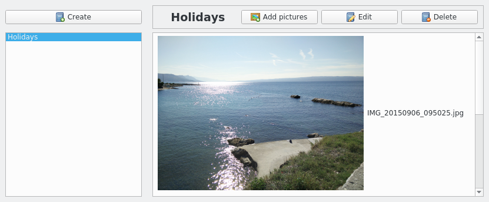
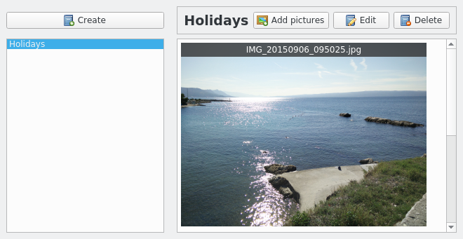

# PictureDelegateでサムネイルを強化する

デフォルトでは、QListViewクラスはQt::DisplayRoleとQt::DecorationRoleに各項目のテキストと画像の表示を要求します。このように、以下のような視覚的な結果が既に得られています。



しかし、私たちの**Gallery**アプリケーションは、より良いサムネイルレンダリングを提供する必要があります。うまくいけば、ビューのデリゲートの概念を使って簡単にカスタマイズできます。QListViewクラスはデフォルトのアイテムレンダリングを提供します。QStyledItemDelegateを継承したクラスを作成することで、独自のアイテムレンダリングを行うことができます。狙いは、以下のスクリーンショットのような名前バナーで夢のサムネイルを描くことです。



PictureDelegate.hを見てみましょう。

```C++
#include <QStyledItemDelegate>

class PictureDelegate : public QStyledItemDelegate
{
    Q_OBJECT
public:
    PictureDelegate(QObject* parent = nullptr);

    // QAbstractItemDelegate interface
public:
    void paint(QPainter *painter, const QStyleOptionViewItem &option, const QModelIndex &index) const override;
    QSize sizeHint(const QStyleOptionViewItem &option, const QModelIndex &index) const override;
};
```

そうです、2つの関数をオーバーライドするだけです。一番重要な関数であるpaint()は、アイテムを好きなように塗れるようにしてくれます。sizeHint()関数でアイテムのサイズを指定します。

これで、PictureDelegate.cppでペインタの仕事を見ることができるようになりました。

```C++
#include "picturedelegate.h"

#include <QPainter>

const unsigned int BANNER_HEIGHT = 20;
const unsigned int BANNER_COLOR = 0x303030p;
const unsigned int BANNER_ALPHA = 200;
const unsigned int BANNER_TEXT_COLOR = 0xffffff;
const unsigned int HEIGHLIGHT_ALPHA = 100;

PictureDelegate::PictureDelegate(QObject *parent) :
    QStyledItemDelegate(parent)
{
}

void PictureDelegate::paint(QPainter *painter, const QStyleOptionViewItem &option, const QModelIndex &index) const
{
    painter->save();

    QPixmap pixmap = index.model()->data(index,
                                         Qt::DecorationRole).value<QPixmap>();
    painter->drawPixmap(option.rect.x(), option.rect.y(), pixmap);

    QRect bannerRect = QRect(option.rect.x(), option.rect.y(),
                             pixmap.width(), BANNER_HEIGHT);
    QColor bannerColor = QColor(BANNER_COLOR);
    bannerColor.setAlpha(BANNER_ALPHA);
    painter->fillRect(bannerRect, bannerColor);

    QString filename = index.model()->data(index,
                                           Qt::DisplayRole).toString();
    painter->setPen(BANNER_TEXT_COLOR);
    painter->drawText(bannerRect, Qt::AlignCenter, filename);

    if (option.state.testFlag(QStyle::State_Selected)) {
        QColor selectedColor = option.palette.highlight().color();
        selectedColor.setAlpha(HEIGHLIGHT_ALPHA);
        painter->fillRect(option.rect, selectedColor);
    }

    painter->restore();
}
```

QListViewがアイテムを表示する必要があるたびに、このデリゲートのpaint()関数が呼び出されます。ペイントシステムは、レイヤーを重ねて塗っていくものと見ることができます。QPainterクラスでは、好きなものを何でも描くことができます。円、パイ、長方形、テキストなどです。アイテムの領域は option.rect() で取得できます。手順は以下の通りです。

1. パラメータリストで渡された painter の状態を壊すのは簡単なので、何かをする前に painter->save() で状態を保存しておかなければなりません。
2. アイテムのサムネイルを取得し、QPainter::drawPixmap() 関数で描画します。
3. QPainter::fillRect()関数を使って、サムネイルの上に半透明のグレーのバナーを描きます。
4. アイテムの表示名を取得し、QPainter::drawText()関数を使用してバナー上に描画します。
5. アイテムが選択されている場合は、そのアイテムのハイライトカラーを使用して、上部に半透明の矩形を描画します。
6. ペインタの状態を元の状態に戻す。

***

## Tip

より複雑なアイテムを描きたい場合は、doc.qt.io/qt-5/qpainter.html にあるQPainter公式ドキュメントを確認してください。

***

sizeHint()関数の実装です。

```C++
QSize PictureDelegate::sizeHint(const QStyleOptionViewItem &option, const QModelIndex &index) const
{
    const QPixmap& pixmap = index.model()->data(index,
                                                Qt::DecorationRole).value<QPixmap>();
    return pixmap.size();
}
```

こちらの方が簡単です。アイテムのサイズをサムネイルのサイズと同じにしたいのです。Picture::setFilePath() でサムネイルのアスペクト比を保持しているので、サムネイルは幅と高さが異なることがあります。そのため、基本的にはサムネイルを取得してサイズを返します。

***

## Tip

アイテムデリゲートを作成する際には、QItemDelegateクラスを直接継承するのは避け、代わりにQStyledItemDelegateを継承します。この最後のものはQtのスタイルシートをサポートしているので、レンダリングを簡単にカスタマイズすることができます。

***

PictureDelegate の準備ができたので、それを使用するように thumbnailListView を設定し、AlbumWidget.cpp ファイルを次のように更新します。

```C++
AlbumWidget::AlbumWidget(QWidget *parent) :
    QWidget(parent),
    ui(new Ui::AlbumWidget),
    mAlbumModel(nullptr),
    mAlbumSelectionModel(nullptr),
    mPictureModel(nullptr),
    mPictureSelectionModel(nullptr)
{
    ui->setupUi(this);
    clearUi();

    ui->thumbnailListView->setSpacing(5);
    ui->thumbnailListView->setResizeMode(QListView::Adjust);
    ui->thumbnailListView->setFlow(QListView::LeftToRight);
    ui->thumbnailListView->setWrapping(true);
    ui->thumbnailListView->setItemDelegate(
        new PictureDelegate(this));A
    ...
}
```

***

## Qt tip

アイテムデリゲートは、QStyledItemDelegate::createEditor()関数を使って編集プロセスを管理することもできます。

***

**[戻る](../index.html)**
