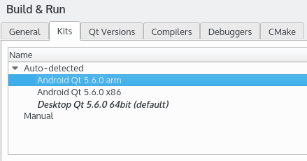

# 開発環境の確認

Android用のQtアプリを作成するためには、以下の条件が必要です。

* Android v2.3.3 (API 10) 以降を搭載した端末
* アンドロイドＳＤＫ
* アンドロイドＮＤＫ
* ジェイディーケー
* Android x86用Qtプリビルトコンポーネント（Qtメンテナンスツールより
* Android ARMv7用Qtプリビルトコンポーネント（Qtメンテナンスツールより

iOS用のQtアプリを作成できるようにするには、以下のものが必要です。

* iOS 5.0以降のデバイス
* Macのデスクトップコンピュータ
* エックスコード
* Qt for iOS (Qtメンテナンスツールより)

起動すると、Qt CreatorがAndroidとiOSのQtキットを検出して作成してくれます。既存のキットは、以下のスクリーンショットのように**ツール** → **オプション** → **ビルドと実行** → **キット**から確認できます。

***

**[戻る](../index.html)**
