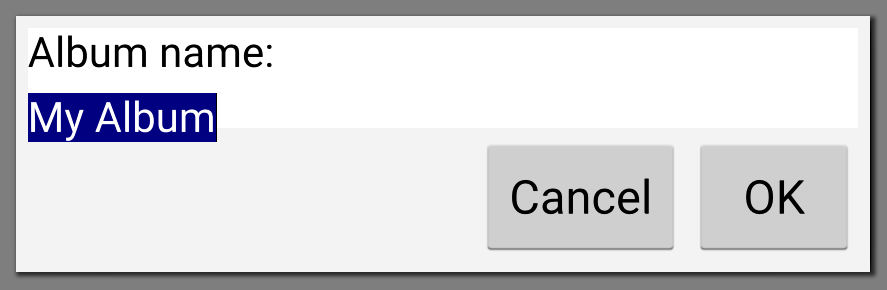

# カスタムInputDialogから新しいアルバムを作成する

AlbumListPageには表示するためのデータが必要です。次のステップは、新しいアルバムを追加できるようにすることです。これを行うには、どこかの時点で QML から AlbumModel 関数を呼び出して、この新しいアルバムを追加する必要があります。UIを構築する前に、gallery-coreに小さな修正を加えなければなりません。

QML には既に AlbumModel 関数が用意されています。しかし、QML コードから AlbumModel::addAlbum(const Album& album) を直接呼び出すことはできません。QML エンジンはこの関数を認識せず、エラー TypeError をスローします。オブジェクト AlbumModel(...) のプロパティ 'addAlbum' は関数ではありません。これは、目的の関数を Q_INVOKABLE マクロで装飾するだけで修正できます（PictureModel::setAlbumId() で行ったように）。

しかし、ここでもう一つ問題があります。Album は C++ のクラスですが、QML では認識されていません。QML で Album に完全にアクセスできるようにするには、クラスに重要な変更を加えなければなりません。

* QObject クラスから Album クラスを継承するようにします。
* Q_PROPERTY マクロを追加し、クラスのどのプロパティを QML からアクセスできるようにするかを指定する。
* 複数のコンストラクタ（コピーコンストラクタ、QObject* parent など）を追加。
* AlbumModel::addAlbum() 関数が、Album& ではなく Album* を取るように強制。複雑なオブジェクト (プリミティブ型ではない) では、QML はポインタしか扱えません。これは大きな問題ではありませんが、ポインタの代わりに参照を使うことでコードがより安全になる傾向があります。

クラスがQMLで大きく操作されている場合、これらの変更は完全に合理的です。私たちの使用例は非常に限定されています。私たちは新しいアルバムを作成したいだけです。アプリケーション全体を通して、我々はアルバムデータを表示するためにネイティブのModel/View APIに依存し、Albumに特化したものは何も使用されません。

これらの理由から、単純に AlbumModel にラッパー関数を追加します。

```C++
// In AlbumModel.h
...
QModelIndex addAlbum(const Album& album);
Q_INVOKABLE void addAlbumFromName(const QString& name);
...

// In AlbumModel.cpp
void AlbumModel::addAlbumFromName(const QString& name)
{
    addAlbum(Album(name));
}
```

これで、gallery-mobileプロジェクトのUIに戻ることができます。QMLのDialogを使ってこのアルバムを追加します。QtQuick は、ダイアログの様々なデフォルト実装を提供しています。

* ColorDialog: このダイアログは、色を選択するために使用されます。
* Dialog: このダイアログは、標準的なボタンを備えた汎用ダイアログ（QDialogと同等）を使用します。
* FileDialog: このダイアログはローカルファイルシステムからファイルを選択するために使われます。
* FontDialog: このダイアログはフォントを選択するために使用します
* MessageDialog: このダイアログは、メッセージを表示するために使用されます。

このリストの中に InputDialog があると思っていたでしょう (第 4 章「デスクトップ UI を制覇する」で QInputDialog ウィジェットを使用したので) が、Qt Quick にはありません。新しいQMLファイル(Qt Quick 2)を作成し、InputDialog.qmlという名前を付けます。内容は以下のようになるはずです。

```QML
import QtQuick 2.6
import QtQuick.Layouts 1.3
import Qt.labs.controls 1.0
import QtQuick.Dialogs 1.2
import QtQuick.Window 2.2
import "."

Dialog {
    property string label: "New item"
    property string hint: ""
    property alias editText : editTextItem

    standardButtons: StandardButton.Ok | StandardButton.Cancel
    onVisibleChanged: {
        editTextItem.focus = true
        editTextItem.selectAll()
    }
    onButtonClicked: {
        Qt.inputMethod.hide();
    }

    Rectangle {
        implicitWidth: parent.width
        implicitHeight: 100

        ColumnLayout {
            Text {
                id: labelItem
                text: label
                color: Style.text
            }

            TextInput {
                id: editTextItem
                inputMethodHints: Qt.ImhPreferUppercase
                text: hint
                color: Style.text
            }
        }
    }
}
```

このカスタムInputDialogでは、汎用のQt Quick Dialogを取り、ID editTextItemで参照されるTextInputアイテムを含むように変更します。また、期待される入力を記述するために、editTextItemのすぐ上にlabelItemを追加しました。このダイアログにはいくつかの注意点があります。

まず、このダイアログは汎用的なものにしたいので、設定可能でなければなりません。呼び出し元は、特定のデータを表示するためのパラメータを提供できるようにしなければなりません。これは Dialog 要素の先頭にある三つのプロパティで行います。

* label_: このプロパティはlabelItemで表示されるテキストを設定します。
* hint: このプロパティはlabelItemに表示されるテキストを設定します。このプロパティはeditTextItemに表示されるデフォルトのテキストです。
* editText: このプロパティは "ローカル "編集テキストを参照します。このプロパティは "ローカル "のeditTextItem要素を参照します。これは、ダイアログが閉じられたときに呼び出し元が値を取得できるようにします。

また、Dialog要素を設定することで、プラットフォームボタンを自動的に使用して、StandardButtonsを使用してダイアログの検証やキャンセルを行うようにしています。StandardButton。 
Ok | StandardButton.Cancel構文です。

最後に、ダイアログをもう少しユーザーフレンドリーにするために、editTextItemはDialog要素が表示され、テキストが選択されたときにフォーカスを持っています。これら2つのステップは onVisibleChanged() コールバック関数で行われます。ダイアログが非表示になった場合（つまり、OkやCancelがクリックされた場合）、Qt.InputMethod.hide()を使って仮想キーボードを非表示にしています。

これでInputDialogが使えるようになりました! AlbumListPage.qmlを開き、以下のように修正します。

```QML
PageTheme {

    toolbarTitle: "Albums"
    toolbarButtons: ToolButton {
        background: Image {
            source: "qrc:/res/icons/album-add.svg"
        }
        onClicked: {
            newAlbumDialog.open()
        }
    }

    InputDialog {
        id: newAlbumDialog
        title: "New album"
        label: "Album name:"
        hint: "My Album"

        onAccepted: {
            albumModel.addAlbumFromName(editText.text)
        }
    }
```

PageTheme 要素の中に newAlbumDialog という ID の InputDialog を追加します。すべてのカスタムプロパティを定義します。title, label, hintです。ユーザーが Ok ボタンをクリックすると、onAccepted() 関数が呼び出されます。ここでは、入力されたテキストで AlbumModel 要素内のラッパー関数 addAlbumFromName() を呼び出すだけです。

このDialog要素はデフォルトでは表示されていないので、 toolbarButtonsにToolButtonを追加して開きます。このToolButtonは、PageTheme.qmlファイルで指定したように、ヘッダーの右端に追加されます。モバイルの標準に合わせるために、ボタンの中にはテキストではなくカスタムアイコンを使用しています。

ここでは、qrc:/res/icons/album-add.svgという構文で.qrcファイルに保存されている画像を参照することができることがわかります。スケーラブルなアイコンを持つためにSVGファイルを使用していますが、gallery-mobileアプリケーションのために独自のアイコンを使用するのは自由です。

ユーザーがツールボタンをクリックすると、onClicked() 関数が呼び出され、そこで newAlbumDialog が開きます。参照デバイスである Nexus 5X では、このようになっています。



ユーザーが**OK**ボタンをクリックすると、全体のModel/Viewパイプラインが動作を開始します。この新しいアルバムは永続化され、AlbumModel 要素は正しいシグナルを発して ListView, albumList, 自体をリフレッシュするように通知します。私たちは gallery-core のパワーを活用し始めています。エンジンコードのかなりの部分を書き換えることなく、デスクトップアプリケーションやモバイルアプリケーションで使用することができます。

***

**[戻る](../index.html)**
