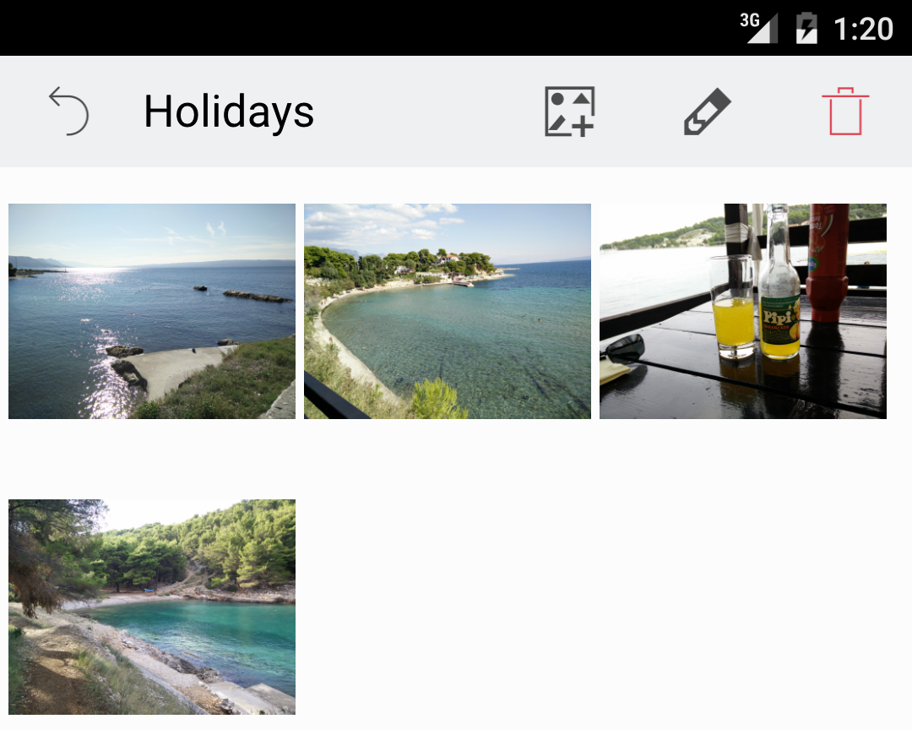

# GridViewでサムネイルを表示する

次のステップは、これらのサムネイルを表示することです。AlbumPage.qmlという名前の新しいQMLファイルを作成します。

```C++
import QtQuick 2.6
import QtQuick.Layouts 1.3
import QtQuick.Controls 2.0
import "."

PageTheme {

    property string albumName
    property int albumRowIndex

    toolbarTitle: albumName

    GridView {
        id: thumbnailList
        model: pictureModel
        anchors.fill: parent
        anchors.leftMargin: 10
        anchors.rightMargin: 10
        cellWidth : thumbnailSize
        cellHeight: thumbnailSize

        delegate: Rectangle {
            width: thumbnailList.cellWidth - 10
            height: thumbnailList.cellHeight - 10
            color: "transparent"

            Image {
                id: thumbnail
                anchors.fill: parent
                fillMode: Image.PreserveAspectFit
                cache: false
                source: "image://pictures/" + index + "/thumbnail"
            }
        }
    }
}
```

この新しい PageTheme 要素は 2 つのプロパティを定義します。albumNameとalbumRowIndexです。albumName プロパティは toolbarTitle のタイトルを更新するために使用されます。albumRowIndex は現在のページからアルバムの名前を変更したり削除したりするために AlbumModel と対話するために使用されます。

サムネイルを表示するために、セルのグリッドにサムネイルをレイアウトするGridView要素に頼っています。この thumbnailList アイテムは pictureModel を使用してデータを要求します。デリゲートは Rectangle 要素で、その中に Image が一つ入っています。このRectangle要素は、thumbnailList.cellWidthやthumbnailList.cellHeightよりも若干小さくなっています。GridView要素には（ListViewのように）各項目の間にある程度の余裕を持たせるためのspacingプロパティがありません。そのため、内容を表示するための面積を小さくすることでシミュレートしています。

Image 項目は、anchors.fill: parent ですべての空きスペースを取ろうとしますが、fillMode.Image: PreserveAspectFit で指定された画像のアスペクト比を維持します。現在のデリゲートである index がサムネイルを取得するために提供されている source 属性を認識します。最後に、cache: false 属性は、PictureImageProviderクラスがネイティブキャッシュを使用しようとしないことを保証します。

AlbumPage.qml を表示するには、stackView (main.qml にあります) を更新する必要があります。スタックビューはプロパティ(pageStack)として宣言されているので、どのQMLファイルからでもアクセスできることを覚えておいてください。

AlbumPage要素は、AlbumListPage.qml内の指定されたAlbum値のMouseArea要素をユーザーがクリックしたときに表示されます。

ここでは、ユーザーが新しい画像を追加する機能を提供します。これを行うには、QtQuick Dialog: FileDialogを使用します。以下はAlbumPage.qml の更新版です。

```QML
import QtQuick 2.6
import QtQuick.Layouts 1.3
import QtQuick.Controls 2.0
import QtQuick.Dialogs 1.2
import "."

PageTheme {

    property string albumName
    property int albumRowIndex

    toolbarTitle: albumName
    toolbarButtons: RowLayout {
        ToolButton {
            background: Image {
                source: "qrc:/res/icons/photo-add.svg"
            }
            onClicked: {
                dialog.open()
            }
        }
    }

    FileDialog {
        id: dialog
        title: "Open file"
        folder: shortcuts.pictures
        onAccepted: {
            var pictureUrl = dialog.fileUrl
            pictureModel.addPictureFromUrl(pictureUrl)
            dialog.close()
        }
    }

    GridView {
    ...
}
```

FileDialog 要素の実装は簡単です。folder: shortcuts.pictures プロパティを使用することで、QtQuickは自動的にプラットフォーム固有のpicturesディレクトリにFileDialog要素を配置します。さらに良いことに、iOS上では、あなたが自分の写真を選ぶことができるネイティブの写真アプリケーションを開きます。

ユーザが画像の選択を確認すると、そのパスは onAccepted()関数の dialog.fileUrl フィールドで利用可能となり、そのパスは pictureUrl 変数に格納されます。このpictureUrl変数は、PictureModel: addPictureFromUrl() の新しいラッパー関数に渡されます。使用するパターンは、AlbumModel::addAlbumFromName() で行ったのと全く同じです。

アルバムページの唯一の欠けている部分は、アルバムの削除とアルバム名の変更です。これらは既にカバーしたパターンに従っています。削除は AlbumModel のラッパー関数を使用して行われ、名前の変更は AlbumListPage.qml のために作成した InputDialog を再利用します。これらの機能の実装については、この章のソースコードを参照してください。Android 端末でのサムネイルの表示はこのようになります。



***

**[戻る](../index.html)**
