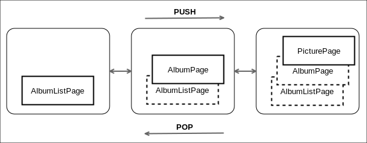

# Qtクイックギャラリーのエントリーポイントの準備

まず最初に、このプロジェクトを gallery-core ライブラリにリンクする必要があります。内部ライブラリをリンクする方法については、第4章「デスクトップUIを制覇する」ですでに説明しました。詳しくはそちらを参照してください。これが更新されたgallery-mobile.proファイルです。

```QMake
TEMPLATE = app

QT += qml quick sql svg

CONFIG += c++11

SOURCES += main.cpp

RESOURCES += gallery.qrc

LIBS += -L$$OUT_PWD/../gallery-core/ -lgallery-core
INCLUDEPATH += $$PWD/../gallery-core
DEPENDPATH += $$PWD/../gallery-core

contains(ANDROID_TARGET_ARCH,x86) {
    ANDROID_EXTRA_LIBS = \
        $$[QT_INSTALL_LIBS]/libQt5Sql.so
}
```

ここでいくつか変更を加えたことに気づいてください。

* モバイルデバイスに依存関係をデプロイするためのsqlモジュールを追加しました。
* ボタンアイコンのsvgモジュールを追加しました。
* qml.qrcファイルの名前がgallery.qrcに変更されました。
* gallery-coreライブラリをリンクしました。
* デフォルトでは、sql共有オブジェクト(libQt5Sql.so)はAndroid x86デバイスにデプロイされません。.pro ファイルに明示的に含める必要があります。

これで、gallery-mobileアプリケーションでgallery-coreライブラリのクラスが使えるようになりました。C++モデルをQMLで結合する方法を見てみましょう。これが更新されたmain.cppです。

```C++
#include <QGuiApplication>
#include <QQmlApplicationEngine>
#include <QQmlContext>
#include <QQuickView>

#include "AlbumModel.h"
#include "PictureModel.h"

int main(int argc, char *argv[])
{
    QGuiApplication app(argc, argv);

    AlbumModel albumModel;
    PictureModel pictureModel(albumModel);

    QQmlApplicationEngine engine;

    QQmlContext* context = engine.rootContext();
    context->setContextProperty("albumModel", &albumModel);
    context->setContextProperty("pictureModel", &pictureModel);

    engine.load(QUrl(QStringLiteral("qrc:/qml/main.qml")));

    return app.exec();
}
```

モデルは C++ でインスタンス化され、ルートの QQmlContext オブジェクトを使用して QML に公開されます。関数 setContextProperty() を使用すると、C++ の QObject を QML プロパティにバインドすることができます。第一引数には QML プロパティ名を指定します。C++ オブジェクトを QML プロパティにバインドしているだけです。コンテキストオブジェクトは、このオブジェクトの所有権を持ちません。

では、モバイルアプリケーション自体について説明しましょう。特定の役割を持つ3つのページを定義します。

* アルバムリストページ
  * 既存のアルバムを表示
  * アルバム作成
  * アルバムセレクション
* アルバムページ
  * 既存の画像をサムネイルとして表示
  * アルバムに写真を追加
  * アルバム名の変更
  * アルバム削除
  * 画像選択
* 画像ページ
  * 選択された画像を表示します。
  * 画像選択
  * 画像の削除

ナビゲーションを処理するために、Qt Quick Controls の StackView コンポーネントを使用します。
このQMLコンポーネントはスタックベースのナビゲーションを実装しています。ページを表示したいときにプッシュすることができます。ユーザーが戻りたいと要求したときには、それをポップすることができます。ここでは、StackViewコンポーネントをギャラリーモバイルアプリケーションに使用したワークフローを示します。枠線のついたページが、現在画面に表示されているページです。



main.qmlの実装です。

```QML
import QtQuick 2.6
import QtQuick.Controls 2.0

ApplicationWindow {

    readonly property alias pageStack: stackView

    id: app
    visible: true
    width: 768
    height: 1280

    StackView {
        id: stackView
        anchors.fill: parent
        initialItem: AlbumListPage {}
    }

    onClosing: {
        if (Qt.platform.os == "android") {
            if (stackView.depth > 1) {
                close.accepted = false
                stackView.pop()
            }
        }
    }
}
```

このメインファイルは本当にシンプルです。アプリケーションはStackViewコンポーネントを中心に構成されています。idプロパティを設定することで、StackViewが他のQMLオブジェクトから参照されるようにしています。anchorsプロパティは、StackViewの親であるApplicationWindow型を埋めるように設定します。最後に initialItem プロパティには、近日中に実装予定の AlbumListPage というページを設定します。

Android では、ユーザが戻るボタンを押すたびに onClosing が実行されます。ネイティブなAndroidアプリケーションを真似るために、アプリケーションを閉じる前に、最初に最後にスタックされたページをポップします。

ファイルの先頭で、スタックビューのための property alias を定義しています。プロパティproperty aliasは、既存のプロパティへの単純な参照である。このエイリアスは、他のQMLコンポーネントからstackViewにアクセスする際に便利です。QMLコンポーネントがstackViewを潰さないようにするために、readonlyキーワードを使用しています。初期化後、コンポーネントはそのプロパティにアクセスできますが、値の変更はできません。

***

**[戻る](../index.html)**
