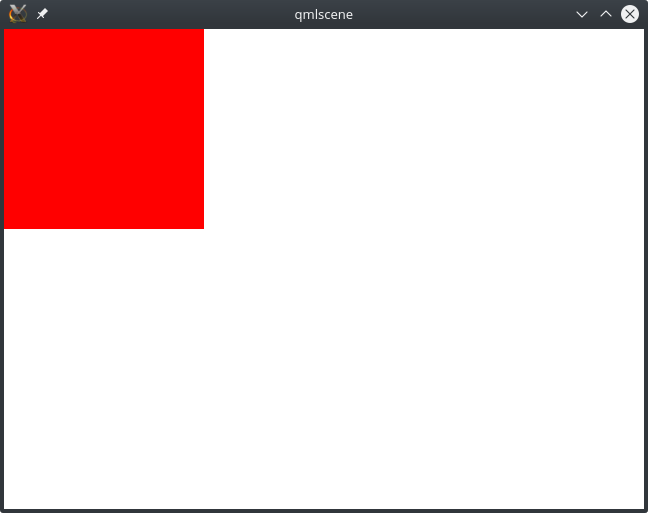
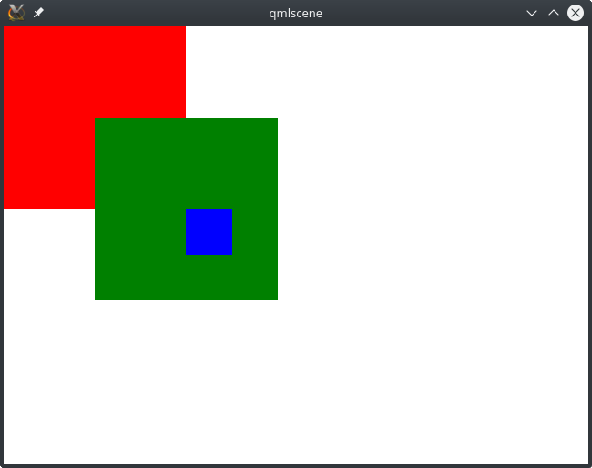
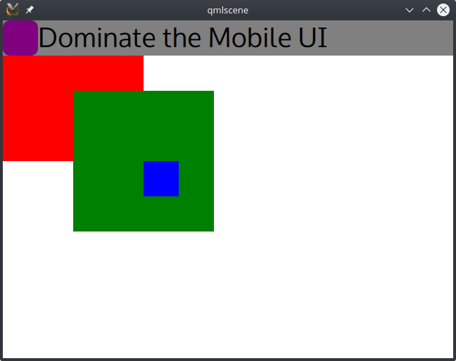
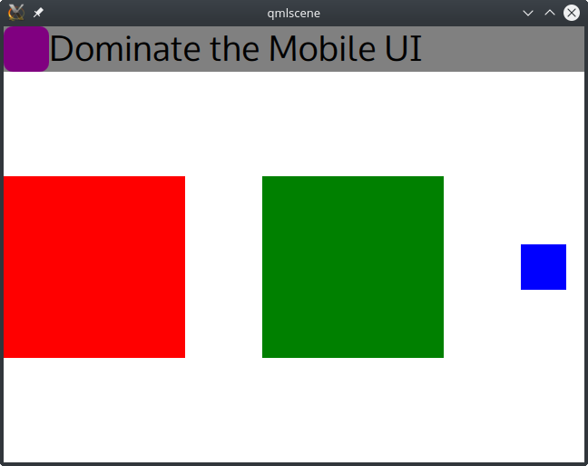
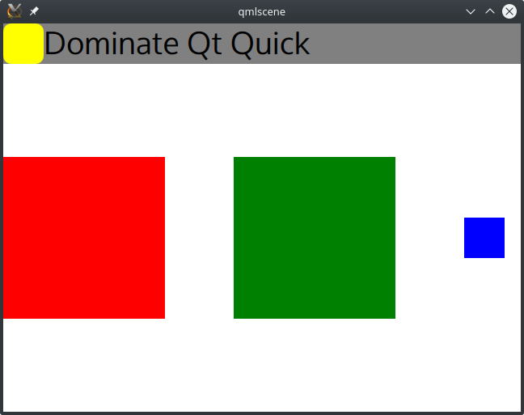

# Qt QuickとQMLで始める

Qt QuickはQtでアプリケーションを作成するもう一つの方法です。Qt ウィジェットの代わりに、これを使って完全なアプリケーションを作成することができます。Qt Quick モジュールは、トランジション、アニメーション、視覚効果を提供します。また、シェーダを使ってグラフィカルな効果をカスタマイズすることもできます。このモジュールは、特にタッチスクリーンを使ったデバイス向けのソフトウェアを作るのに効率的です。Qt Quickは専用の言語を使用しています。Qtモデリング言語（QML）です。宣言型言語です。構文はJSON（JavaScript Object Notation）構文に近いです。さらに、QMLはJavaScriptの表現をインラインまたは別ファイルでサポートしています。

まずは、QMLを使ったQt Quickアプリケーションの簡単な例から見ていきましょう。このコードスニペットを使って、main.qmlというファイルを新規に作成します。

```QML
import QtQuick 2.5
import QtQuick.Window 2.2

Window {
    visible: true
    width: 640; height: 480

    // A nice red rectangle
    Rectangle {
        width: 200; height: 200
        color: "red"
    }
}
```

Qt 5 には qmlscene と呼ばれる、QML ユーザーインターフェースをプロトタイプ化するための素晴らしいツールが用意されています。バイナリファイルは Qt のインストールフォルダにあります。Qt/5.7/gcc_64/bin/qmlscene.
main.qmlファイルを読み込むには、ツールを実行してファイルを選択するか、引数に.qmlファイルを指定してCLIを使用します。qmlscene main.qml。このようなものが表示されるはずです。



Qt Quickモジュールを使用するには、それをインポートする必要があります。構文は簡単です。

```QML
import <moduleName> <moduleVersion>
```

この例では、基本的なコンポーネント (Rectangle, Image, Text) を提供する共通モジュールである QtQuick をインポートし、メインのウィンドウアプリケーション (Window) を提供する QtQuick.Window モジュールもインポートします。

QMLコンポーネントはプロパティを持つことができます。例えば、Windowクラスのwidthプロパティを640に設定します。以下に一般的な構文を示します。

```QML
<ObjectType> {
 <PropertyName>: <PropertyValue>
}
```

これでmain.qmlファイルを新しい長方形で更新することができるようになりました。

```QML
import QtQuick 2.5
import QtQuick.Window 2.2

Window {
    visible: true
    width: 640; height: 480

    Rectangle {
        width: 200; height: 200
        color: "red"
    }

    Rectangle {
        width: 200; height: 200
        color: "green"
        x: 100; y: 100

        Rectangle {
            width: 50; height: 50
            color: "blue"
            x: 100; y: 100
        }
    }
}
```

視覚的な結果がこちらです。



QMLファイルでは、UIをコンポーネントの階層として記述しています。Window要素の下の階層は以下のようになります。

* 赤い四角形
* 緑の長方形
* 青い長方形

入れ子になった各項目は、常に親からの相対的な x, y 座標を持ちます。

アプリケーションを構造化するために、再利用可能なQMLコンポーネントを構築することができます。新しいコンポーネントを簡単に作成することができます。すべてのQMLコンポーネントは、単一のルート項目を持たなければなりません。MyToolbar.qmlというファイルを新規に作成して、MyToolbarコンポーネントを構築してみましょう。

```QML
import QtQuick 2.5

import QtQuick 2.5

Rectangle {
    color: "gray"
    height: 50

    Rectangle {
        id: purpleRectangle
        width: 50; height: parent.height
        color: "purple"
        radius: 10
    }

    Text {
        anchors.left: purpleRectangle.right
        anchors.right: parent.right
        text: "Dominate the Mobile UI"
        font.pointSize: 30
    }
}
```

グレーのRectangle要素が背景として使用されるルートアイテムになります。また、2つのアイテムを作成しました。

* ID purpleRectangleで識別できる紫色のRectangle要素。この項目の高さは、その親、つまり灰色のRectangle要素の高さになります。

* テキスト項目。この場合はアンカーを使用します。ハードコードされた座標を使わずにアイテムをレイアウトできるようになります。Text項目の左はpurpleRectangleの右に、Text項目の右は親(灰色のRectangle要素)の右に合わせます。

***

## Info

Qt Quickにはたくさんのアンカーが用意されています。left、horizontalCenter、right、top、verticalCenter、bottom。fill や centerIn などの便利なアンカーも使えます。アンカーの詳細については、<http://doc.qt.io/qt-5/qtquick-positioning-anchors.html> を参照してください。 

***

main.qmlを更新することで、ウィンドウ内でMyToolbarを使用することができます。

```QML
Window {
    ...
    MyToolbar {
        width: parent.width
    }
}
```

幅を親幅に設定しています。このように、ツールバーがウィンドウの幅を埋めます。その結果がこちらです。



アンカーは特定のアイテムを整列させるのに最適ですが、複数のアイテムをグリッド、行、列のいずれかの方法でレイアウトしたい場合は、QtQuick.layoutsモジュールを使用することができます。以下は更新された main.qml の例です。

```QML
import QtQuick 2.5
import QtQuick.Window 2.2
import QtQuick.Layouts 1.3

Window {
    visible: true
    width: 640; height: 480

    MyToolbar {
        id: myToolbar
        width: parent.width
    }

    RowLayout {
        anchors.top: myToolbar.bottom
        anchors.left: parent.left
        anchors.right: parent.right
        anchors.bottom: parent.bottom
        Rectangle { width: 200; height: 200; color: "red" }
        Rectangle { width: 200; height: 200 color: "green" }
        Rectangle { width: 50; height: 50; color: "blue" }
    }
}
```

こんな感じのものが出てくるはずです。



ご覧のように、myToolbarの下に収まるRowLayout要素と、その親であるWindow要素を使用しています。このアイテムは、行内のアイテムを動的にレイアウトする方法を提供します。 
Qt Quickは他のレイアウト項目も提供しています。GridLayoutとColumnLayoutです。

カスタムコンポーネントは、コンポーネントの外部で変更可能なカスタムプロパティを公開することもできます。property属性を追加することでそれを行うことができます。MyToolbar.qmlを更新してください。

```QML
import QtQuick 2.5

Rectangle {

    property color iconColor: "purple"
    property alias title: label.text

    color: "gray"
    height: 50

    Rectangle {
        id: purpleRectangle
        width: 50; height: parent.height
        color: iconColor
        radius: 10
    }

    Text {
        id: label
        anchors.left: purpleRectangle.right
        anchors.right: parent.right
        text: "Dominate the Mobile UI"
        font.pointSize: 30
    }
}
```

iconColorは本当に新しいプロパティで、本格的な変数です。また、Rectangle属性を更新して、このプロパティをcolorとして使用するようにしています。titleプロパティはaliasだけです。このように、label.textプロパティを更新するためのポインタとして見ることができます。

外部からは同じ構文でこれらの属性を使用することができます。main.qmlファイルを以下のスニペットで更新してください。

```QML
import QtQuick 2.5
import QtQuick.Window 2.2
import QtQuick.Layouts 1.3

Window {
    visible: true
    width: 640; height: 480

    MyToolbar {
        id: myToolbar
        width: parent.width

        title: "Dominate Qt Quick"
        iconColor: "yellow"
    }
    ...
}
```

このような素敵な更新されたツールバーが出来上がります。



ここまではQMLの基本を解説してきましたが、次はQMLを使ったモバイルアプリケーション開発に進んでいきます。

***

**[戻る](../index.html)**
