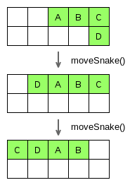
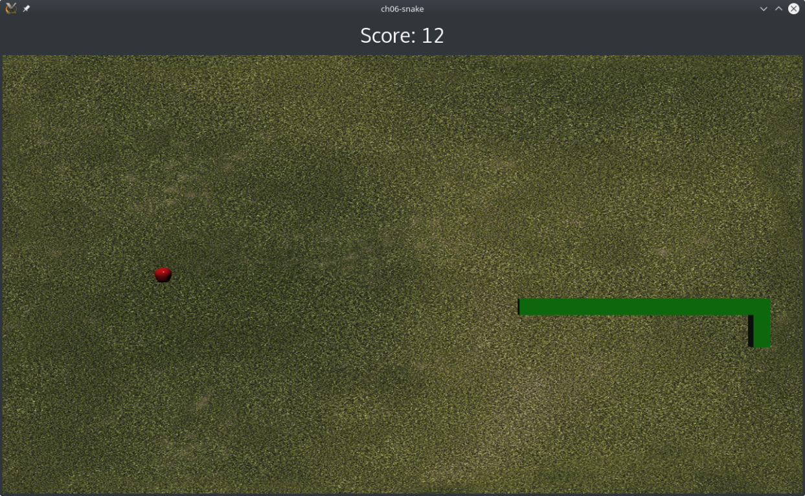

# JavaScriptでスネークエンジンを構築する

そろそろ手を汚す時期になってきました。ボードとファクトリーとQMLの力を使って、JavaScriptでスネークゲームを管理するエンジンを作る方法を見てみましょう。

以下のスニペットを使用して、engine.jsファイルを新規作成してください。

```JavaScript
.import "factory.js" as Factory
.import "board.js" as Board

var COLUMN_COUNT = 50;
var ROW_COUNT = 29;
var BLOCK_SIZE = 1;

var factory = new Factory.GameFactory();
var board = new Board.Board(COLUMN_COUNT, ROW_COUNT, BLOCK_SIZE);

var snake = [];
var direction;
```

最初の行は、別のJavaScriptファイルからJavaScriptファイルをインポートするQtの方法です。そして、factory変数と50×29のboard変数を簡単にインスタンス化します。snake配列には、インスタンス化されたすべてのスネークゲームのアイテムが含まれています。この配列はスネークを動かすのに便利です。最後に、direction変数は現在のスネークの方向を扱う2次元ベクトルです。

これが我々のエンジンの最初の機能です。

```JavaScript
function start() {
    initEngine();

    createSnake();
    createWalls();

    spawnApple();
    gameRoot.state = "PLAY";
}
```

これで、エンジンを始動したときに何をするかの概要がわかります。

1. エンジンを初期化する。
2. 初期スネークを作成します。
3. ゲームエリアを囲む壁を作成します。
4. 最初のリンゴをスポーンします。
5. GameAreaの状態をPLAYに切り替えます。

まずは initEngine() 関数から始めましょう。

```JavaScript
function initEngine() {
    timer.interval = initialTimeInterval;
    score = 0;

    factory.board = board;
    factory.parentEntity = gameRoot;
    factory.removeAllEntities();

    board.init();
    direction = Qt.vector2d(-1, 0);
}
```

この関数は、すべての変数を初期化してリセットします。最初のタスクは、GameAreaのタイマー間隔を初期値に設定することです。蛇がリンゴを食べるたびに、この間隔が短くなり、ゲームスピードが上がり、蛇の移動スピードが上がります。論理的には、プレイヤーのスコアを0にリセットします。次に、ボードとgameRootを参照してファクトリーを初期化します。gameRootはGameAreaを参照します。このエンティティは、ファクトリーによってインスタンス化されたすべてのアイテムの親となります。次に、ファクトリーからすべての既存のエンティティを削除し、ボードのinit()関数を呼び出してボードをクリアします。最後に、スネークのデフォルトの方向を設定します。ベクトル -1,0 は、蛇が左に移動し始めることを意味します。スネークを上に移動させたい場合は、ベクトルを0,1に設定します。

次の機能はスネークの作成です。

```JavaScript
function createSnake() {
    snake = [];
    var initialPosition = Qt.vector2d(25, 12);
    for (var i = 0; i < initialSnakeSize; i++) {
        snake.push(factory.createGameEntity(Factory.SNAKE_TYPE,
            initialPosition.x + i,
            initialPosition.y));
    }
}
```

ここでは大したことはないので、snake配列をリセットして初期化します。最初のスネークアイテムは25×12で作成されます。次に、適切な初期サイズのスネークを生成するために必要な数だけスネークアイテムを作成していきます。最初のアイテムの右側には、他のスネークアイテムが作成されることに注意してください（26×12、27×12など）。工場に電話して、新しいスネークアイテムのインスタンスをリクエストするのがいかに簡単かがお分かりいただけると思います。

engine.jsにcreateWalls()関数を追加してみましょう。

```JavaScript
function createWalls() {
    for (var x = 0; x < board.columnCount; x++) {
        factory.createGameEntity(Factory.WALL_TYPE, x, 0);
        factory.createGameEntity(Factory.WALL_TYPE, x, board.rowCount - 1);
    }
    for (var y = 1; y < board.rowCount - 1; y++) {
        factory.createGameEntity(Factory.WALL_TYPE, 0, y);
        factory.createGameEntity(Factory.WALL_TYPE, board.columnCount - 1, y);
    }
}
```

最初のループは上と下の壁を作ります。2 番目のループは左右の壁を作成します。2つ目のループのインデックスは、角を2回作らないように1つ目のループとは異なります。

それでは、engine.jsでspawnApple()関数を実装する方法を見てみましょう。

```JavaScript
function spawnApple() {
    var isFound = false;
    var position;
    while (!isFound) {
        position = Qt.vector2d(Math.floor(Math.random()
            * board.columnCount),
            Math.floor(Math.random()
            * board.rowCount));
        if (board.at(position.x, position.y) == null) {
            isFound = true;
        }
    }
    factory.createGameEntity(Factory.APPLE_TYPE, position.x, position.y);

    if (timerInterval > 10) {
        timerInterval -= 2;
    }
}
```

まずは空のマスを探します。whileループでランダムな盤面位置を生成し、空の四角があるかどうかをチェックします。空の四角が見つかったらすぐに、この位置にリンゴの実体を作るようにファクトリーに要求します。最後にGameAreaのTimerInverval値を下げてゲームを高速化します。

それでは、engine.jsにスネークの位置に関連したユーティリティ関数を追加していきます。

```JavaScript
function setPosition(item, column, row) {
    board.setData(item, column, row);
    item.gridPosition = Qt.vector2d(column, row);
    item.position.x = column * board.blockSize;
    item.position.y = row * board.blockSize;
}

function moveSnake(column, row) {
    var last = snake.pop();
    board.setData(null, last.gridPosition.x, last.gridPosition.y);
    setPosition(last, column, row);
    snake.unshift(last);
}
```

setPosition()関数は、ゲームアイテムを移動させたいときに必要なすべてのタスクを処理します。まず、ゲームアイテムを正しいボードの正方形に割り当ててから、（GameEntityの）gridPositionプロパティを更新し、OpenGLのposition.xとposition.yも更新します。

2 番目の関数 moveSnake() は、ヘビを隣のマスに移動させます。この関数で実行されるすべてのステップを分解してみましょう。

1. snake は、すべてのスネークアイテムを含むグローバル配列です。pop()メソッドは、last変数に格納した最後の要素を削除して返します。
2. 変数 last には、ヘビの尻尾のグリッド位置が格納されています。このボードの正方形をnullに設定します。これは空の正方形を意味します。
3. 変数lastは、呼び出し元が要求した隣接するマスに置かれます。
4. 最後に last 変数を snake 配列の先頭に挿入します。

次のスキーマは、ヘビが左に移動しているときの moveSnake() の処理を示しています。また、ヘビのアイテムに文字で名前を付けることで、尾が頭になる様子を視覚化し、動くヘビをシミュレートしています。



スネークを動かせるようになったので、スネークを正しい方向に動かすためのキーイベントを処理しなければなりません。この新しい関数を engine.js に追加してください。

```JavaScript
function handleKeyEvent(event) {
    switch(event.key) {
    // restart game
    case Qt.Key_R:
        start();
        break;

    // direction UP
    case Qt.Key_I:
        if (direction != Qt.vector2d(0, -1)) {
            direction = Qt.vector2d(0, 1);
        }
        break;

    // direction RIGHT
    case Qt.Key_L:
        if (direction != Qt.vector2d(-1, 0)) {
            direction = Qt.vector2d(1, 0);
        }
        break;

    // direction DOWN
    case Qt.Key_K:
        if (direction != Qt.vector2d(0, 1)) {
            direction = Qt.vector2d(0, -1);
        }
        break;

    // direction LEFT
    case Qt.Key_J:
        if (direction != Qt.vector2d(1, 0)) {
            direction = Qt.vector2d(-1, 0);
        }
        break;
    }
}
```

このゲームでは、I-J-K-Lキーを使ってヘビの方向ベクトルを更新します。オリジナルのスネークゲームのように、方向を逆にすることはできません。この動作を回避するためのチェックが行われています。Rキーを押すとstart()を呼び出すので、ゲームを再起動することに注意してください。この関数をQMLキーボードコントローラにバインドする方法については、近日中に見ていきたいと思います。

ここで、最後（といっても最後ではありませんが）の関数、engine.jsのupdate()関数を紹介します。

```JavaScript
function update() {
    if (gameRoot.state == "GAMEOVER") {
        return;
    }

    var headPosition = snake[0].gridPosition;
    var newPosition = Qt.vector2d(headPosition.x + direction.x,
        headPosition.y + direction.y);
    var itemOnNewPosition = board.at(newPosition.x,
        newPosition.y);
    ...
}
```

この関数は、QML から一定間隔で呼び出されます。ご覧のように、gameRoot（つまり GameArea）の state 変数が GAMEOVER に等しい場合、この関数は何もせずにすぐに戻ります。次に、3 つの重要なステップが実行されます。

1. headPositionでヘビの頭のグリッド位置を取得します。
2. newPositionのdirectionベクトルを使って、ヘビの移動先を処理します。
3. itemOnNewPositionにヘビの進行方向のアイテムを配置する。

update()関数の2番目の部分は、以下のスニペットです。

```JavaScript
function update() {
    ...
    if(itemOnNewPosition == null) {
        moveSnake(newPosition.x, newPosition.y);
        return;
    }

    switch(itemOnNewPosition.type) {
        case Factory.SNAKE_TYPE:
            gameRoot.state = "GAMEOVER";
            break;

        case Factory.WALL_TYPE:
            gameRoot.state = "GAMEOVER";
            break;

        case Factory.APPLE_TYPE:
            itemOnNewPosition.setParent(null);
            board.setData(null, newPosition.x, newPosition.y);
            snake.unshift(factory.createGameEntity(
                Factory.SNAKE_TYPE,
                newPosition.x,
                newPosition.y));
            spawnApple();
            score++;
            break;
    }
}
```

スネークが空のマスに向かっている場合(itemOnNewPositionがnull)は問題ないので、newPositionにスネークを移動させるだけです。

マスが空でない場合は、アイテムの種類に応じて正しいルールを適用する必要があります。次のマスが蛇の部分や壁の場合は、GAMEOVERに更新します。一方、次のマスがリンゴの場合は、いくつかのステップを実行します。

1. GameAreaの親をnullにして、リンゴアイテムをGameAreaから切り離します。
2. ボードの四角をnullに設定して、リンゴをボードから取り外します。
3. スネークを成長させ、snake配列の先頭にスネーク部分を作成する。
4. ランダムな空のマスに新しいリンゴを産み付けます。
5. スコアを増やします。

これでスネークエンジンは完成しました。最後のステップは、QMLからエンジンの関数を呼び出すことです。GameArea.qmlを更新してください。

```QML
...
import "engine.js" as Engine

Entity {
    ...
    QQ2.Component.onCompleted: {
        console.log("Start game...");
        Engine.start();
        timer.start()
    }

    QQ2.Timer {
        id: timer
        interval: initialTimeInterval
        repeat: true
        onTriggered: Engine.update()
    }

    KeyboardInput {
        id: input
        controller: keyboardController
        focus: true
        onPressed: Engine.handleKeyEvent(event)
    }
    ...
}
```

すでにゲームをすることができます。リンゴを食べると蛇が成長して1点を獲得します。自分や壁にぶつかるとゲーム状態がGAMEOVERに切り替わり、ゲームが停止します。最後にRキーを押すとゲームが再開します。nullのRaspberry Piに次のスクリーンショットのようなゲームになっています。



***

**[戻る](../index.html)**
