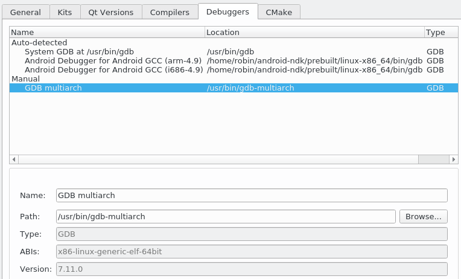
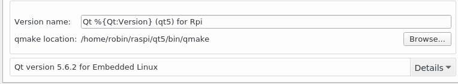
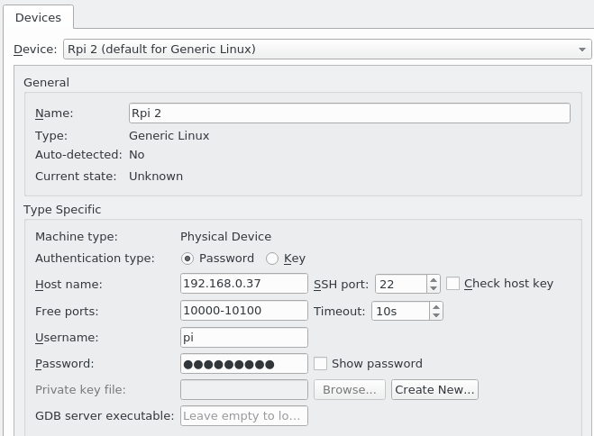
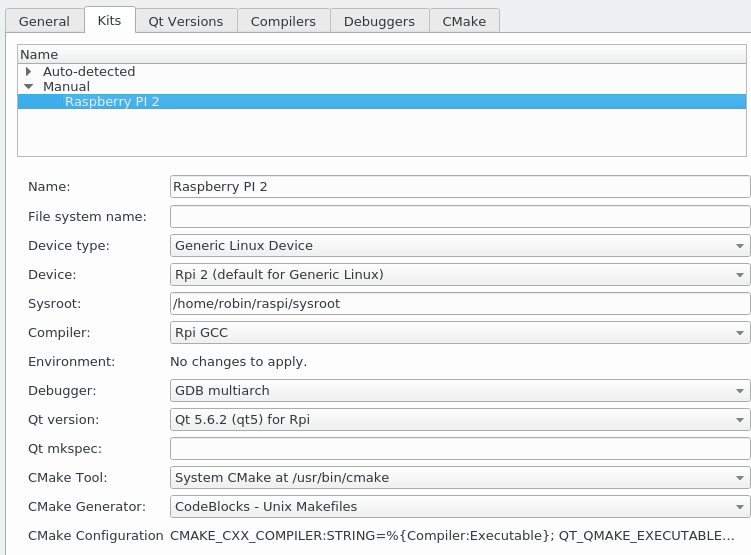

# Raspberry Pi用にQtを設定する

このプロジェクトは新しい組み込みプラットフォームであるRaspberry Piをターゲットにしています。Qt は公式には Raspberry Pi 2 をサポートしていますが、私たちは Raspberry Pi 3 で問題なくプロジェクトを動かすことができました。もしあなたがこれらのデバイスを持っていないのであれば、クロスコンパイルがどのように動作するのか、また Qt Creator で独自のキットを設定する方法を知るために、この章を読んでみるのも面白いかもしれません。この章の残りの部分は、いずれにしてもデスクトッププラットフォームで動作します。

Raspberry Pi の設定に飛び込む前に、我々の目的を理解するために一歩下がってみましょう。あなたのコンピュータはおそらく x86 CPU アーキテクチャで動作しています。これは、あなたが実行するすべてのプログラムが、あなたの CPU の x86 命令セットで実行されることを意味します。Qt Creator では、これを利用可能なキットに変換します。キットはターゲットプラットフォームと一致している必要があります。起動時に、Qt Creator はコンピュータ内の利用可能なキットを検索してロードします。

第5章「モバイルUIを支配する」では、異なるプラットフォームをターゲットにしました。Android と iOS です。これらのプラットフォームは、異なるCPU命令セットで動作しています。ARMです。幸いなことに、Qt の背後にいる人たちが、それを動作させるために必要なナットとボルトを自動的に設定してくれました。

Raspberry PiもARMで動作しますが、デフォルトではQtに対応していません。Qt Creatorで遊ぶ前に準備しておく必要があります。なお、以下のコマンドはLinuxボックスから実行していますが、MacやWindowsからでもCygwinで実行できるはずです。

***

## Info

Raspberry Pi を Qt 用に準備するための完全なガイドを <https://wiki.qt.io/RaspberryPi2EGLFS> で見るか、<http://www.qtrpi.com> からプリコンパイルされたバンドルをダウンロードしてください。

***

Raspberry Pi の完全なインストールガイドはこの本の範囲外です。それにもかかわらず、主なステップをまとめることは興味深いことです。

1. Raspberry Pi に開発パッケージを追加する。
2. マシンから実行されるクロスコンパイラを含む完全なツールチェーンを取得する。
3. マシン上に sysroot フォルダを作成し、Raspberry Pi から必要なディレクトリをミラーリングします。
4. sysroot フォルダ内のクロスコンパイラを使って Qt をコンパイルする。
5. この sysroot を Raspberry Pi と同期させます。

sysroot は、与えられたプラットフォーム用の最小限のファイルシステムを含むディレクトリです。一般的には /usr/lib と /usr/include ディレクトリが含まれています。このディレクトリがあることで、クロスコンパイラは Raspberry Pi から実行されることなく、適切にコンパイルしてバイナリをリンクすることができます。

これらのステップは、Raspberry Pi上で直接何かをコンパイルすることを避けるために行われています。低消費電力のデバイスであるため、コンパイルの実行には非常に長い時間がかかります。Raspberry Pi上でQtをコンパイルすると、40時間以上かかることになります。これを知っていると、クロスコンパイラの設定に費やしていた時間がずっと楽に感じられます。

先に進む前に、wikiに記載されているqopenglwidgetの例が適切に実行されている必要があります。これが完了したら、プロジェクトを実行するためにいくつかのQtモジュールをクロスコンパイルしなければなりません。

* Qtdeclarative: このモデルは Qt Quick にアクセスするために使用されます。
* qt3d: このモデルを使用して3Dワールドを構築します。
* qtquickcontrols: このモデルは、興味深いコントロール（ラベル）を含むために使用されます。
* qtquickcontrols2: このモデルは、いくつかの新しいレイアウトを利用できるようにするために使用されます。

これらのモジュールのそれぞれについて、以下のコマンドを実行してください ( ~/raspi ディレクトリから)。

```shell
    git clone git://code.qt.io/qt/<modulename>.git -b 5.7
    cd <modulename>
    ~/raspi/qt5/bin/qmake -r
    make
    make install
```

***

## Tip

make に -j (または --jobs) パラメータを追加することで、コンパイルを高速化することができます。makeコマンドは、コンパイルジョブをCPUコアにまたがって並列化しようとします。

***

すべてがコンパイルされたら、再び sysroot ディレクトリと同期してください。

```shell
rsync -avz qt5pi pi@IP:/usr/local
```

先ほどのコマンドでは、IPを実際のRaspberry Piのアドレスに置き換える必要があります。

Raspberry PiはQtのコードを実行する準備ができています。しかし、Qt Creatorで独自のキットを作成し、その上でプログラムをコンパイルしてデプロイできるようにしなければなりません。キットは以下の部分で構成されています。

* ターゲットプラットフォームのCPU命令セットを使用してコードをコンパイルする**コンパイラ**
* ターゲットプラットフォームの命令セットを知っている**デバッガ**が適切にブレークしてメモリの内容を読み出す
* ターゲットプラットフォーム用にコンパイルされた **Qt のバージョン**をコンパイルし、バイナリをターゲットプラットフォームの共有オブジェクトにリンクします。
* Qt Creator がプログラムをデプロイして実行するために接続できる**デバイス**

まずはコンパイラから始めます。Qt Creatorで

1. 「**ツール**」→「**オプション**」→「**ビルドと実行**」→「**コンパイラ**」と進みます。
2. 「**追加**」→「GCC」をクリックします。
3. raspi/tools/arm-bcm2708/gcc-linaro-arm-linuxgnueabihf-raspbian/bin/arm-linux-nueabihf-g++ を参照してください。
4. コンパイラの名前をRpi GCCに変更します。

この奇妙なバイナリ名は、Qt が ABI (**アプリケーション・バイナリ・インターフェース**) を解析して、プラットフォームのアーキテクチャやファイル形式などを調べるのを容易にします。以下のようになっているはずです。

さて、デバッガです。先に述べたように、今回のプロジェクトはLinuxボックス(Ubuntu)から構築しています。クロスコンパイルや組み込み開発はLinuxの方が簡単な傾向にありますが、WindowsやMacでも、いくつかのステップを追加するだけで同じことができるはずです。

Ubuntu Linuxでは、sudo apt-get install gdb-multiarchコマンドでマルチアーキテクチャgdbをインストールするだけです。Qt Creatorで、**Debuggers**タブにこの新しいデバッガを追加します。



次に、**Qt Versions**タブのwikiページで説明されているクロスコンパイルされたQtを追加します。**追加**をクリックして、~/raspi/qt5/bin/qmakeを参照します。これが出来上がったQtのバージョンです。



あと少しで完成です!キットを作る前に、Raspberry Pi のデバイスアクセスを設定する必要があります。「**オプション**」→「**デバイス**」で、以下の手順で設定します。

1. 「**Add...**」→「Generic Linux Device」→「ウィザードの開始」をクリックします。
2. 名前はRpi2（あれば3）になります。
3. デバイスのIPアドレスを入力します（実際にはローカルネットワークに接続されている必要があります！）。 
4. デフォルトのユーザー名は**pi**です。
5. デフォルトのパスワードは "raspberry "です。
6. 「**次へ**」をクリックして、デバイスとの接続をテストします。

すべてがうまくいったなら、これが新しいデバイスです。



最後に、キットはこれらすべてのパーツを有効な Qt Creator プラットフォームに統合します。「**Build & Run**」→「**Kits**」 に戻ってください。ここからは、先ほど作った各パーツを指し示すだけです。出来上がったキットは以下の通りです。



**Sysroot** ファイルは ~/raspi/sysroot に作成した sysroot フォルダを指すことに注意してください。

***

## Tip2

**Name**の右にあるボタンをクリックすると、Raspberry Piのロゴなど、キット用のカスタム画像を選ぶことができます。

***

すべてが素晴らしい蛇のゲームを作るために準備ができました。

***

**[戻る](../index.html)**
