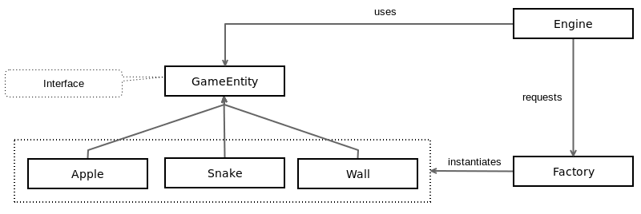

# ファクトリから実体を作る

アイテムを受け取るためのボードができたので、ゲームアイテムのファクトリーを作成します。ファクトリーとは、呼び出し元に作成ロジックを公開せずにオブジェクトを作成することができるデザインパターンです。このファクトリーは、JavaScriptから新しいゲームアイテムを作成したいときに必要な汚い作業をすべて処理してくれるヘルパークラスと見ることができます。GameEntity.qmlを覚えていますか？Apple.qml、Snake.qml、Wall.qmlの親クラスです。ファクトリーでは、与えられた型と座標に対して特定のエンティティを作成することができるようになります。ここでは、プロパティタイプを使ってエンティティの種類を特定していきます。ここでは、私たちのスネークゲームで使用されているファクトリーパターンスキーマを示します。



これで、このように始まる factory.js ファイルを作成することができます。

```JavaScript
var SNAKE_TYPE = 1;
var WALL_TYPE = 2;
var APPLE_TYPE = 3;

var snakeComponent = Qt.createComponent("Snake.qml");
var wallComponent = Qt.createComponent("Wall.qml");
var appleComponent = Qt.createComponent("Apple.qml");
```

まず、ゲームのエンティティタイプを定義します。ここでは、リンゴ型、ヘビ型、壁型を定義します。次に、QMLファイルからゲームアイテムのコンポーネントを作成します。これらのコンポーネントは、ファクトリーが新しいゲームエンティティを動的に作成するために使用します。

これで、コンストラクタと removeAllEntities() ユーティリティ関数を追加して、インスタンス化されたすべてのエンティティを削除することができます。

```JavaScript
function GameFactory() {

    this.board = null;
    this.parentEntity = null;
    this.entities = [];
}

GameFactory.prototype.removeAllEntities = function() {
    for(var i = 0; i < this.entities.length; i++) {
        this.entities[i].setParent(null);
    }
```

このファクトリには3つのメンバ変数があります。

* 前のセクションで説明したゲームboardへの参照
* parentEntity変数への参照、つまりゲーム領域
* 作成されたアイテムへの参照を保持する entities 配列

removeAllEntities() 関数は、親 (つまりゲームエリア) からアイテムを削除し、新しい空のエンティティ配列を作成します。これにより、古いエンティティは確実にガベージコレクタによって削除されます。

ファクトリーにコア関数のcreateGameEnity()を追加してみましょう。

```JavaScript
GameFactory.prototype.createGameEntity = function(type, column, row) {
    var component;
    switch(type) {
    case SNAKE_TYPE:
        component = snakeComponent;
        break;

    case WALL_TYPE:
        component = wallComponent;
        break;

    case APPLE_TYPE:
        component = appleComponent;
        break;
    }
    var gameEntity = component.createObject(this.parentEntity);
    gameEntity.setParent(this.parentEntity);

    this.board.setData(gameEntity, column, row);
    gameEntity.gridPosition = Qt.vector2d(column, row);
    gameEntity.position.x = column * this.board.blockSize;
    gameEntity.position.y = row * this.board.blockSize;

    this.entities.push(gameEntity);
    return gameEntity;
}
```

ご覧のように、呼び出し元はエンティティtypeとボード座標(columnとrow)を提供しています。最初の部分は、正しいQMLコンポーネントを選択するためのスイッチです。コンポーネントを取得したら、component.createObject()を呼び出して、このコンポーネントのインスタンスを作成します。この新しいコンポーネントの親は this.parentEntity になります。そして、ボードを更新し、エンティティの位置を更新し、この新しいエンティティを entities 配列に追加します。

最後に、QMLのゲームエンティティを適切なファクトリータイプに更新します。Apple.qmlを開いて、このように更新してください。

```QML
import "factory.js" as Factory

GameEntity {

    id: root
    type: Factory.APPLE_TYPE
    ...
}
```

これで、Snake.qmlはFactory.SNAKE_TYPE、Wall.qmlはFactory.WALL_TYPEで更新できるようになりました。

***

**[戻る](../index.html)**
