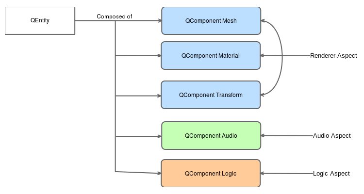
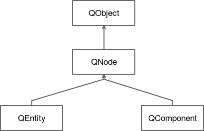

# Qt3Dの発見

この章のサンプルプロジェクトは、3Dレンダリングに依存しています。このために Qt3D を使用します。
フレームワークのこの部分は、アプリケーションが3D環境をほぼリアルタイムでシミュレーションすることを可能にする様々なQtモジュールに分かれています。OpenGL上に構築されたQt3Dは、低レベルのOpenGL命令を記述することなく複雑なシーンを記述するための高レベルのAPIを提供しています。Qt3Dは以下の基本機能をサポートしています。

* C++とQt Quickのための2Dと3Dレンダリング
* メッシュ
* マテリアル
* GLSLシェーダ
* シャドウマッピング
* 遅延レンダリング
* インスタンスレンダリング
* 均一バッファオブジェクト

これらの機能はすべて**ECS**（**エンティティコンポーネントシステム**）アーキテクチャで実装されています。定義した各メッシュ、マテリアル、シェーダはコンポーネントです。これらのコンポーネントの集合体がエンティティとなります。3D の赤いリンゴを描くには、以下のコンポーネントが必要です。

* リンゴの頂点を保持するメッシュコンポーネント
* メッシュにテクスチャを適用したり、カラーリングしたりするマテリアルコンポーネント

そして、これらの 2 つのコンポーネントを再グループ化して、エンティティ Apple を定義します。ここでは、ECSの2つの部分、すなわち、エンティティとコンポーネントが見えます。全体的なアーキテクチャは次のようになります。



これらのコンポーネントのそれぞれは、アスペクトで再グループ化することができます。アスペクトとは、同じパーツ（レンダリング、オーディオ、ロジック、物理）で動作する複数のコンポーネントの「スライス」のことです。すべてのエンティティのグラフが Qt3D エンジンで処理されると、アスペクトの各レイヤーが順次処理されます。

基本的なアプローチは、継承よりも構成を優先することです。ゲームでは、エンティティ（リンゴ、プレイヤー、敵）はそのライフサイクルの中で様々な状態を持つことができます：スポーン、特定の状態のためのアニメーション、ダイイングアニメーションなど。これらの状態を記述するために継承を使用すると、神経をすり減らすようなツリーになってしまいます。AppleSpawn、AppleAnimationShiny、AppleDeathなどです。すぐにメンテナンス性が悪くなってしまいます。あるクラスに変更を加えると、他の多くのクラスに大きな影響を与える可能性があり、状態の組み合わせの数が増えて手に負えなくなってしまいます。ステートは与えられたエンティティの単なるコンポーネントであると言うことで、コンポーネントを簡単に交換できる柔軟性を与え、エンティティの抽象化を維持したままにすることができます。apple _Entity_要素は、AnimationSpawnComponentの代わりにAnimationShinyComponentを使用しているにもかかわらず、リンゴであることに変わりはありません。

QMLで基本的なEntity要素を定義する方法を見てみましょう。これが先ほどのリンゴだとしましょう。Apple.qmlファイルは以下のようになります。

```QML
import Qt3D.Core 2.0
import Qt3D.Render 2.0
import Qt3D.Extras 2.0

Entity {

    property alias position: transform.translation
    PhongMaterial {
        id: material
        diffuse: "red"
    }

    SphereMesh {
        id: mesh
    }

    Transform {
        id: transform
    }

    components: [material, mesh, transform]
}
```

数行で Entity 要素のあらゆる側面を説明しています。

* Entity: これはファイルのルートオブジェクトで、第5章「モバイルUIを支配する」で学んだのと同じQMLパターンに従っています。
* PhongMaterial. これは、表面がどのようにレンダリングされるかを定義します。

* PhongMaterial: サーフェスがどのようにレンダリングされるかを定義します。ここでは、滑らかなサーフェスを実現するためにフォンシェーディング技術を使用します。すべてのマテリアルクラスの基底クラスである QMaterial を継承しています。
* CuboidMesh: どのようなタイプのメッシュを使用するかを定義します。これは QGeometryRenderer を継承しており、カスタムモデル（3D モデリングソフトウェアからエクスポートしたもの）をロードする機能も備えています。
* Transform: コンポーネントの変換行列を定義します。Entity要素の変換、スケール、位置をカスタマイズすることができます。
* Position: これは、与えられた呼び出し元/親に対してtransform.translationを公開するためのプロパティです。リンゴを移動させたいときにすぐに便利になるかもしれません。
* Components: これは Entity 要素のすべてのコンポーネントの ID を含む配列です。

Appleを別のEntityの子にしたい場合は、この新しいEntity要素の中にAppleを定義すればいいだけです。これをWorld.qmlと呼びましょう。

```QML
import Qt3D.Core 2.0
import Qt3D.Render 2.0
import Qt3D.Extras 2.0

Entity {
    id: sceneRoot

    RenderSettings {
        id: frameFraph
        activeFrameGraph: ForwardRenderer {
            clearColor: Qt.rgba(0, 0, 0, 1)
        }
    }

    Apple {
        id: apple
        position: Qt.vector3d(3.0, 0.0, 2.0)
    }

    components: [frameGraph]
}
```

ここでは、World Entityには視覚的な表現がありません。これは、先ほど定義したAppleだけを含んでいます。リンゴの x, y, z 座標は親からの相対座標です。親が変換を行うと、同じ変換がリンゴに適用されます。

このようにして、エンティティ/コンポーネントの階層が定義されています。Qt3DのコードをC++で書く場合、同等のC++クラス（QEntity、QComponentなど）にも同じロジックが適用されます。

シーンのルートとして World.qml ファイルを使用することにしたので、シーンがどのようにレンダリングされるかを定義しなければなりません。Qt3Dのレンダリングアルゴリズムはデータ駆動型です。言い換えれば、レンダリングされるべきもの（エンティティとコンポーネントのツリー）と、どのようにレンダリングされるべきかは明確に分離されています。

「どのように」は framegraph を使った同様のツリー構造に依存しています。Qt Quickでは、単一のレンダリング手法を使用しており、2D描画をカバーしています。一方、3Dでは、柔軟なレンダリングが求められるため、レンダリング手法を切り離す必要があります。

この例を考えてみましょう。自分のアバターを操作しているゲームをプレイしていて、鏡に遭遇したとします。同じ 3D シーンを複数のビューポートからレンダリングしなければなりません。レンダリング技術が固定されている場合、これは複数の問題を引き起こします：どのビューポートを最初に描画すべきか？GPUでビューポートのレンダリングを並列化することは可能でしょうか？レンダリングのために複数のパスが必要な場合は？

このコードスニペットでは、ForwardRendererツリーを使用した伝統的なOpenGLレンダリング技術を使用しています。Qt3Dでは、レンダラ（ForwardRenderer、DeferredRendererなど）を選択し、シーンのレンダリング方法を設定することができます。

OpenGLは、通常、そのコンテンツをレンダリングするためにダブルバッファリング技術を使用しています。フロントバッファは画面に表示されるものであり、バックバッファはシーンがレンダリングされる場所です。バックバッファの準備ができたら、2つのバッファが入れ替わります。

最後に、各Entity要素の先頭には、以下のように指定しています。

```QML
import Qt3D.Core 2.0
import Qt3D.Render 2.0
import Qt3D.Extras 2.0
```

インポート部にはQt3Dモジュールしかありません。Qt3DクラスはItemを継承しないので、QMLコンポーネントと直接混在させることはできません。Qt3Dの基本的なビルディングブロックの継承ツリーはこのようになっています。



QNode クラスは、すべての Qt3D ノードクラスの基底クラスです。QNode クラスは、QObject クラスに依存して親となる関係を定義します。また、各 QNode クラスのインスタンスには一意の id 変数が追加され、他のインスタンスから認識できるようになっています。

QNodeとQt Quick型を混ぜることはできませんが、Q3DScene要素（QMLではScene3D）に追加することで、Qt3Dコンテンツのキャンバスとなり、Qt Quick Itemに追加することができます。World.qmlをシーンに追加するのは、このように簡単です。

```QML
Rectangle {
    Scene3D {
        id: scene
        anchors.fill: parent
        focus: true

        World { }
    }
}
```

Scene3D 要素には World インスタンスが含まれ、共通の Qt Quick プロパティ (anchors, focus) を定義しています。

***

**[戻る](../index.html)**
