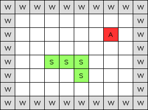

# ボードゲームの準備

私たちのゲームが3Dで表現されていたとしても、オリジナルのスネークゲームのような2Dのゲームプレイを実装します。私たちのゲームアイテムは、2Dのエリアで生まれ、生き、そして死ぬ。チェスのように、このボードは行と列で構成されます。しかし、私たちのヘビゲームでは、各正方形ができます。

* りんご
* ヘビ
* 壁
* 空

エンジンから見たボード表現の一例をご紹介します。



これは10×8の小さなボードです。サイズが問題でなくても、もっと大きなボードを定義することができます。あなたのゲーム、あなたのルールで!ゲームエリアを囲む壁(**W**)があります。リンゴ(**A**)は7×2の場所に産卵されます。最後に、３×４から始まり、５×５で終わる蛇（**S**）がいます。

いよいよボードクラスを作成する時が来ました。board.jsというJSファイルを作成してください。

```JavaScript
function Board(columnCount, rowCount, blockSize) {
    this.columnCount = columnCount;
    this.rowCount = rowCount;
    this.blockSize = blockSize;
    this.maxIndex = columnCount * rowCount;
    this.data = new Array(this.maxIndex);
}
```

このオブジェクトのコンストラクタ関数には3つのパラメータが必要でした。columnCountとrowCountのパラメータは、ボードの寸法を選択するのに役立ちます。最後のパラメータであるblockSizeは、OpenGLの世界でのボードの正方形のサイズです。例えば、blockSizeを10に設定します。この場合、7×2のボード上のリンゴは、OpenGLの世界ではx = 70、y = 20で表示されます。この章ではブロックサイズを1にして、ボードの座標がOpenGLの座標と一致するようにします。

board.jsにユーティリティ関数を追加してみましょう。

```JavaScript
Board.prototype.init = function() {
    for (var i = 0; i < this.data.length; i++) {
        this.data[i] = null;
    }
}

Board.prototype.index = function(column, row) {
    return column + (row * this.columnCount);
}

Board.prototype.setData = function(data, column, row) {
    this.data[this.index(column, row)] = data;
}

Board.prototype.at = function(column, row) {
    return this.data[this.index(column, row)];
}
```

JavaScriptでクラスを定義するのは、C++開発者にとっては邪魔になるかもしれません。JavaScriptのオブジェクトには必ずプロトタイプオブジェクトがあり、そこに関数を追加することができます。それを使って、Boardにクラスメソッドを追加しています。

ここでは、Boardクラスの各関数の目的をまとめています。

* init(): この関数は、すべての配列の値を null 値に初期化します。
* index(): この関数は，配列のインデックスを列/行座標から返します。
* setData():  この関数は、列/行座標からボード上のdataの値を代入します。
* at():  この関数は，配列内のdataの値を，列/行の座標から取得します。

私たちの場合、nullの正方形は空の正方形を意味することに注意してください。

***

**[戻る](../index.html)**
