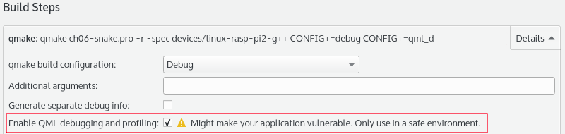
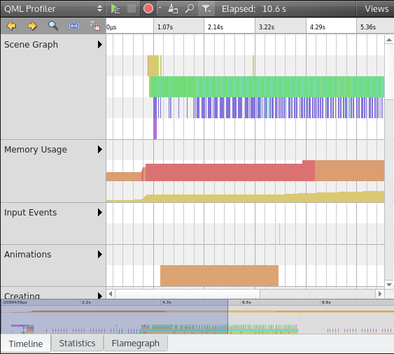
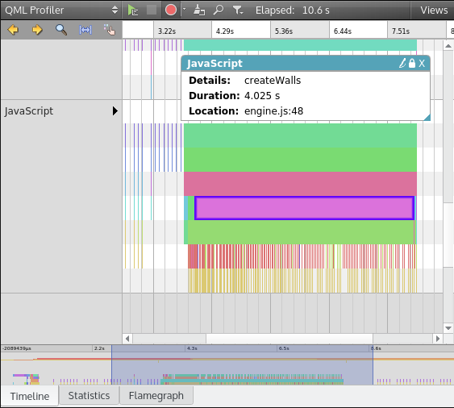
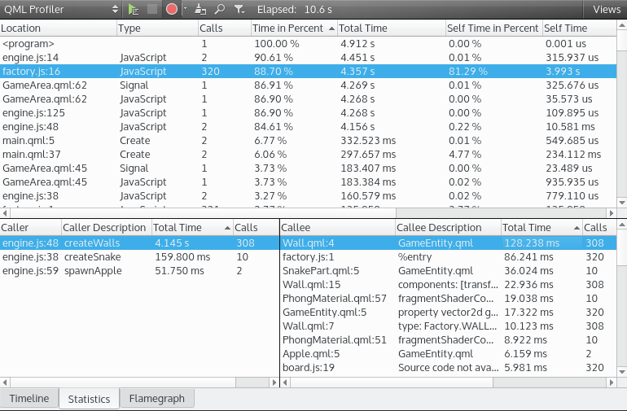
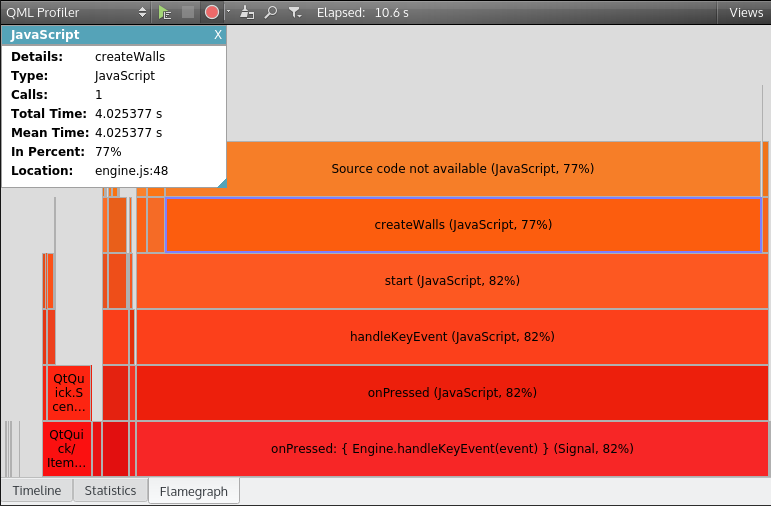

# QML アプリケーションのプロファイリング

Qt Creator は、実行時にアプリケーションの有用なデータを収集するための QML プロファイラを提供します。デスクトップ上だけでなく、Raspberry Pi のようなリモートターゲットでも使用できます。デバッグビルドの設定で QML デバッグとプロファイリングが可能であることを確認してみましょう。**Projects｜Rpi 2｜Build**をクリックします。そして、**ビルドステップ**から**qmake**の**詳細**をクリックします。デスクトップキットの場合も確認しておきましょう。



デフォルトでは、プロファイリングを停止すると、データはターゲットからホストにのみ送信されます。定期的にデータをフラッシュすることができます。**ツール**→**オプション**→**アナライザー**→**QML Profiler**を選択します。

プロファイリング中にデータをフラッシュすると、ターゲットデバイスのメモリが解放されますが、時間がかかることを覚えておいてください。そのため、プロファイリングの結果や分析に影響を与える可能性があります。

Qt Creatorキットを使用している間は、デスクトップやリモートデバイスでも同じようにQMLプロファイラを起動することができます。キットに切り替えて「**Analyze**」→「**QML Profiler**」をクリックすると、QML プロファイリングが開始されます。デスクトップ上で実行しているアプリケーションをプロファイリングしている場合、Qt Creator は以下のような引数でソフトウェアを起動します。

```shell
-qmljsdebugger=file:/tmp/QtCreator.OU7985
```

リモートデバイス（Raspberry Piなど）でアプリケーションをプロファイリングしている場合、Qt CreatorはTCPソケットを使ってデータを取得し、このような引数を追加します。

```shell
-qmljsdebugger=port:10000
```

どちらのターゲットでも、QML プロファイラはその後、アプリケーションへの接続を試みます。また、リモートデバイス上で QML プロファイラを起動する方法として、-qmljsdebugger 引数を指定して自分自身でアプリケーションを起動する方法もあります。

```shell
./ch06-snake -qmljsdebugger=port:3768
```

次に、**「Analyze」→「QML Profiler (External)」をクリックします。リモートキット（Rpi 2など）を選択し、**ポート**を3768に設定し、**OK**をクリックします。

いいね！QMLプロファイラが起動すると、新しいツールバーが表示されます。数秒間ゲームをプレイして、QML Profilerツールバーから**停止**ボタンをクリックします。すると、QMLプロファイラがデータを処理して、こんな感じで表示されます。



それでは、トップボタンの分析を左から右へと始めてみましょう。

1. QMLプロファイラを起動します。
2. アプリケーションとQMLプロファイラを停止します。
3. プロファイリングの有効化/無効化を行います。キャプチャするイベントを選択することもできます。
4. データを破棄して、プロファイリング セッションをクリーンアップします。
5. タイムラインのイベントノートを検索します。
6. イベントのカテゴリを非表示または表示。
7. **経過**状況はセッションの期間を示します。
8. **表示** **タイムライン**、**統計情報**、**フレームグラフ**のタブを非表示または表示します。

QMLプロファイラの使い方を学ぶために、実際のケースを取り上げます。Raspberry Piでは、ゲームの再起動が少し遅いです。QMLプロファイラを使って、ゲームの再起動に何秒かかるかを調べてみましょう。

QML プロファイラからデータを収集するためには、この運用モードに従ってください。

1. Raspberry Piキットを選択します。
2. QML プロファイラを起動します。
3. ヘビが壁にぶつかるのを待ちます。
4. Rキーを押してゲームを再開します。
5. ゲームが再開され、ヘビが再び動くのを待ちます。
6. QMLプロファイラを停止します。

まず、Timelineタブを使って調査を始めましょう。このビューでは、イベントのタイプごとにグループ化されたイベントの時系列ビューが表示されます。JavaScript の行は、コードを分解して有用な情報を表示します。項目をクリックすると詳細を知ることができます。ゲームを再起動したときにタイムラインで識別します。JavaScriptの行は、上から下へ、コールスタックとして読み取ることができます。



今回の場合、アプリケーションの起動から3.5秒後にゲームを再起動しています。QMLプロファイラが提供しているデュレーションのスタックは以下の通りです。QMLプロファイラで提供されているデュレーションのスタックは以下の通りです。Rキーを押して再起動したときに呼び出された関数を追跡してみましょう。

* GameArea.qmlのonPressed()関数
* engine.js の handleKetEvent() 関数
* engine.js の start() 関数 (4.2 秒)
  * initEngine() を 80 ms で実行
  * createSnake() を 120 ミリ秒で実行
  * createWalls() 4.025秒で!

ここで、createWalls()はゲームを再起動するとRaspberry Pi上で〜4秒かかります。

**統計**画面に切り替えてみましょう。



**Statistics** ビューには、イベントの呼び出し回数に関する数値が表示されます。イベントには、QMLバインディング、作成、シグナルトリガー、JavaScript関数などがあります。下部には、QMLの呼び出し元と呼び出し元が表示されます。

呼び出し元はバインディングの変更元です。例えば、JS 関数 createWalls() は呼び出し元です。

callee とは、バインディングがトリガーとなって影響を受ける項目のことである。例えば、QML項目Wall.qmlはcalleeである。

繰り返しになりますが、Raspberry Piでゲームの再起動が遅いのは、多くのファクトリーアイテムの作成を要求するcreateWalls()が原因のようです。

QMLプロファイラの最後のビュー、Flamegraphを見てみましょう。



**Flamegraph**ビューは、ゲームを実行している間のQMLとJavaScriptのコードをコンパクトにまとめたものです。呼び出し回数と総時間に対する相対的な時間を見ることができます。**タイムライン**ビューのように、コールスタックを下から上に向かって見ることができます。

繰り返しになりますが、プロファイラーは createWalls() が重い関数であることを示しています。10秒のプロファイリングセッションで、1回のゲーム再起動で77%の時間がengine.createWalls()に費やされています。

これでQMLアプリケーションのプロファイルができるようになります。再起動が早くなるようにコードを編集してみてください。いくつかのヒントをご紹介します。

* 壁はアプリケーション起動時に一度だけ作成し、再起動のたびに削除・再作成しないようにしてください。
* ビデオゲームで一般的なデザインパターンである、プリロードされたアイテムのオブジェクトプールを実装します。必要なときには壁をリクエストし、使わないときはプールに戻します。

## まとめ

この章では、Qt3Dモジュールの使い方を発見しました。また、組み込みLinuxデバイス用の新しいキットを作成するためにQt Creatorを設定する方法も学びました。これであなたのRaspberry PiはQtアプリケーションを実行できるようになりました。QMLビューとJavaScriptのエンジンを使ってヘビゲームを作成しました。また、エンジンから簡単に新しいゲームアイテムを作成するためのFactoryデザインパターンも取り上げました。最後に、強力なQMLプロファイラを使って、QMLソフトウェアの悪い動作を調査できるようになりました。

Qt が強力なフレームワークであっても、時にはサードパーティ製のライブラリを使用しなければならないことがあります。次の章では、OpenCV ライブラリを Qt アプリケーションに統合する方法を見ていきます。

***

**[戻る](../index.html)**
