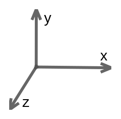

# シーンの設定

これでQt3Dのコードを書き始めることができるようになりました。最初のステップは、シーンのルートを定義することです。GameArea.qmlという名前の新しいファイルを作成します。

```QML
import Qt3D.Core 2.0
import Qt3D.Render 2.0
import Qt3D.Extras 2.0

Entity {
    id: root

    property alias gameRoot: root

    Camera {
        id: camera
        property real x: 24.5
        property real y: 14.0

        projectionType: CameraLens.PerspectiveProjection
        fieldOfView: 45
        aspectRatio: 16/9
        nearPlane : 0.1
        farPlane : 1000.0
        position: Qt.vector3d( x, y, 33.0 )
        upVector: Qt.vector3d( 0.0, 1.0, 0.0 )
        viewCenter: Qt.vector3d( x, y, 0.0 )
    }

    RenderSettings {
        id: frameFraph
        activeFrameGraph: ForwardRenderer {
            clearColor: Qt.rgba(0, 0, 0, 1)
            camera: camera
        }
    }

    components: [frameFraph]
}
```

最初に行うことは、カメラを作成し、それを配置することです。OpenGLでは、座標は右手の親指が左を指すように追従していることを覚えておいてください



カメラをQt.vector3d(x, y, 33)に配置することで、カメラを「画面の外」に出して、まだ作成されていないエンタテイの座標を単純なx, y軸で表現できるようにしています。upVectorです。Qt.vector3d(0.0, 1.0, 0.0)でカメラのアップベクトルを指定します。最後に、Qt.vector(x, y, 0)を指定します。

全体的な目的は、座標表現を単純化することです。このようにカメラを配置することで、座標0,0にオブジェクトを配置するとウィンドウの左下の部分に配置され、座標50,28はウィンドウの右上の部分を意味します。

また、2つのプロパティを定義するForwardRenderedでRenderSettingsを構成します。

* clearColor: このプロパティ Qt.rgba(0, 0, 0, 1) は、背景が真っ黒になることを意味します。
* camera: このプロパティは、レンダリングされるビューポートを決定するために使用されます。

シーンをレンダリングする準備ができましたが、ユーザー入力、つまりキーボードを処理する必要があります。
キーボードイベントをキャプチャするには、GameArea.qmlを以下のように変更します。

```QML
import Qt3D.Core 2.0
import Qt3D.Render 2.0
import Qt3D.Input 2.0

Entity {
    ...
    RenderSettings {
    ...
    }

    KeyboardDevice {
        id: keyboardController
    }

    InputSettings { id: inputSettings }

    KeyboardHandler {
        id: input
        sourceDevice: keyboardController
        focus: true
        onPressed: { }
    }

    components: [frameFraph, input]
}
```

KeyboardDevice要素は、アクティブなKeyboardHandler、すなわちinputへのキーイベントのディスパッチを担当しています。KeyboardHandler コンポーネントはコントローラにアタッチされており、キーが押されるたびに onPressed() 関数が呼び出されます。KeyboardHandlerはコンポーネントなので、GameAreaのコンポーネントリストに追加する必要があります。

GameAreaの最後の欠けている部分は、エンジンの実行を事前に行うことです（初期化と
update)を使用しています。

```QML
import Qt3D.Core 2.0
import Qt3D.Render 2.0
import Qt3D.Input 2.0
import QtQuick 2.6 as QQ2

Entity {
    id: root

    property alias gameRoot: root
    property alias timerInterval: timer.interval
    property int initialTimeInterval: 80
    property int initialSnakeSize: 5
    property string state: ""
    ...

    KeyboardDevice {
        id: keyboardController
    }

    QQ2.Component.onCompleted: {
        console.log("Start game...");
        timer.start()
    }

    QQ2.Timer {
        id: timer
        interval: initialTimeInterval
        repeat: true
        onTriggered: {}
    }

    components: [frameFraph, input]
}
```

ここでは、Qt3DにQt Quick要素を組み合わせています。名前の衝突の可能性があるため、別名QQ2を使ってモジュールをインポートする必要があります。Component.onCompletedは、第5章「モバイルUIを支配する」ですでに紹介しました。その仕事は、ゲームエンジンを起動し、直後に定義されたtimerを起動することです。

このtimer変数は、80ミリ秒ごとに(initialTimeIntervalプロパティで定義されているように)繰り返し、エンジンのupdate()関数を呼び出します。この関数については、この章の後半でエンジンのコードを作成するときに説明します。目標は、オリジナルのスネークゲームを可能な限り忠実にエミュレートすることです。ゲーム全体のロジックは、通常のフレーム更新間隔ではなく、この間隔で更新されます。update() を呼び出すたびに、スネークは前進します。その結果、蛇の動きは滑らかではなく、むしろぎこちないものになります。これは明らかにレトロゲーミング感を出すためのデザイン選択です。

ヘビがリンゴを食べるたびに、2つのことが起こります。

* タイマーのintervalは、エンジンによって縮小されます(timerIntervalプロパティによってアクセスされます)。
* ヘビは成長します。初期サイズは intialSnakeSize プロパティで定義されています。

タイマー間隔を短くすることで、蛇の方向管理が非常に困難になるまで蛇の前進が速くなります。

***

**[戻る](../index.html)**
