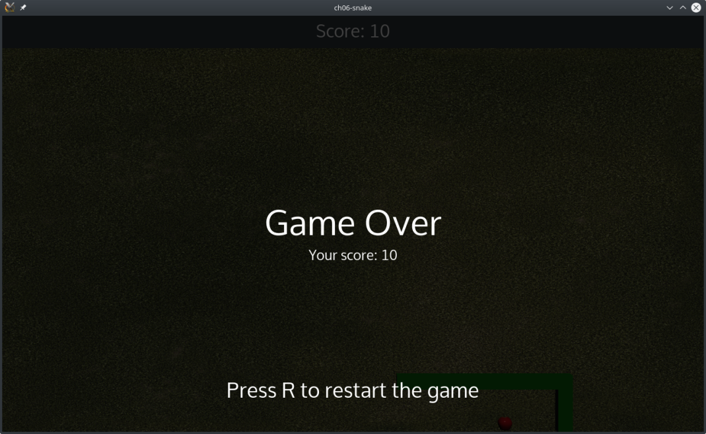

# QMLの状態でHUDを変化させる

ここでは、ゲームに負けた時に表示される「Game Over」というHUDを作成します。GameOverItem.qmlというファイルを新規作成します。

```QML
Item {
    id: root
    anchors.fill: parent

    onVisibleChanged: {
        scoreLabel.text = "Your score: " + score
    }

    Rectangle {
        anchors.fill: parent
        color: "black"
        opacity: 0.75
    }

    Label {
        id: gameOverLabel
        anchors.centerIn: parent
        color: "white"
        font.pointSize: 50
        text: "Game Over"
    }

    Label {
        id: scoreLabel
        width: parent.width
        anchors.top: gameOverLabel.bottom
        horizontalAlignment: "AlignHCenter"
        color: "white"
        font.pointSize: 20
    }

    Label {
        width: parent.width
        anchors.bottom: parent.bottom
        anchors.bottomMargin: 50
        horizontalAlignment: "AlignHCenter"
        color: "white"
        font.pointSize: 30
        text:"Press R to restart the game"
    }
}
```

今回のゲームオーバー画面の項目を見てみましょう。

* 黒い四角形が画面全体を埋め尽くし、opacityの値が75%になります。その結果、ゲームエリアはゲームオーバー画面の後ろ25%の位置に表示されます。
* 「GameOver」というテキストを表示する gameOverLabel ラベル。これは伝統的なゲームメッセージですが、"Loser!"や "Too bad!"などのテキストで編集することができます。
* 最終的なスコアを表示する動的な scoreLabel ラベル。
* ゲームの再開方法をプレイヤーに説明するラベル。

ルート項目の可視性が変わると、scoreLabel のテキストは main.qml の現在の変数 score で更新されることに注意してください。

Qt QuickにはUIの状態に関連した興味深い機能があります。アイテムに複数の状態を定義して、それぞれの状態に対する振る舞いを記述することができます。ここでは、この機能とGameOverItemをOverlayItem.qmlという新しいファイルで使用します。

```QML
Item {
    id: root

    states: [
        State {
            name: "PLAY"
            PropertyChanges { target: root; visible: false }
        },
        State {
            name: "GAMEOVER"
            PropertyChanges { target: root; visible: true }
            PropertyChanges { target: gameOver; visible: true }
        }
    ]

    GameOverItem {
        id: gameOver
    }
}
```

states要素がItemプロパティであることがわかります。デフォルトでは、states要素には空の文字列ステートが含まれています。ここでは、PLAYとGAMEOVERという2つのState項目を定義しています。engine.jsと同じ命名規則を使用しています。その後、プロパティの値をステートにバインドすることができます。この例では、ステートが GAMEOVER の場合、この OverlayItem とその GameOverItem の可視性を true に設定しています。そうでない場合は、状態が PLAY の場合は非表示にします。

オーバーレイHUDとその「ゲームオーバー」画面が使えるようになりました。以下のスニペットでmail.qmlを更新してください。

```QML
Item {
    id: mainView
    property int score: 0
    readonly property alias window: mainView
    ...
    OverlayItem {
        id: overlayItem
        anchors.fill: mainView
        visible: false

        Connections {
            target: gameArea
            onStateChanged: {
                overlayItem.state = gameArea.state;
            }
        }
    }
}
```

私たちのOverlayItem要素は画面にフィットし、デフォルトでは表示されません。C++ Qt ウィジェットのシグナル/スロット接続のように、QML 接続を実行することができます。targetプロパティには、シグナルを送信するアイテムが含まれています。そして、QMLスロット構文を使用することができます。

```QML
on<PropertyName>Changed
```

今回の場合、ターゲットはgameAreaです。この項目にはstate変数が含まれているので、onStateChangedを使って状態変数が更新された時に通知します。次に、OverlayItemの状態を切り替えます。この割り当てにより、OverlayItem要素で定義されている全てのProperyChangedが発動し、GameOverItemの表示・非表示が行われます。

これでゲームに負けずにゲームオーバーのオーバーレイを楽しむことができるようになりました。



***

**[戻る](../index.html)**
