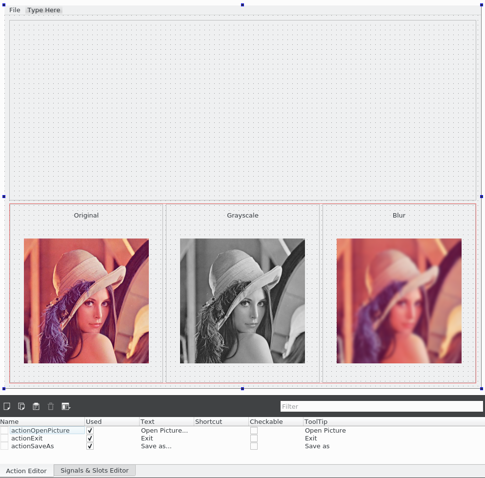
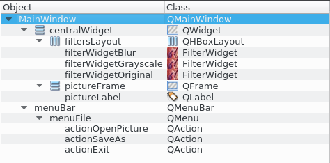

# 画像フィルタアプリケーションの構築

アプリケーションのUIを構築していきましょう。ファイルシステムから画像を開き、 filter-designer-plugin プロジェクトで開発した様々なフィルタを適用します。結果を残したい場合は、結果の画像を保存することができます。

まずはUIをデザインするところから始めます。MainWindow.uiを以下のように変更します。



このレイアウトを構築するのに役立つオブジェクトインスペクタのコンテンツは以下の通りです。



このUIには3つの要素があります。

* menuFile要素には、actionOpenPicture、actionExit、actionSaveAsの3つのアクションが含まれています。これらのアクションの詳細は Action Editor ウィンドウで見ることができます。
* pictureLabel要素で、読み込まれた画像を空の上部に表示します。
* filtersLayout 要素は、下部にある FilterWidget クラスの 3 つのインスタンスを含んでいます。

filtersLayout に FilterWidget クラスを追加すると、**プロパティエディタ**ウィンドウで title と filterType をカスタマイズできることがわかります。プレビューはデフォルトの画像に適用されたフィルタで自動的に更新されます。このような動的なプレビューは非常に素晴らしいもので、カスタム Qt Designer ウィジェットが非常に強力になることを予感させます。

アプリケーションのロジックを実装してみましょう。MainWindow.hを以下のように更新します。

```C++
#include <QMainWindow>
#include <QImage>
#include <QVector>

namespaceUi {
    classMainWindow;
}

classFilterWidget;

classMainWindow : public QMainWindow
{
    Q_OBJECT

public:
    explicitMainWindow(QWidget *parent = 0);
    ~MainWindow();
    voidloadPicture();
    private slots:
    voiddisplayPicture(constQImage& picture);

private:
    voidinitFilters();
    voidupdatePicturePixmap();

private:
    Ui::MainWindow *ui;
    QImagemSourcePicture;
    QImagemSourceThumbnail;
    QPixmapmCurrentPixmap;
    FilterWidget* mCurrentFilter;
    QVector<FilterWidget*>mFilters;
};
```

ここでは、説明しなければならない要素をいくつかご紹介します。

* mSourcePicture: この要素は、読み込まれた画像です。
* mSourceThumbnail: この要素は、mSourcePicture から生成されたサムネイルです。CPU サイクルを無駄にしないように、mSourcePicture は一度だけリサイズされ、各 FilterWidget インスタンスはフル解像度の画像ではなく、このサムネイルを処理します。
* mCurrentPixmap: この要素は、pictureLabelウィジェットに現在表示されているQPixmapです。
* mCurrentFilter: この要素は、現在適用されているフィルタです。ユーザが別の FilterWidget をクリックするたびに、このポインタが更新されます。
* mFilters: この要素は、MainWindow.uiに追加したFilterWidgetクラスのQVectorです。各 FilterWidget クラスに同じ命令を簡単に適用するために導入されたヘルパーに過ぎません。

関数については、ここでは大まかな概要にとどめておきます。詳細は各関数の実装を見ていきます。

* loadPicture(): この関数はパイプライン全体をトリガーします。ユーザーが actionOpenPicture をクリックしたときに呼び出されます。
* initFilters(): この関数は、mFiltersの初期化を担当します。
* displayPicture(): この関数は、フィルタリングされた画像を表示するために mCurrentWidget::pictureProcessed() によって呼び出されるスロットです。
* updatePicturePixmap(): この関数は、pictureLabel内のmCurrentPixmapの表示を処理します。

MainWindow.cppのMainWindowクラスのコンストラクタの実装を見てみましょう。

```C++
#include <QFileDialog>
#include <QPixmap>
#include <QDir>

#include "FilterWidget.h"

MainWindow::MainWindow(QWidget *parent) :
    QMainWindow(parent),
    ui(new Ui::MainWindow),
    mSourcePicture(),
    mSourceThumbnail(),
    mCurrentPixmap(),
    mCurrentFilter(nullptr),
    mFilters()
{
    ui->setupUi(this);
    ui->pictureLabel->setMinimumSize(1, 1);

    connect(ui->actionOpenPicture, &QAction::triggered,
        this, &MainWindow::loadPicture);
    connect(ui->actionExit, &QAction::triggered,
        this, &QMainWindow::close);
    initFilters();
}
```

actionOpenPicture::triggered() シグナルをまだ実装されていない loadPicture() 関数に接続します。actionExitは簡単で、QMainWindow::close()スロットに接続するだけです。最後に initFilter() が呼び出されます。本体を見てみましょう。

```C++
voidMainWindow::initFilters()
{
    mFilters.push_back(ui->filterWidgetOriginal);
    mFilters.push_back(ui->filterWidgetBlur);
    mFilters.push_back(ui->filterWidgetGrayscale);

    for (inti = 0; i<mFilters.size(); ++i) {
        connect(mFilters[i], &FilterWidget::pictureProcessed,
        this, &MainWindow::displayPicture);
    }
    mCurrentFilter = mFilters[0];
}
```

各 FilterWidget インスタンスは mFilters に追加されます。その後、pictureProcessed()シグナルをMainWindow::displayPicture命令に接続し、mCurrentFilterを元のフィルタに初期化します。

これで、クラスに画像をロードする準備ができました!これがloadPicture()の実装です。

```C++
voidMainWindow::loadPicture()
{
    QString filename = QFileDialog::getOpenFileName(this,
        "Open Picture",
        QDir::homePath(),
        tr("Images (*.png *.jpg)"));
    if (filename.isEmpty()) {
        return;
    }
    mSourcePicture = QImage(filename);
    mSourceThumbnail = mSourcePicture.scaled(QSize(256, 256),
    Qt::KeepAspectRatio,
    Qt::SmoothTransformation);
    for (inti = 0; i<mFilters.size(); ++i) {
        mFilters[i]->setSourcePicture(mSourcePicture);
        mFilters[i]->updateThumbnail(mSourceThumbnail);
    }

    mCurrentFilter->process();
}
```

mSourcePictureメソッドはQFileDialogを使ってロードされ、この入力からmSourceThumbnailが生成されます。各FilterWidgetクラスはこの新しいデータで更新され、mCurrentFilter要素はそのprocess()関数を呼び出すことでトリガされます。

FilterWidget::process() が終了すると、displayPicture() スロットに接続された pictureProcessed() シグナルを発します。この関数に切り替えてみましょう。

```C++
voidMainWindow::displayPicture(constQImage& picture)
{
    mCurrentPixmap = QPixmap::fromImage(picture);
    updatePicturePixmap();
}
```

ここでは、mCurrentPixmapは与えられた画像から更新され、updatePicturePixmap()関数はpictureLabel要素の更新を担当しています。以下がupdatePicturePixmap()の実装です。

```C++
voidMainWindow::updatePicturePixmap()
{
    if (mCurrentPixmap.isNull()) {
        return;
    }
    ui->pictureLabel->setPixmap(
        mCurrentPixmap.scaled(ui->pictureLabel->size(),
        Qt::KeepAspectRatio,
        Qt::SmoothTransformation));
}
```

この関数は、単純に、pictureLabel内に収まるように、mCurrentPixmapのスケーリングされたバージョンを作成します。

これで画像の読み込み・フィルター処理は全て完了です。アプリケーションを実行すれば、画像の読み込みと修正ができるはずです。しかし、ウィンドウのサイズを変更してみると、pictureLabel要素のスケールがあまり良くないことがわかります。

この問題に対処するためには、ウィンドウのサイズを変更するたびに mCurrentPixmap のスケーリングされたバージョンを再生成する必要があります。MainWindowをこのように更新します。

```C++
// In MainWindow.h
classMainWindow : public QMainWindow
{
    ...
    voidloadPicture();
    protected:
    voidresizeEvent(QResizeEvent* event) override;
    ...
};

// In MainWindow.cpp
voidMainWindow::resizeEvent(QResizeEvent* /*event*/)
{
    updatePicturePixmap();
}
```

ここで、mCurrentPixmapとpictureLabel要素のpixmapを分離することは意味があります。フル解像度のmCurrentPixmapから常にスケーリングされたものを生成しているので、結果として得られるpixmapの見栄えは確実です。

画像フィルターアプリケーションは、フィルターした画像を保存する機能がなければ完全ではありません。これにはさほど手間はかかりません。ここに MainWindow.h の更新版があります。

```C++
classMainWindow : public QMainWindow
{
    ...

    private slots:
    voiddisplayPicture(constQImage& picture);
    voidsaveAsPicture();
    ...

private:
    Ui::MainWindow *ui;
    QImagemSourcePicture;
    QImagemSourceThumbnail;
    QImage&mFilteredPicture;
    ...
};
```

ここでは、mFilteredPicture 要素を取得してファイルに保存する saveAsPicture() 関数を追加しただけです。MainWindow.cpp に実装されているので、気にする必要はないでしょう。

```C++
// In MainWindow.cpp
MainWindow::MainWindow(QWidget *parent) :
    QMainWindow(parent),
    ui(new Ui::MainWindow),
    mSourcePicture(),
    mSourceThumbnail(),
    mFilteredPicture(mSourcePicture),
    ...
{
    ui->setupUi(this);
    ui->actionSaveAs->setEnabled(false);
    ui->pictureLabel->setMinimumSize(1, 1);

    connect(ui->actionOpenPicture, &QAction::triggered,
        this, &MainWindow::loadPicture);
    connect(ui->actionSaveAs, &QAction::triggered,
        this, &MainWindow::saveAsPicture);
    ...
}

voidMainWindow::loadPicture()
{
    ...
    if (filename.isEmpty()) {
        return;
    }
    ui->actionSaveAs->setEnabled(true);
    ...
}

voidMainWindow::displayPicture(constQImage& picture)
{
    mFilteredPicture = picture;
    mCurrentPixmap = QPixmap::fromImage(picture);
    updatePicturePixmap();
}

voidMainWindow::saveAsPicture()
{
    QString filename = QFileDialog::getSaveFileName(this,
        "Save Picture",
        QDir::homePath(),
        tr("Images (*.png *.jpg)"));
    if (filename.isEmpty()) {
        return;
    }
    mFilteredPicture.save(filename);
}
```

コードスニペットは長いですが、それほど複雑ではありません。actionSaveAs関数は、画像が読み込まれたときだけ有効になります。画像が処理されると、mFilteredPictureは与えられた画像で更新されます。これは参照なので、このフィルタリングされた画像を保存するのには何のコストもかかりません。

最後に、saveAsPicture（）関数はユーザーにパスを要求し、QImage APIを使用してそれを保存します。QImageAPIは、ファイル拡張子に基づいて画像タイプを推測しようとします。

***

## まとめ

この章では、各デスクトップOS（Windows、Linux、Mac）にサードパーティ製のライブラリを統合する方法を学びました。私たちが選んだのは、Qt Designerのカスタムプラグインに含まれていて、画像処理結果をQt Designerでライブプレビュー表示できるOpenCVライブラリです。画像を開いてフィルターをかけ、その結果をマシンに保存できる画像フィルターアプリケーションを作成しました。

サードパーティのライブラリを統合する方法と、Qt Designerのプラグインを作る方法をよく見てきました。次の章では、サードパーティの開発者が実装できるフィルタープラグインをロードできるようにimage-filterアプリケーションを作成することで、物事を進めていきます。さらにクールにするために、Qt アニメーションフレームワークを取り上げ、image_filter をより華やかにします。

***

**[戻る](../index.html)**
