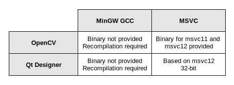

# Windows用のプロジェクトを設定する

このプロジェクトをWindows上で準備する前に、Windowsホスト上でQtアプリケーションを開発する際に利用可能な選択肢についてお話しましょう。Qtの公式サイトでは、複数のバイナリパッケージが提供されています。主に以下のものに注目しています。

* Qt for Windows 32-bit (MinGW)
* Qt for Windows 32ビット版 (VS 2013)

すでにこれらのバージョンのいずれかを使用しているかもしれません。最初のものはMinGW GCCコンパイラとQtフレームワークが付属しています。2つ目はQtフレームワークのみを提供し、Visual Studioと一緒にインストールされるMicrosoft Visual C++コンパイラに依存しています。

Windows用の共通のQtアプリケーションを作成したい場合は、どちらのバージョンでも構いません。しかし、この章では、filter-plugin-designer プロジェクトを OpenCV ライブラリとリンクさせたいと思います。また、Qt Designerはfilter-plugin-designerを動的にロードできるようにしなければならないので、すべての段階で一貫したコンパイラバージョンを使用する必要があります。

Windows上のQt Creatorは、MinGWのバイナリパッケージであっても、常にMSVCをベースにしていることに注意してください！そのため、MinGWコンパイラでQt Designerプラグインを作成すると、Qt Creatorはロードできません。そのため、MinGWコンパイラを使ってQt Designerプラグインを作成しても、Qt Creatorはロードできません。OpenCV for Windows は MSVC ライブラリのみを提供しており、MSVC11 (VS 2012) と MSVC12 (VS 2013) 用にコンパイルされています。

ここでは、Windowsでプロジェクトの例を構築するためのさまざまなソリューションをまとめています。



Qt CreatorやOpenCVのようなオープンソースのソフトウェアは、常に別のコンパイラを使ってソースからコンパイルすることができることを覚えておいてください。ですから、どうしてもMinGWコンパイラを使いたい場合は、OpenCVやQt Creatorをソースから再コンパイルする必要があります。それ以外の場合は、後ほど説明するように、Qt for Windows 32ビット版（VS 2013）を使用することをお勧めします。以下に開発環境を整える手順を示します。

1. Visual Studio Community Editionをダウンロードしてインストールします。
2. Qt for Windows 32ビット版（VS 2013）をダウンロードしてインストールします。
3. Windows用のOpenCVをダウンロードして解凍します(例: C:\libop\opencv)。
4. 新規にOPENCV_HOMEを作成します。C:\\libopencvbuild\x86vc12 環境変数を作成します。
5. 5. Append to your system Path. C:\\lib\opencv\buildx86\vc12bin 環境変数。

OPENCV_HOME ディレクトリは，.pro ファイルで使用されます。また，実行時に依存関係を簡単に解決できるように，PathディレクトリにOpenCVライブラリフォルダを追加します．

これで、以下のスニペットをfilter-plugin-designer.proファイルに追加することができます。

```QMake
windows {
target.path = $$(QTDIR)/../../Tools/QtCreator/bin/plugins/designer

debug:target_lib.files = $$OUT_PWD/debug/$${TARGET}.lib
release:target_lib.files = $$OUT_PWD/release/$${TARGET}.lib
target_lib.path = $$(QTDIR)/../../Tools/QtCreator/bin/plugins/designer
    INSTALLS += target_lib

    INCLUDEPATH += $$(OPENCV_HOME)/../../include
    LIBS += -L$$(OPENCV_HOME)/lib
    -lopencv_core2413
    -lopencv_imgproc2413
}
```

QtargetパスはQt Creatorのプラグインフォルダに設定しています。また，動的ライブラリ(.dll)を作成する際にMSVCによって生成された.libファイルをコピーするために，target_libライブラリを作成します．OpenCVヘッダフォルダをINCLUDEPATHに追加し、コードに簡単にインクルードできるようにします。最後に，OpenCV の lib フォルダにある OpenCV モジュール (core と imgproc) とプラグインをリンクするために，LIBS 変数を更新します．

スタンドアロンの Qt Designer アプリケーションと Qt Creator は別のソフトウェアであることに注意してください。どちらのプログラムも異なるプラグインパスを使用しています。今回の場合はQt Creatorのフォームエディタのみを使用していたので、Qt Creatorのプラグインパスを対象としています。

INSTALLS に target と target_lib を追加したように、.dll と .lib の両方のファイルが make install コマンドの Qt Creator プラグインパスにコピーされます。Qt Creator は、実行時にプラグインをロードするために .dll ファイルのみを必要とします。.lib ファイルは、画像フィルターアプリケーションを構築する際に filter-plugin-designer とのリンクを解決するためにのみ使用されます。簡単のために、同じディレクトリを使用しています。

***

**[戻る](../index.html)**
