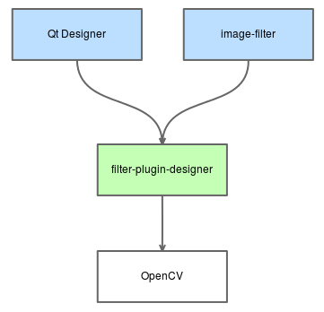
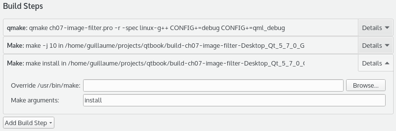

# Qt Designer プラグインの作成

第4章「デスクトップUIを制覇する」では、プロモーションのテクニックを使ってQt DesignerでカスタムQtウィジェットを作成しました。ここからは、Qt Designer用のプラグインをビルドして、カスタムQtウィジェットを作成する方法を学びます。作成したウィジェットは、ウィジェットボックスの**デザインモード**から他の通常の Qt ウィジェットと一緒に利用できるようになります。このプロジェクトの例では、入力画像を処理してフィルタを適用する FilterWidget クラスを作成します。ウィジェットには、フィルタ名とフィルタリングされた画像のダイナミックサムネイルも表示されます。

このプロジェクトは2つのサブプロジェクトで構成されています。

* filter-plugin-designer: これは FilterWidget クラスと画像処理コードを含む Qt Designer プラグインです。このプラグインは、Qt Creator が**フォームエディタ**で新しい FilterWidget を提供するために使用する動的ライブラリです。
* image-filter: 複数のFilterWidgetを利用したQt Widgetアプリケーションです。ユーザーはハードディスクから画像を開き、フィルタ（グレースケール、ぼかしなど）を選択し、フィルタをかけた画像を保存することができます。

filter-plugin-designer はサードパーティ製の **OpenCV (Open Source Computer Vision)** ライブラリを使用します。これは画像を操作するための強力なクロスプラットフォームのオープンソースライブラリです。以下に概要のスキーマを示します。



既存のソフトウェアに簡単に追加することができるモジュールの一種であるプラグインを見ることができます。プラグインは、アプリケーションから自動的に呼び出されるように、特定のインターフェイスを尊重しなければなりません。私たちの場合、Qt DesignerはQtプラグインをロードするアプリケーションです。そのため、プラグインを作成することで、Qt Designer のソースコードを変更して再コンパイルすることなく、アプリケーションを強化することができます。プラグインは一般的に動的なライブラリ (.dll/.so) であるため、アプリケーションによって実行時に読み込まれます。

Qt Designerのプラグインについての理解が深まったところで、早速作ってみましょう。まず、ch07-image-filterというSubdirsプロジェクトを作成します。そして、filterplugin-designerというサブプロジェクトを追加します。このプロジェクトはゼロから始めるので、Empty qmake Projectのテンプレートを使います。以下がfilter-plugin-designer.proファイルです。

```QMake
QT += widgets uiplugin
CONFIG += plugin
CONFIG += c++14
TEMPLATE = lib
DEFINES += FILTERPLUGINDESIGNER_LIBRARY

TARGET = $$qtLibraryTarget($$TARGET)
INSTALLS += target
```

QT と CONFIG の uiplugin と plugin キーワードに注意してください。これらは Qt Designer プラグインを作成するために必要です。動的ライブラリを作成しているので、TEMPLATE キーワードを lib に設定しています。定義された FILTERPLUGINDESIGNER_LIBRARY は、ライブラリのインポート/エクスポート機構で使用されます。このトピックについては、第 3 章「プロジェクトの分割とコードのルール」ですでに説明しました。デフォルトでは、TARGETはfilter-plugindesignerで、$$qtLibraryTarget()関数はプラットフォームに応じて更新します。例えば、Windowsでは、接尾辞「d」（デバッグの意味）が追加されます。最後に、INSTALLSにtargetを追加します。今のところ、この行は何もしていませんが、近日中に各プラットフォームのインストール先パスを記述する予定です。これにより、make installコマンドを実行すると、ターゲットライブラリファイル(.dll/.so)が正しいフォルダにコピーされます。コンパイルのたびにこのタスクを自動的に実行するために、新しいビルドステップを追加することができます。

デプロイパスは設定されていますが、自動的には行われません。**プロジェクト**タブを開き、以下のようにします。

1. 「ビルド設定」→「ビルドステップ」を開きます。
2. 「ビルドステップの追加」をクリックします。
3. Make arguments フィールドに install と入力します。

こんな感じのものが出てくるはずです。



プロジェクトをビルドするたびに make install コマンドが呼ばれ、Qt Creator にライブラリをデプロイします。

***

**[戻る](../index.html)**
