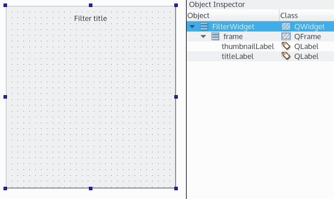

# FilterWidget で UI をデザインする

いいでしょう。フィルタクラスが実装されたので、カスタムウィジェットを作ることができます。このウィジェットは入力、ソース、サムネイル画像を受け取ります。そして、サムネイルはすぐに処理されてフィルタのプレビューが表示されます。ユーザーがウィジェットをクリックすると、ソース画像が処理され、フィルタリングされた画像でシグナルがトリガーされます。このウィジェットは後でQt Creatorの**フォームエディタ**にドラッグ＆ドロップされることを覚えておいてください。そのため、Qt Creatorからフィルタを選択するためのゲッターとセッターを持つプロパティを用意します。**Qt Designerのフォームクラス**テンプレートを使って、FilterWidgetという新しいウィジェットを作成してください。FilterWidget.uiは本当にシンプルです。



titleLabelはQWidgetの上にあるQLabelです。その下の thumbnailLabel はフィルタリングされた画像のサムネイルを表示します。FilterWidget.hに切り替えてみましょう。

```C++
class FILTERPLUGINDESIGNERSHARED_EXPORT FilterWidget : public QWidget
{
    Q_OBJECT

    Q_ENUMS(FilterType)
    Q_PROPERTY(QString title READ title WRITE setTitle)
    Q_PROPERTY(FilterTypefilterType READ filterType WRITE setFilterType)

public:
    enumFilterType { Original, Blur, Grayscale };

    explicitFilterWidget(QWidget *parent = 0);
    ~FilterWidget();

    void process();
    voidsetSourcePicture(constQImage&sourcePicture);
    voidupdateThumbnail(constQImage&sourceThumbnail);

    QStringtitle() const;
    FilterTypefilterType() const;

public slots:
    voidsetTitle(constQString& tile);
    voidsetFilterType(FilterTypefilterType);

signals:
    voidpictureProcessed(constQImage& picture);

protected:
    voidmousePressEvent(QMouseEvent*) override;

private:
    Ui::FilterWidget *ui;
    std::unique_ptr<Filter>mFilter;
    FilterTypemFilterType;

    QImagemDefaultSourcePicture;
    QImagemSourcePicture;
    QImagemSourceThumbnail;

    QImagemFilteredPicture;
    QImagemFilteredThumbnail;
};
```

上部では、enumFilterTypeで利用可能な全てのフィルタタイプを定義しています。また、Qtpropertyシステムを使って、ウィジェットのタイトルと現在のフィルタタイプをQt Creatorの**Property Editor**に公開しています。構文は以下のようになります。

```
Q_PROPERTY(<type><name> READ <getter> WRITE <setter>)
```

列挙を公開するにはQ_ENUM()マクロを使って登録する必要があるので、**プロパティエディタ**ではQt Creatorからフィルタの種類を選択できるコンボボックスが表示されるので注意してください。

中間部には、すべての関数、スロット、シグナルがリストアップされています。最も注目すべきは process() 関数で、現在のフィルタを使ってソース画像を修正します。pictureProcessed()シグナルは、フィルタリングされた画像をアプリケーションに通知します。

下の部分は、このクラスで使われているピクチャとサムネイルのQImage変数のリストです。どちらの場合も、ソース画像とフィルタリングされた画像の両方を扱います。デフォルトのソース画像は、プラグインに埋め込まれた画像です。これにより、サムネイルが提供されていない場合にデフォルトのプレビューを表示することができます。mFilter 変数は、現在の Filter クラスへのスマートポインタです。

FilterWidget.cppを使った実装に切り替えてみましょう。

```C++
FilterWidget::FilterWidget(QWidget *parent) :
    QWidget(parent),
    ui(new Ui::FilterWidget),
    mFilterType(Original),
    mDefaultSourcePicture(":/lenna.jpg"),
    mSourcePicture(),
    mSourceThumbnail(mDefaultSourcePicture.scaled(QSize(256, 256),
    Qt::KeepAspectRatio,
    Qt::SmoothTransformation)),
    mFilteredPicture(),
    mFilteredThumbnail()
{
    ui->setupUi(this);
    setFilterType(Original);
}

FilterWidget::~FilterWidget()
{
    delete ui;
}
```

コンストラクタとデストラクタです。デフォルトのソース画像には、画像処理の文献でよく使われている豪華なレンナの画像が埋め込まれていることに注意してください。画像はリソースファイル filter-plugin-designer.qrc にあります。mSourceThumbnail関数は、レンナの縮小画像で初期化されています。コンストラクタではsetFilterType()関数を呼び出して、デフォルトでオリジナルフィルタを初期化しています。コアとなるprocess()関数は以下の通りです。

```C++
voidFilterWidget::process()
{
    mFilteredPicture = mFilter->process(mSourcePicture);
    emitpictureProcessed(mFilteredPicture);
}
```

process() 関数は強力ですが、 実にシンプルです。現在のフィルタの process() を呼び出して、現在のソース画像からフィルタリングされた画像を更新します。そして、フィルタリングされた画像を使って pictureProcessed() シグナルを発生させます。これで QImage セッターを追加することができます。

```C++
voidFilterWidget::setSourcePicture(constQImage&sourcePicture)
{
    mSourcePicture = sourcePicture;
}

voidFilterWidget::updateThumbnail(constQImage&sourceThumbnail)
{
    mSourceThumbnail = sourceThumbnail;
    mFilteredThumbnail = mFilter->process(mSourceThumbnail);
    QPixmappixmap = QPixmap::fromImage(mFilteredThumbnail);
    ui->thumbnailLabel->setPixmap(pixmap);
}
```

setSourcePicture()関数は、新しいソース画像を持つアプリケーションから呼び出される単純なセッターです。updateThumbnail()メソッドは、新しいソースのサムネイルをフィルタリングして表示します。Q_PROPERTYで使用するセッターを追加してみましょう。

```C++
voidFilterWidget::setTitle(constQString& tile)
{
    ui->titleLabel->setText(tile);
}

voidFilterWidget::setFilterType(FilterWidget::FilterTypefilterType)
{
    if (filterType == mFilterType&&mFilter) {
        return;
    }

    mFilterType = filterType;

    switch (filterType) {
    case Original:
        mFilter = make_unique<FilterOriginal>();
        break;

    case Blur:
        mFilter = make_unique<FilterBlur>();
        break;

    case Grayscale:
        mFilter = make_unique<FilterGrayscale>();
        break;

    default:
        break;
    }

    updateThumbnail(mSourceThumbnail);
}
```

setTitle()関数は、ウィジェットのタイトルをカスタマイズするためのシンプルなセッターです。setFilterType()関数について説明しましょう。ご覧のように、この関数は現在のフィルタの種類である mFilterType を更新するだけではありません。タイプに応じて、対応するフィルタが作成されます。第3章「プロジェクトの分割とコードの規則化」のスマートポインタを覚えていますか？ここでは mFilter 変数に unique_ptr ポインタを使っているので、new raw の代わりに make_unique を使うことができます。FilterWidget クラスは Filter クラスの所有権を引き継ぎ、メモリ管理を気にする必要はありません。make_unique 命令を実行すると、古いポインタがあれば自動的に削除されます。

最後に、updateThumbnail()関数を呼び出して、選択されたフィルタタイプに対応するフィルタリングされたサムネイルを表示します。以下にゲッターとマウスイベントハンドラを示します。

```C++
QStringFilterWidget::title() const
{
    returnui->titleLabel->text();
}

FilterWidget::FilterTypeFilterWidget::filterType() const
{
    returnmFilterType;
}

voidFilterWidget::mousePressEvent(QMouseEvent*)
{
    process();
}
```

title()関数とfilterType()関数は、Qtプロパティ・システムで使用されるゲッターです。ユーザーがウィジェットをクリックするたびに process() 関数を呼び出すために、mousePressEvent() 関数をオーバーライドします。

***

**[戻る](../index.html)**
