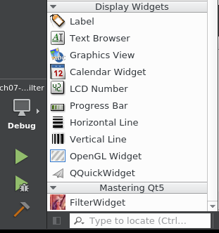
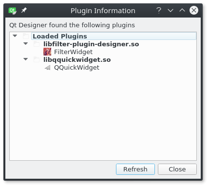

# Qt Designer プラグインを使用する

カスタムプラグインが完成しました。フィルタウィジェットライブラリを自動的にデプロイするためのカスタムビルドコマンドを追加したので、Qt Designerで表示されているはずです。指定したデプロイパスはQt Creatorディレクトリ内にあります。Qt CreatorはQt Creator内のUIを表示するプラグインを介してQt Designerを統合しています。

Qt Creator を起動すると、特定のパスで利用可能なすべてのライブラリを読み込もうとします。これは、プラグインを変更するたびに Qt Creator を再起動しなければならないことを意味します (変更した結果をデザイナーで確認したい場合)。

プラグインの動作を見るために、今度はこの章のアプリケーションプロジェクトを作成します。ch07-image-filterプロジェクト内にimage-filterという名前の**Qt Widgets Application**サブプロジェクトを作成します。ウィザードで、MainWindow.uiというフォームを生成します。

プラグインを適切に使用するには、imagefilter.pro の中の filter-plugin-designer ライブラリをこのようにリンクするだけです。

```QMake
QT += core gui

greaterThan(QT_MAJOR_VERSION, 4): QT += widgets

TARGET = image-filter
TEMPLATE = app

INCLUDEPATH += ../filter-plugin-designer

win32 {
    LIBS += -L$$(QTDIR)/../../Tools/QtCreator/bin/plugins/designer -lfilter-plugin-designer
}

macx {
    LIBS += -L$$(QTDIR)/../../"QtCreator.app"/Contents/PlugIns/designer/ -lfilter-plugin-designer
}

linux {
    LIBS += -L$$(QTDIR)/../../Tools/QtCreator/lib/Qt/plugins/designer/ -lfilter-plugin-designer
}

SOURCES += main.cpp\
    MainWindow.cpp

HEADERS += MainWindow.h

FORMS += MainWindow.ui
```

filter-plugin-designerのヘッダにアクセスできるようにするには、INCLUDEPATHディレクトリに追加するだけです。最後に、リンカーは Qt Creator でデプロイしたライブラリにリンクするように指示されます。これにより、Qt Designer とアプリケーションで同じライブラリが使用されるようになります。

MainWindow.ui ファイルを開き、**ウィジェットボックス**の一番下までスクロールします。すると、このように表示されます。



FilterWidget プラグインは Qt5 のマスタリングセクションの下に表示されます。有名な Lenna もプレビューアイコンとして表示されます。FilterWidget プラグインが表示されない場合は、Qt Creator を再起動してプラグインが正しく読み込まれていることを確認してください。これを確認するには、（デザインタブの）「**ツール**」→「**フォームエディタ**」→「**Qt Designer プラグインについて**」で確認してください。このように表示されるはずです。



FilterWidget プラグインがこのリストに表示されていない場合は、Qt Creator プラグインのディレクトリの内容を確認する必要があります (パスは image-filter.pro に記載されています)。

***

**[戻る](../index.html)**
