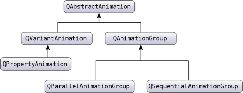
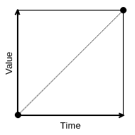
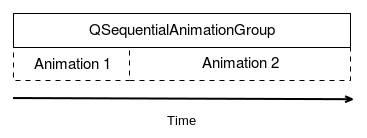
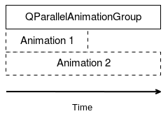

# アニメーションフレームワークを理解する

あなたのアプリケーションは魅力的に動作します。どうやってジャンプさせて移動させるか、一言で言えばライブ感を出すかに注目してみましょう。Qt Animation Frameworkを使用して、Qtプロパティのアニメーションを作成したり、開始したりすることができます。プロパティの値は、Qtによる内部グローバルタイマーハンドルによってスムーズに補間されます。Qtプロパティであれば何でもアニメーションさせることができます。Q_PROPERTYを使って自分のオブジェクトのプロパティを作成することもできます。Q_PROPERTYのことを忘れてしまった方は、第7章「頭の痛くないサードパーティライブラリ」を参照してください。

アニメーションを構築するために、主に3つのクラスが用意されています。

* QPropertyAnimation: このクラスは、Qtプロパティのアニメーションをアニメーション化します。
* QParallelAnimationGroup: このクラスは複数のアニメーションを並列にアニメーションします（すべてのアニメーションが一緒に始まります）。
* QSequentialAnimationGroup: このクラスは、複数のアニメーションを連続してアニメーションします (アニメーションは、定義された順序で一つずつ実行されます)。

これらのクラスはすべて QAbstractAnimation を継承しています。Qt の公式ドキュメントにある図を見てみましょう。



QAbstractAnimation, QVariantAnimation, QAnimationGroupは抽象クラスであることに注意してください。Qtアニメーションの簡単な例を示します。

```C++
QLabel label;
QPropertyAnimation animation;

animation.setTargetObject(&label);
animation.setPropertyName("geometry");
animation.setDuration(4000);
animation.setStartValue(QRect(0, 0, 150, 50));
animation.setEndValue(QRect(300, 200, 150, 50));
animation.start();
```

前述のスニペットは、QLabelラベルを0×0の位置から300×200の位置に4秒で移動させています。最初にやるべきことは、ターゲットオブジェクトとそのプロパティを定義することです。この例では、ターゲットオブジェクトはラベルであり、ジオメトリと呼ばれるプロパティをアニメーションさせたいと考えています。そして、アニメーションの持続時間をミリ秒単位で設定します。4000 ミリ秒、4 秒です。最後に、このように定義された QRect である geometry プロパティの開始値と終了値を決定します。

```C++
QRect(x, y, width, height)
```

ラベルオブジェクトは0×0の位置から始まり、300×200で終わります。この例では、サイズは固定（150 x 50）ですが、必要に応じて幅と高さをアニメーションさせることもできます。

最後に、start()関数を呼び出してアニメーションを開始します。4秒後、アニメーションはラベルを0 x 0の位置から300 x 200までスムーズに移動させます。デフォルトでは、アニメーションは中間値を提供するために線形補間を使用するので、2秒後にはlabelは150 x 100の位置になります。値の線形補間は以下のスキーマのようになります。



この場合、labelオブジェクトは開始位置から終了位置まで一定の速度で移動します。イージング関数とは、時間の経過に伴う値の変化を記述する数学関数です。イージング曲線は、数学関数を視覚的に表現したものです。デフォルトの線形補間は良いスタート地点ですが、Qt にはアニメーションの速度動作を制御するためのイージングカーブがたくさん用意されています。ここに更新された例があります。

```C++
QLabel label;
QPropertyAnimation animation(&label, "geometry");
animation.setDuration(4000);
animation.setStartValue(QRect(0, 0, 150, 50));
animation.setEndValue(QRect(300, 200, 150, 50));
animation.setEasingCurve(QEasingCurve::InCirc);
animation.start();
```

QPropertyAnimationのコンストラクタを使って直接ターゲットオブジェクトとプロパティ名を設定することができます。その結果、setTargetObject()関数とsetPropertyName()関数を削除しました。その後、setEasingCurve()を使って、このアニメーションの曲線を指定しています。InCircは以下のようになります。

この緩和曲線では、ラベルは本当にゆっくりと動き始めますが、アニメーションの間に徐々に加速していきます。

もうひとつの方法は、中間キーのステップを自分で定義し、 setKeyValueAt() 関数を使用することです。例を更新してみましょう。

```C++
QLabel label;
QPropertyAnimation animation(&label, "geometry");
animation.setDuration(4000);
animation.setKeyValueAt(0, QRect(0, 0, 150, 50));
animation.setKeyValueAt(0.25, QRect(225, 112.5, 150, 50));
animation.setKeyValueAt(1, QRect(300, 200, 150, 50));
animation.start();
```

setKeyValueAt()を使ってキーフレームを設定しています。最初の引数は、0から1の範囲のタイムステップです。私たちの場合、ステップ1は4秒を意味します。ステップ0とステップ1のキーフレームは、最初の例の開始/終了位置と同じ位置を提供します。ご覧のように、ステップ0.25（我々の場合は1秒）に225 x 112.5の位置を持つキーフレームを追加します。次のスキーマはこれを示しています。

setKeyValueAt()で作成された3つのキーフレームを明確に区別することができます。この例では、labelは1秒で225 x 112.5の位置にすぐに到達します。その後、残りの3秒の間にラベルはゆっくりと300 x 200の位置に移動します。

複数のQPropertyAnimationオブジェクトがある場合、グループを使用してより複雑なシーケンスを作成することができます。例を見てみましょう。

```C++
QPropertyAnimation animation1(&label1, "geometry");
QPropertyAnimation animation2(&label2, "geometry");
...
QSequentialAnimationGroup animationGroup;
animationGroup.addAnimation(&anim1);
animationGroup.addAnimation(&anim2);
animationGroup.start();
```

この例では、QSequentialAnimationGroupを使ってアニメーションを1つずつ実行しています。まず最初にやるべきことは、アニメーションをanimationGroupに追加することです。そして、アニメーショングループでstart()を呼び出すと、animation1がlaunchedされます。animation1が終了すると、animationGroupはanimation2を実行します。QSequentialAnimationGroupはリストの最後のアニメーションが終了すると終了します。次のスキーマはこの動作を示しています。



2つ目のアニメーショングループであるQParallelAnimationGroupは、QSequentialAnimationGroupと同じ方法で初期化され、開始されます。しかし、動作が異なります。すべてのアニメーションを並行して開始し、最も長いアニメーションが終了するのを待ちます。これを図示してみましょう。



アニメーショングループはそれ自体がアニメーションであることを覚えておきましょう (QAbstractAnimation を継承しています)。結果として、アニメーショングループを他のアニメーショングループに追加することで、非常に複雑なアニメーションシーケンスを作成することができます。

***

**[戻る](../index.html)**
